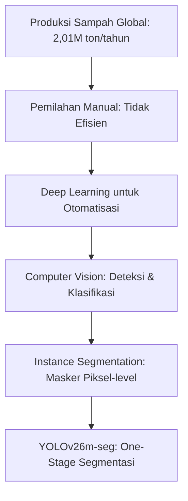
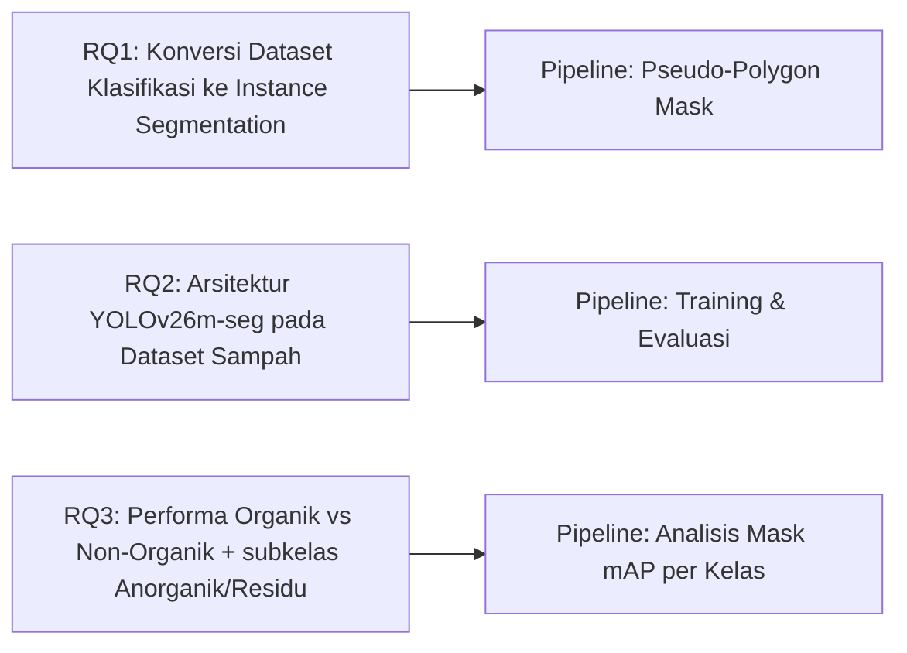
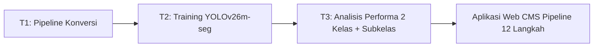

# BAB I: PENDAHULUAN

## 1.1 Latar Belakang

Permasalahan sampah telah mencapai tingkat mengkhawatirkan, khususnya di Bali sebagai destinasi wisata global. Bali menghasilkan ~1.340 ton sampah per hari (DLHK Bali), dengan 60% berasal dari sektor pariwisata. Komposisi sampah didominasi organik (60%) dan plastik (30%). Tantangan utama adalah pemilahan yang masih manual, tidak efisien, dan rawan error.

Pemerintah Bali melalui Pergub No.47/2019 menetapkan standar klasifikasi sampah menjadi 3 kategori: Organik, Anorganik (recyclable), dan Residu (landfill). Sistem ini bertujuan meningkatkan efektivitas daur ulang dan mengurangi beban Tempat Pemrosesan Akhir (TPA). Penelitian ini mengadopsi standar tersebut dengan memetakan subkategori sampah ke dalam klasifikasi yang sesuai.

Perkembangan deep learning dalam computer vision membuka paradigma baru otomatisasi deteksi dan klasifikasi objek. Instance segmentation - yang memprediksi masker piksel-level untuk setiap objek - memberikan informasi lebih detail dibandingkan bounding box detection. Arsitektur YOLO (You Only Look Once) sebagai one-stage detector telah berevolusi hingga generasi YOLOv26 yang mendukung instance segmentation dengan berbagai fitur arsitektur baru.

YOLOv26m-seg sebagai varian segmentasi memperkenalkan MuSGD Optimizer (hybrid SGD + Muon dari Moonshot AI), Semantic Segmentation Loss untuk kualitas masker, Multi-Scale Proto Modules untuk informasi multi-resolusi, dan NMS-Free End-to-End yang menghilangkan post-processing. Fitur-fitur ini memungkinkan segmentasi instans yang akurat tanpa beban komputasi tambahan.

Penelitian ini mengembangkan pipeline instance segmentation untuk klasifikasi sampah ke dalam 2 kelas utama (Organik/Non-Organik) dengan subklasifikasi Anorganik dan Residu sesuai Pergub No.47/2019, menggunakan dataset phenomsg/waste-classification. Pipeline end-to-end mencakup konversi dataset klasifikasi ke format YOLO-seg dengan pseudo-polygon mask, pelatihan YOLOv26m-seg, evaluasi mask mAP, dan aplikasi web untuk inferensi.

Pendekatan 2 kelas (Organik/Non-Organik) dipilih karena kesederhanaan validasinya. Masyarakat umum dapat membedakan sampah organik (sisa makanan, daun, limbah dapur) dari non-organik (plastik, kertas, logam) tanpa keahlian khusus. Ini berbeda dengan sistem multi-kelas yang membutuhkan pakar untuk memvalidasi 18 subkategori. Kesederhanaan ini selaras dengan Pergub Bali No.47/2019 tentang Pengelolaan Sampah Berbasis Sumber yang mengklasifikasikan sampah menjadi Organik, Anorganik, dan Residu untuk memudahkan pemilahan dari sumber.

## 1.2 Rumusan Masalah

1. Bagaimana mengkonversi dataset klasifikasi sampah ke format instance segmentation dengan pseudo-polygon mask?
2. Bagaimana arsitektur YOLOv26m-seg bekerja pada dataset sampah dengan variasi bentuk dan tekstur antar kelas?
3. Bagaimana performa segmentasi (mask mAP) pada kelas Organik dan Non-Organik, serta bagaimana pemetaan ke subkelas Anorganik dan Residu sesuai Pergub No.47/2019?

## 1.3 Tujuan Penelitian

1. Mengembangkan pipeline konversi dataset klasifikasi ke format YOLO-seg dengan polygon mask otomatis.
2. Melatih dan mengevaluasi model YOLOv26m-seg untuk segmentasi 2 kelas sampah (Organik/Non-Organik) dengan subklasifikasi Anorganik dan Residu.
3. Menganalisis performa dan memberikan recycling advice 3-tier (Organik → kompos, Anorganik → Bank Sampah, Residu → TPA) berdasarkan hasil deteksi.

## 1.4 Manfaat Penelitian

Manfaat Akademis: Memberikan referensi implementasi instance segmentation untuk klasifikasi sampah 2 kelas yang dapat divalidasi tanpa keahlian khusus.

Manfaat Praktis: Menyediakan sistem deteksi sampah Organik/Non-Organik lengkap dengan recycling advice 3-tier (Organik, Anorganik, Residu) sesuai standar Pemerintah Bali.

Manfaat Lingkungan: Mendukung efektivitas pemilahan sampah melalui segmentasi otomatis berbasis computer vision.

## 1.5 Batasan Penelitian

1. Dataset menggunakan phenomsg/waste-classification (~2.917 citra, 2 kelas: Organik/Non-Organik) dengan subklasifikasi Anorganik dan Residu.
2. Masker segmentasi adalah pseudo-polygon (generated, bukan annotated manual).
3. Arsitektur model terbatas pada YOLOv26m-seg (medium variant).

## 1.6 Sistematika Penulisan

| Bab | Isi |
|-----|-----|
| Bab I Pendahuluan | Latar belakang, rumusan masalah, tujuan, manfaat, batasan |
| Bab II Tinjauan Pustaka | CNN, YOLO26 arsitektur, loss functions, augmentasi, metrik evaluasi |
| Bab III Metode Penelitian | Pipeline data, pseudo-mask generation, konfigurasi YOLOv26m-seg, lingkungan eksperimen |
| Bab IV Hasil dan Pembahasan | Dataset statistics, hasil training, per-class mask AP, pembahasan |
| Bab V Penutup | Kesimpulan, saran, kontribusi penelitian |
