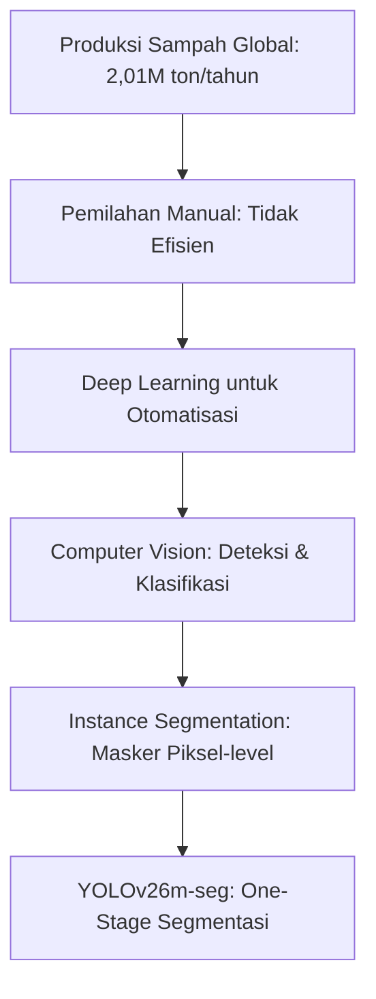
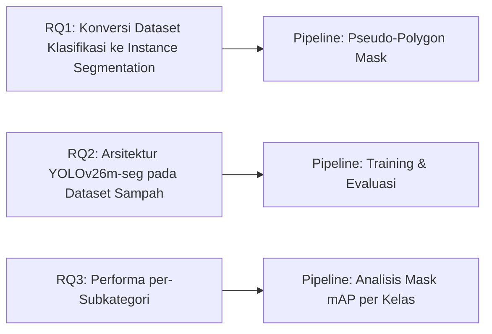
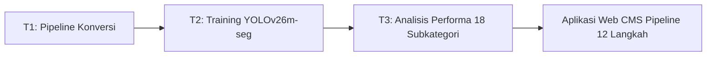

# BAB I: PENDAHULUAN

## 1.1 Latar Belakang

Permasalahan sampah global telah mencapai tingkat mengkhawatirkan. Produksi sampah global mencapai 2,01 miliar ton per tahun dan diproyeksikan meningkat 70% pada 2050. Di Indonesia, timbulan sampah nasional mencapai 175.000 ton per hari. Tantangan utama adalah pemilahan yang masih manual, tidak efisien, dan rawan error.

Perkembangan deep learning dalam computer vision membuka paradigma baru otomatisasi deteksi dan klasifikasi objek. Instance segmentation - yang memprediksi masker piksel-level untuk setiap objek - memberikan informasi lebih detail dibandingkan bounding box detection. Arsitektur YOLO (You Only Look Once) sebagai one-stage detector telah berevolusi hingga generasi YOLOv26 yang mendukung instance segmentation dengan berbagai fitur arsitektur baru.

YOLOv26m-seg sebagai varian segmentasi memperkenalkan MuSGD Optimizer (hybrid SGD + Muon dari Moonshot AI), Semantic Segmentation Loss untuk kualitas masker, Multi-Scale Proto Modules untuk informasi multi-resolusi, dan NMS-Free End-to-End yang menghilangkan post-processing. Fitur-fitur ini memungkinkan segmentasi instans yang akurat tanpa beban komputasi tambahan.

Penelitian ini mengembangkan pipeline instance segmentation untuk klasifikasi sampah ke dalam 18 subkategori (4 kategori utama) menggunakan dataset phenomsg/waste-classification. Pipeline end-to-end mencakup konversi dataset klasifikasi ke format YOLO-seg dengan pseudo-polygon mask, pelatihan YOLOv26m-seg, evaluasi mask mAP, dan aplikasi web untuk inferensi.

## 1.2 Rumusan Masalah

1. Bagaimana mengkonversi dataset klasifikasi sampah 18 kelas ke format instance segmentation dengan pseudo-polygon mask?
2. Bagaimana arsitektur YOLOv26m-seg bekerja pada dataset sampah dengan variasi bentuk dan tekstur antar subkategori?
3. Bagaimana performa segmentasi (mask mAP) pada masing-masing 18 subkategori sampah?

## 1.3 Tujuan Penelitian

1. Mengembangkan pipeline konversi dataset klasifikasi ke format YOLO-seg dengan polygon mask otomatis.
2. Melatih dan mengevaluasi model YOLOv26m-seg untuk segmentasi 18 subkategori sampah.
3. Menganalisis performa per-subkategori dan memberikan recycling advice berdasarkan hasil deteksi.

## 1.4 Manfaat Penelitian

Manfaat Akademis: Memberikan referensi implementasi instance segmentation untuk klasifikasi sampah multi-kelas menggunakan YOLOv26m-seg.

Manfaat Praktis: Menyediakan sistem deteksi sampah dengan 18 subkategori lengkap dengan recycling advice.

Manfaat Lingkungan: Mendukung efektivitas pemilahan sampah melalui segmentasi otomatis berbasis computer vision.

## 1.5 Batasan Penelitian

1. Dataset menggunakan phenomsg/waste-classification (~2.917 citra, 18 subkategori).
2. Masker segmentasi adalah pseudo-polygon (generated, bukan annotated manual).
3. Arsitektur model terbatas pada YOLOv26m-seg (medium variant).

## 1.6 Sistematika Penulisan

| Bab | Isi |
|-----|-----|
| Bab I Pendahuluan | Latar belakang, rumusan masalah, tujuan, manfaat, batasan |
| Bab II Tinjauan Pustaka | CNN, YOLO26 arsitektur, loss functions, augmentasi, metrik evaluasi |
| Bab III Metode Penelitian | Pipeline data, pseudo-mask generation, konfigurasi YOLOv26m-seg, lingkungan eksperimen |
| Bab IV Hasil dan Pembahasan | Dataset statistics, hasil training, per-class mask AP, pembahasan |
| Bab V Penutup | Kesimpulan, saran, kontribusi penelitian |
