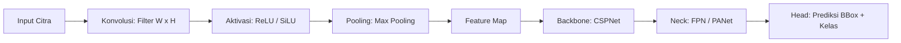
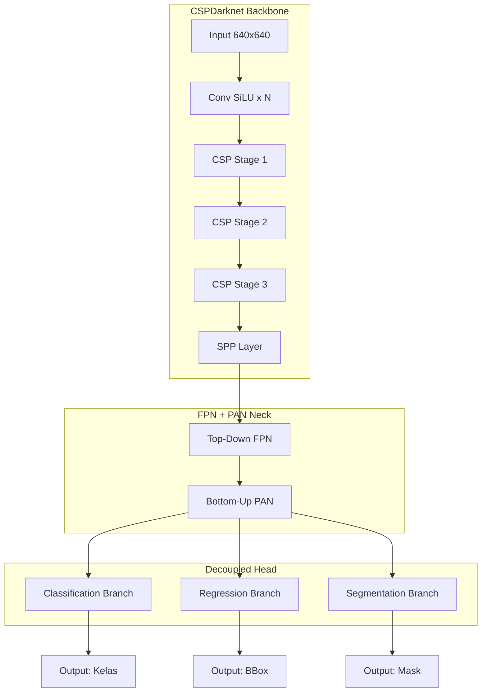
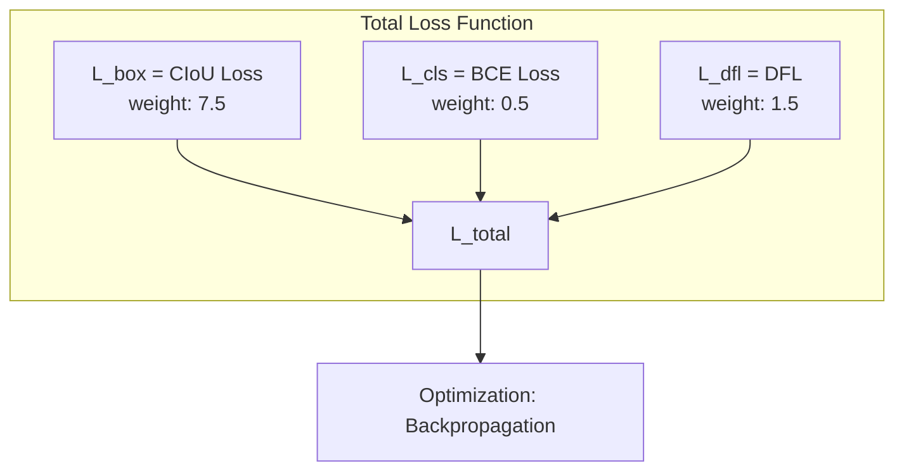
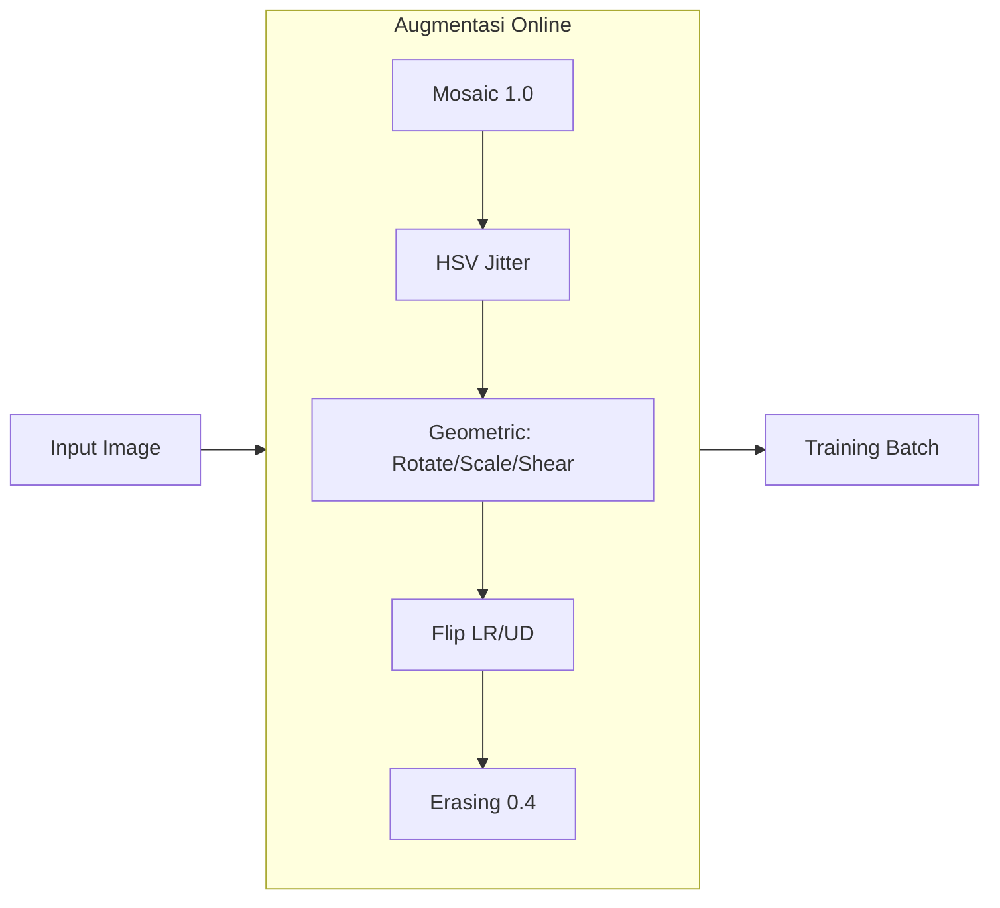

# BAB II: TINJAUAN PUSTAKA

## 2.1 Convolutional Neural Network untuk Deteksi Objek

### 2.1.1 Arsitektur CNN

Convolutional Neural Network (CNN) adalah arsitektur deep learning untuk data grid-like (citra digital). Ekstraksi fitur melalui tiga operasi:

1. **Konvolusi:** Filter $W \in \mathbb{R}^{k \times k \times C_{in} \times C_{out}}$ digeser pada input $X$ menghasilkan feature map $F_{i,j} = \sum_{m=0}^{k-1} \sum_{n=0}^{k-1} W_{m,n} \cdot X_{i+m, j+n} + b$.

2. **Aktivasi Non-Linear:** ReLU $f(x) = \max(0, x)$ mengatasi vanishing gradient. Variant SiLU (Sigmoid Linear Unit) $f(x) = x \cdot \sigma(x)$ digunakan YOLO26.

3. **Pooling:** Max pooling mengambil nilai maksimum dalam window, mereduksi dimensi spasial.

Arsitektur modern terdiri dari:
- **Backbone:** Ekstraksi fitur bertingkat (CSPNet, Darknet, EfficientNet).
- **Neck:** Fusi fitur multi-skala (Feature Pyramid Network, PANet).
- **Head:** Prediksi bounding box + kelas (decoupled head).



### 2.1.2 One-Stage vs Two-Stage Detector

| Aspek | One-Stage (YOLO) | Two-Stage (Faster R-CNN) |
|-------|------------------|--------------------------|
| Pipeline | Regresi langsung | RPN → ROI Pool → Classifier |
| Kecepatan | Real-time (30-300 FPS) | 5-15 FPS |
| Akurasi | Kompetitif (40-55% mAP) | Tinggi (55-65% mAP) |
| Kompleksitas | Sederhana | Kompleks |

YOLO sebagai one-stage detector membagi citra menjadi grid $S \times S$. Setiap cell memprediksi $B$ bounding box dengan confidence $C = P(\text{obj}) \times \text{IoU}$ dan probabilitas kelas $P(\text{class}_i|\text{obj})$.

## 2.2 Arsitektur YOLO26

YOLO26 adalah generasi terbaru Ultralytics YOLO dengan tiga komponen utama:



### 2.2.1 Backbone: CSPNet Termodifikasi

Backbone mengekstraksi fitur melalui Cross Stage Partial Network (CSPNet) - membagi feature map menjadi dua jalur, satu diproses melalui convolution block, satu langsung digabung. Ini mengurangi computational load sambil mempertahankan representasi fitur.

CSPDarknet di YOLO26 menggunakan convolution SiLU + batch normalization + residual shortcut. Strided convolution menggantikan pooling untuk downsampling.

### 2.2.2 Neck: Feature Pyramid Network (FPN)

Neck menggabungkan fitur multi-skala dari backbone untuk mendeteksi objek berbagai ukuran. YOLO26 menggunakan concatenation-based FPN: fitur dari level berbeda digabung melalui upsampling + concatenation, bukan penjumlahan element-wise seperti FPN awal.

### 2.2.3 Head: Decoupled Head

Head terpisah untuk classification dan regression branch:
- **Classification branch:** Memprediksi probabilitas kelas per anchor.
- **Regression branch:** Memprediksi bounding box offsets (x, y, w, h).

Pemisahan memungkinkan setiap branch mengoptimalkan representasi berbeda.

### 2.2.4 Varian Model

| Varian | Parameter | Ukuran (MB) | mAP COCO 50-95 | CPU Speed (ms) |
|--------|-----------|-------------|----------------|-----------------|
| yolo26n | 2,7M | 5,0 | 40,1% | 6,1 |
| yolo26s | 9,8M | 19 | 47,8% | 8,5 |
| yolo26m | 21,2M | 42 | 52,5% | 13,2 |

Penelitian ini menggunakan YOLOv26m-seg (21,2M parameter) - varian medium dengan keseimbangan optimal antara akurasi dan komputasi untuk segmentasi 18 kelas sampah.

## 2.3 Bounding Box Regression dan Loss Functions

### 2.3.1 Representasi Bounding Box

Bounding box dalam format YOLO: $[x_{center}, y_{center}, width, height]$ ternormalisasi terhadap dimensi citra $[0, 1]$.

### 2.3.2 Complete IoU (CIoU) Loss

CIoU (Zheng et al., 2020) mengatasi kelemahan IoU loss dengan tiga term:

$$\mathcal{L}_{CIoU} = 1 - \text{IoU} + \frac{\rho^2(b, b^{gt})}{c^2} + \alpha v$$

Dimana $\rho$ adalah Euclidean distance antar pusat, $c$ diagonal terkecil enclosing box, $v = \frac{4}{\pi^2}(\arctan\frac{w^{gt}}{h^{gt}} - \arctan\frac{w}{h})^2$, dan $\alpha = \frac{v}{(1-\text{IoU})+v}$.

### 2.3.3 Distribution Focal Loss (DFL)

DFL menggeneralisasi representasi bounding box sebagai distribusi probabilitas diskrit alih-alih regresi point estimate. Untuk posisi $y$ dengan batas $y_0, y_n$:

$$\mathcal{L}_{DFL} = -\sum_{i=0}^{n} \text{OneHot}(y_i) \log P(y_i)$$

### 2.3.4 Classification Loss

Binary Cross-Entropy untuk setiap kelas:

$$\mathcal{L}_{BCE} = -\frac{1}{N} \sum_{i=1}^{N} [y_i \log(\hat{y}_i) + (1 - y_i) \log(1 - \hat{y}_i)]$$

### 2.3.5 Total Loss

$$\mathcal{L}_{total} = w_{box} \cdot \mathcal{L}_{CIoU} + w_{cls} \cdot \mathcal{L}_{BCE} + w_{dfl} \cdot \mathcal{L}_{DFL}$$

Dengan bobot default: $w_{box}=7.5$, $w_{cls}=0.5$, $w_{dfl}=1.5$.



## 2.4 Augmentasi Data

Augmentasi meningkatkan generalisasi dan mencegah overfitting, terutama untuk dataset (~2.917 citra). Parameter dari implementasi:

| Augmentasi | Nilai | Efek |
|------------|-------|------|
| Mosaic | 1.0 | Gabung 4 citra, tingkatkan konteks |
| Mixup | 0.3 | Blending 2 citra, tingkatkan generalisasi |
| Copy-paste | 0.4 | Salin objek antar citra (segmentation) |
| HSV-Hue | 0.05 | Variasi warna |
| HSV-Saturation | 0.8 | Variasi intensitas warna |
| HSV-Value | 0.5 | Variasi brightness |
| Scale | 0.5 | Multi-skala |
| Translation | 0.2 | Pergeseran |
| Rotation | 15.0 | Rotasi |
| Shear | 5.0 | Distorsi affine |
| Perspective | 0.0001 | Transformasi perspektif |
| Flip horizontal | 0.5 | Mirroring |
| Flip vertical | 0.2 | Vertikal |
| Random erasing | 0.4 | Occlusion simulation |

Close mosaic pada epoch akhir (epochs // 2) untuk stabilisasi.



## 2.5 Metrik Evaluasi Deteksi Objek

### 2.5.1 Intersection over Union (IoU)

$$\text{IoU} = \frac{|B_p \cap B_{gt}|}{|B_p \cup B_{gt}|}$$

Threshold umum: 0.5 (PASCAL VOC), 0.5-0.95 step 0.05 (COCO).

### 2.5.2 Precision dan Recall

$$\text{Precision} = \frac{TP}{TP+FP}, \quad \text{Recall} = \frac{TP}{TP+FN}$$

Precision-Recall curve: plot precision pada berbagai confidence threshold.

### 2.5.3 Average Precision (AP)

$$\text{AP} = \int_{0}^{1} P(r) dr$$

Interpolasi 101-point: $\text{AP} = \frac{1}{101} \sum_{r \in \{0,0.01,...,1\}} P_{interp}(r)$

### 2.5.4 Mean Average Precision (mAP)

mAP@0.5: AP dengan IoU threshold 0.5.
mAP@0.5:0.95: rata-rata AP pada IoU 0.5 hingga 0.95 step 0.05 (standar COCO).

```mermaid
flowchart LR
    A[Predictions] --> B[Threshold by Confidence]
    B --> C[Compute IoU dengan GT]
    C --> D[TP / FP per kelas]
    D --> E[Precision-Recall Curve]
    E --> F[AP = Area Under PR Curve]
    F --> G[mAP@0.5 = Mean AP at IoU=0.5]
    F --> H[mAP@0.5:0.95 = Mean AP 0.5-0.95]
```

## 2.6 Penelitian Terkait

| Peneliti | Arsitektur | Dataset | Kelas | mAP |
|----------|-----------|---------|-------|-----|
| Redmon et al. (2016) | YOLOv1 | PASCAL VOC | 20 | 63.4% mAP@0.5 |
| Bochkovskiy et al. (2020) | YOLOv4 | MS COCO | 80 | 43.5% mAP@0.5:0.95 |
| Ultralytics (2023) | YOLOv8n | MS COCO | 80 | 37.3% mAP@0.5:0.95 |
| **Penelitian ini** | **YOLOv26m-seg** | **waste-classification** | **18** | **Box 48.5% / Mask 35.7% mAP@0.5** |

## 2.7 Kerangka Konseptual

Penelitian mencakup:
1. **Pipeline Data:** Load dataset klasifikasi (18 kelas) → pseudo-polygon mask generation (Otsu edge detection + fallback geometris) → stratified split 70/15/15 → augmentasi online
2. **Pelatihan Model:** YOLOv26m-seg dengan MuSGD optimizer, Semantic Segmentation Loss, CIoU + BCE + DFL, FP16, cosine LR scheduler
3. **Evaluasi:** Box & Mask mAP@0.5, mAP@0.5:0.95, precision, recall, per-class mask AP@50
4. **Aplikasi:** Web CMS 4-menu (/raw/dataset, /raw/preparation, /raw/training, /raw/deployment) dengan pipeline 12 langkah
