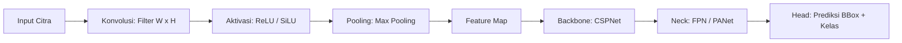
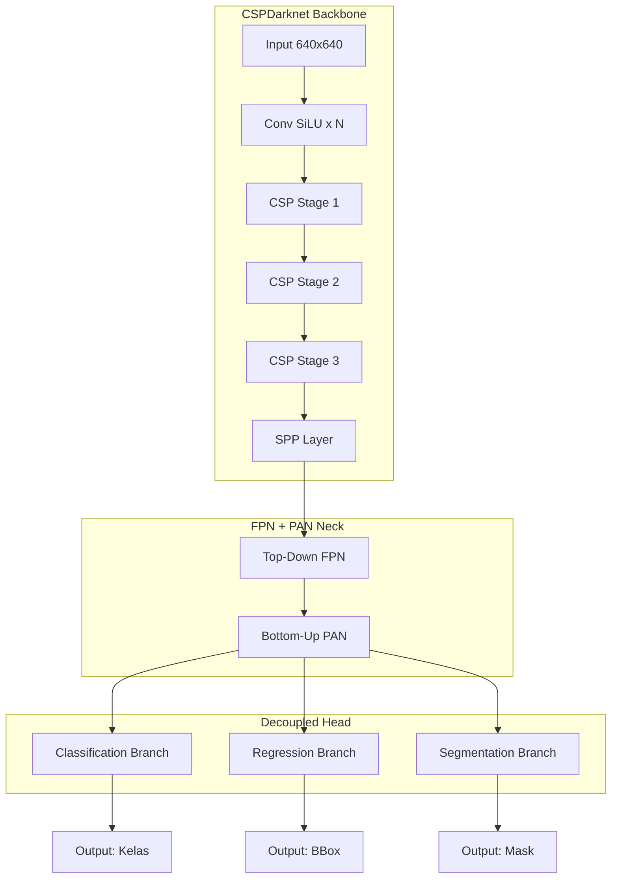
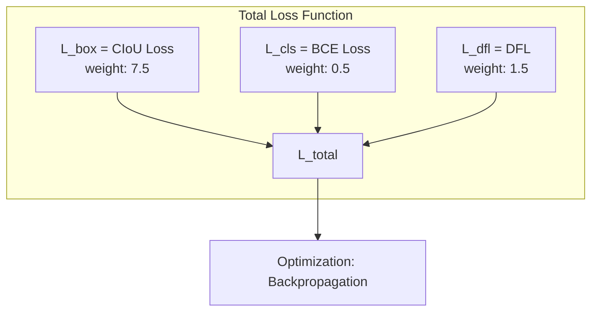
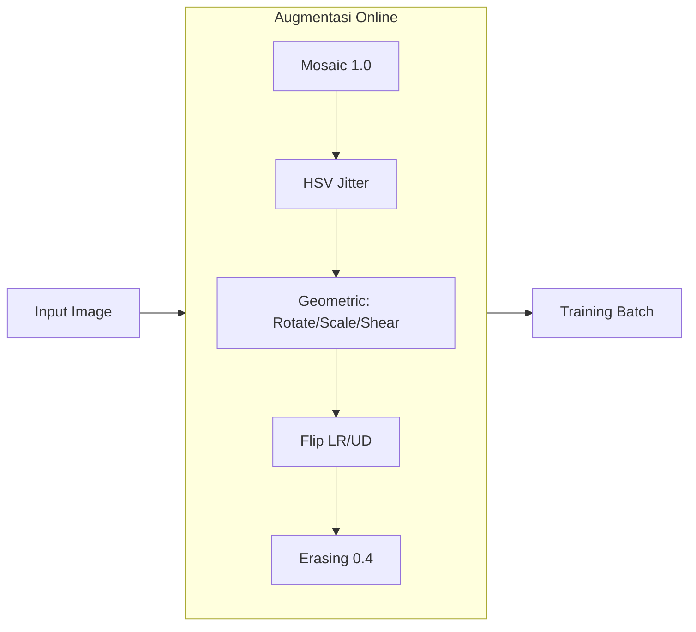

# BAB II: TINJAUAN PUSTAKA

## 2.1 Convolutional Neural Network untuk Deteksi Objek

### 2.1.1 Arsitektur CNN

Convolutional Neural Network (CNN) adalah arsitektur deep learning untuk data grid-like (citra digital). Ekstraksi fitur melalui tiga operasi:

1. **Konvolusi:** Filter $W \in \mathbb{R}^{k \times k \times C_{in} \times C_{out}}$ digeser pada input $X$ menghasilkan feature map $F_{i,j} = \sum_{m=0}^{k-1} \sum_{n=0}^{k-1} W_{m,n} \cdot X_{i+m, j+n} + b$.

2. **Aktivasi Non-Linear:** ReLU $f(x) = \max(0, x)$ mengatasi vanishing gradient. Variant SiLU (Sigmoid Linear Unit) $f(x) = x \cdot \sigma(x)$ digunakan YOLO26.

3. **Pooling:** Max pooling mengambil nilai maksimum dalam window, mereduksi dimensi spasial.

Arsitektur modern terdiri dari:
- **Backbone:** Ekstraksi fitur bertingkat (CSPNet, Darknet, EfficientNet).
- **Neck:** Fusi fitur multi-skala (Feature Pyramid Network, PANet).
- **Head:** Prediksi bounding box + kelas (decoupled head).



### 2.1.2 One-Stage vs Two-Stage Detector

| Aspek | One-Stage (YOLO) | Two-Stage (Faster R-CNN) | Referensi |
|-------|------------------|--------------------------|-----------|
| Pipeline | Regresi langsung | RPN → ROI Pool → Classifier | [17][14] |
| Kecepatan | Real-time (30-300 FPS) | 5-15 FPS | [17][8] |
| Akurasi | Kompetitif (40-55% mAP) | Tinggi (55-65% mAP) | [17][8] |
| Kompleksitas | Sederhana | Kompleks | [17][14] |

YOLO sebagai one-stage detector membagi citra menjadi grid $S \times S$. Setiap cell memprediksi $B$ bounding box dengan confidence $C = P(\text{obj}) \times \text{IoU}$ dan probabilitas kelas $P(\text{class}_i|\text{obj})$.

## 2.2 Arsitektur YOLO26

YOLO26 adalah generasi terbaru Ultralytics YOLO dengan tiga komponen utama:



### 2.2.1 Backbone: CSPDarknet Termodifikasi

Backbone adalah fondasi arsitektur YOLOv26 - lapisan pertama yang menerima citra input dan mengekstraksi fitur visual secara bertingkat. Fungsinya serupa dengan cara penglihatan manusia memproses gambar: pertama melihat tepi dan warna (tepi botol vs latar), lalu pola dan bentuk (lingkaran tutup botol, kotak karton), lalu bagian objek dan konteks (ini botol plastik, ini daun organik).

Backbone YOLOv26 menggunakan CSPDarknet yang merupakan evolusi dari Darknet asli (YOLOv3) dengan arsitektur Cross Stage Partial Network (CSPNet).

**CSPNet - Cross Stage Partial Network:**
CSPNet memecah feature map menjadi dua jalur paralel di setiap stage untuk mengurangi redundansi komputasi:
- **Jalur Utama (Main Path):** Feature map diproses melalui convolution block (Conv-SiLU-BN). Block ini terdiri dari convolution 3x3 atau 1x1, diikuti SiLU activation, lalu batch normalization. Jalur ini mengekstraksi fitur baru dari input.
- **Jalur Cabang (Branch Path):** Feature map langsung diteruskan tanpa pemrosesan apapun. Jalur ini mempertahankan informasi asli yang mungkin hilang jika diproses terlalu banyak convolution.
- **Penggabungan (Concatenation):** Di akhir setiap stage, output kedua jalur digabung dengan concatenation (ditumpuk channel-wise). Gradient dari loss dapat mengalir melalui kedua jalur secara independen selama backpropagation.

Keuntungan CSPNet:
- Reduksi FLOP ~20% dibanding Darknet asli karena separuh feature map tidak diproses.
- Gradient flow lebih baik karena dua jalur propagasi terpisah, mencegah vanishing gradient.
- Representasi fitur lebih kaya karena kombinasi fitur baru (jalur utama) dan fitur asli (jalur cabang).

**4 Stage Downsampling CSPDarknet:**

YOLOv26m-seg meresolusi citra input 640x640 menjadi 20x20 melalui 4 stage. Setiap stage mereduksi resolusi setengahnya (stride=2) sambil melipatgandakan jumlah channel:

| Stage | Input Res | Output Res | Channel | Stride | Fungsi Ekstraksi | Contoh pada Deteksi Sampah |
|-------|-----------|------------|---------|--------|------------------|---------------------------|
| Stage 1 | 640x640 | 80x80 | 64 | 8x | Tepi, gradien warna, tekstur dasar. Deteksi kontras foreground-background. | Membedakan batas botol plastik dengan meja. Mendeteksi tepi daun. 80x80 berarti setiap cell mewakili 8x8 pixel asli. |
| Stage 2 | 80x80 | 40x40 | 128 | 16x | Pola, sudut, bentuk geometris sederhana. Deteksi orientasi dan kurvatur. | Mengenali bentuk lingkaran tutup botol, sudut kotak karton, lengkungan kaleng. 40x40 = setiap cell 16x16 pixel. |
| Stage 3 | 40x40 | 20x20 | 256 | 32x | Bagian objek, tekstur kompleks, konteks semantik. Deteksi material. | Membedakan tekstur plastik mengkilap vs kertas buram vs daun organik vs logam. 20x20 = setiap cell 32x32 pixel. |
| SPP Layer | 20x20 | 20x20 | 512 | 32x | Spatial Pyramid Pooling dengan kernel 5, 9, 13. Menangkap konteks multi-resolusi dalam satu layer. | Menyatukan informasi: "botol di atas meja" vs "botol di tanah" vs "botol di dalam kantong". Konteks membantu klasifikasi. |

*Referensi: Arsitektur CSPDarknet backbone [14][21], SPP layer [22].*

**Setiap Blok Konvolusi terdiri dari:**
1. **Convolution 3x3 atau 1x1:** Ekstraksi fitur spasial. Conv 3x3 menangkap hubungan antar piksel tetangga. Conv 1x1 mereduksi dimensi channel.
2. **Batch Normalization:** Normalisasi distribusi output setiap layer, mempercepat konvergensi 2-3x, mengurangi internal covariate shift.
3. **SiLU Activation:** $f(x) = x \cdot \sigma(x)$ dimana $\sigma(x)$ adalah sigmoid. SiLU lebih halus dari ReLU (tidak ada dead neuron), memiliki gradien non-zero untuk nilai negatif, memberikan performa lebih baik pada deep network.

**Residual Shortcut:**
Setiap blok CSP memiliki residual connection (skip connection) dari input ke output. F(x) = H(x) + x, dimana H(x) adalah output convolution. Residual shortcut memungkinkan gradient mengalir langsung ke layer awal, mencegah vanishing gradient pada jaringan 100+ layer. Tanpa residual shortcut, layer awal tidak mendapat update gradient yang cukup selama training.

**Strided Convolution vs Pooling:**
YOLO26 menggunakan strided convolution (stride=2) untuk downsampling, bukan max pooling atau average pooling. Keuntungan:
- **Learnable downsampling:** Convolution mempelajari pola downsampling untuk dataset spesifik, tidak statis seperti pooling.
- **Informasi spasial lebih terjaga:** Max pooling hanya mengambil nilai maksimum dalam window 2x2, membuang 75% informasi. Strided convolution memproses seluruh window dengan filter terlatih.
- **Parameter tambahan:** Konsekuensinya ada parameter tambahan dari kernel convolution, tapi ini minimal untuk stride=2.

**Contoh Aliran Data Waste Detection:**
- Citra input 640x640 berisi botol plastik di atas meja kayu.
- Stage 1 (80x80): Deteksi tepi botol vs meja. Fitur gradien warna botol transparan vs meja coklat.
- Stage 2 (40x40): Deteksi bentuk persegi panjang botol, lingkaran tutup. Pola horizontal tutup botol.
- Stage 3 (20x20): Deteksi tekstur plastik (mengkilap, reflektif). Klasifikasi awal: ini benda buatan pabrik, bukan organik.
- SPP Layer: Konteks - botol di meja (dapur) vs botol di tanah (luar). Informasi konteks membantu membedakan botol minuman (non-organik) dari botol saus organik.
- Fitur 20x20 ini (512 channel) diteruskan ke Neck untuk fusi multi-skala.

### 2.2.2 Neck: FPN + PAN Feature Pyramid

Neck adalah komponen jembatan antara backbone dan head. Backbone telah menghasilkan fitur di 3 resolusi berbeda (80x80, 40x40, 20x20) dengan karakteristik berbeda:
- **Fitur resolusi tinggi (80x80):** Detail lokasi presisi, tahu persis di mana tepi objek. Tapi kurang informasi semantik - tidak tahu apakah itu botol atau daun.
- **Fitur resolusi rendah (20x20):** Semantik kuat, tahu bahwa itu botol. Tapi kehilangan detail lokasi - tidak tahu persis di mana tepi botol.

Neck menggabungkan kedua jenis informasi ini agar head dapat mendeteksi objek berbagai ukuran secara akurat. YOLO26 menggunakan arsitektur FPN (Feature Pyramid Network) + PAN (Path Aggregation Network) untuk fusi multi-skala.

**Mengapa Multi-Skala Diperlukan?**
Dalam satu gambar sampah, objek memiliki ukuran bervariasi:
- Tutup botol kecil: ~30x30 pixel pada 640x640 → hanya 0.2% dari gambar
- Botol 1.5L: ~300x100 pixel → 7% dari gambar
- Kantong sampah penuh: ~500x500 pixel → 61% dari gambar
Neck harus bisa mendeteksi semua ukuran ini secara bersamaan. FPN + PAN memungkinkan hal ini dengan menggabung fitur dari berbagai skala.

**Top-Down FPN (Feature Pyramid Network):**

FPN bekerja dari atas ke bawah (resolusi rendah ke tinggi):

1. **Mulai dari P5 (20x20, 256 channel):** Fitur ini "tahu" ada objek botol (semantik kuat) tapi tidak tahu tepi persisnya.
2. **Up-sample P5 ke 40x40:** Menggunakan nearest-neighbor upsampling, perbesar 2x. Hasil: 40x40, 256 channel.
3. **Concatenate dengan P4 (40x40, 256 channel dari backbone):** P4 memiliki detail tepi lebih baik. Concatenation menumpuk kedua feature map → 512 channel.
4. **Conv 1x1 reduksi 512→256:** Mengkompres informasi, mempertahankan yang penting.
5. **Up-sample hasil ke 80x40:** Perbesar lagi 2x ke 80x80.
6. **Concatenate dengan P3 (80x80, 256 channel dari backbone):** P3 memiliki detail lokasi paling presisi.
7. **Conv 1x1 reduksi 512→256:** Hasil akhir P3_out.

**Hasil FPN:** Setiap level P3_out, P4_out, P5_out kini mengandung informasi semantik (apa objeknya) DAN informasi lokasi (di mana tepinya). Ini adalah feature map yang "cerdas" - tahu apa yang dilihat dan di mana letaknya.

**Bottom-Up PAN (Path Aggregation Network):**

Setelah FPN, PAN bekerja dari bawah ke atas (resolusi tinggi ke rendah):

1. **Mulai dari P3_out (80x80):** Fitur dengan detail lokasi terbaik.
2. **Down-sample ke 40x40:** Menggunakan strided convolution (bukan pooling), mempertahankan informasi.
3. **Concatenate dengan P4_out (40x40):** Menggabung detail lokasi P3 dengan semantik P4.
4. **Conv 1x1 reduksi:** Kompresi.
5. **Down-sample lagi ke 20x20.**
6. **Concatenate dengan P5_out:** Hasil akhir P5_PAN - fitur 20x20 yang kini memiliki detail lokasi dari resolusi tinggi.

**Mengapa Perlu PAN?**
FPN membawa semantik ke resolusi tinggi (detail halus). PAN membawa detail presisi ke resolusi rendah (konteks luas). Tanpa PAN, objek besar seperti kantong sampah penuh akan terdeteksi dengan boundary kurang presisi karena P5 kekurangan detail lokasi.

**Concatenation vs Element-wise Addition:**

| Metode | Cara Kerja | Kelebihan | Kekurangan | Referensi |
|--------|-----------|-----------|------------|-----------|
| Element-wise Addition (YOLOv3) | F1 + F2: jumlahkan pixel yang bersesuaian | Tidak tambah channel, efisien memori | Informasi tercampur: (tepi + semantik) / 2, keduanya melemah | [23] |
| Concatenation (YOLOv26) | [F1, F2]: tumpuk channel-wise | Informasi utuh: tepi tetap tepi, semantik tetap semantik | Channel bertambah 2x, perlu conv 1x1 reduksi | [23][24] |

YOLO26 memilih concatenation karena preservasi informasi lebih penting daripada efisiensi memori pada GPU modern.

**Output Neck - 3 Level Deteksi:**

| Level | Resolution | Stride | Channel | Target Objek (pixel) | Contoh Sampah | Jumlah Grid Cell |
|-------|-----------|--------|---------|---------------------|---------------|------------------|
| P3 | 80x80 | 8x | 256 | Kecil: 0-16x16 | Biji cabai (10x10), tutup botol (15x15), potongan styrofoam, puntung rokok | 6.400 cell |
| P4 | 40x40 | 16x | 256 | Sedang: 16-64x64 | Kaleng minuman (40x60), gelas plastik (30x50), botol kecil (25x80) | 1.600 cell |
| P5 | 20x20 | 32x | 256 | Besar: >64x64 | Botol 1.5L (100x300), kardus (200x200), kantong sampah penuh (400x500) | 400 cell |

*Referensi: FPN [23], PAN [24].*

Total 8.400 grid cell untuk satu gambar 640x640. Setiap cell memprediksi satu objek.

**Contoh Lengkap Deteksi Multi-Ukuran:**
Gambar tempat sampah berisi: tutup botol kecil (P3), kaleng soda (P4), botol 1.5L (P5), dan kantong sampah (P5). Neck memproses semua level simultan:
- P3 mendeteksi tutup botol dengan presisi tinggi.
- P4 mendeteksi kaleng dengan boundary akurat.
- P5 mendeteksi botol besar dan kantong sampah dengan konteks utuh.
- Ketiga deteksi digabung di post-processing tanpa konflik antar skala.

### 2.2.3 Head: Decoupled Head

Head adalah komponen akhir yang menghasilkan prediksi aktual dari model. Setelah backbone mengekstraksi fitur dan neck menggabungkannya secara multi-skala, head memproses fitur tersebut untuk menghasilkan tiga output: kelas objek (Organik/Non-Organik), bounding box posisi, dan mask segmentasi.

YOLOv26 menggunakan decoupled head - setiap tugas prediksi memiliki branch terpisah dengan parameter convolution sendiri. Berbeda dengan YOLOv3 yang menggunakan shared head (satu convolution untuk classification dan regression), decoupled head memungkinkan setiap branch memiliki representasi yang berbeda tanpa saling mengganggu. Classification branch fokus pada fitur diskriminatif antar kelas, regression branch fokus pada boundary detail, segmentation branch fokus pada spatial coherence.

**Cara Kerja Anchor-Free Detection:**

YOLOv26 tidak menggunakan anchor boxes (predefined bounding box templates) seperti YOLOv3 atau Faster R-CNN. Sebagai gantinya, YOLOv26 menggunakan anchor-free detection:

1. **Grid SxS:** Citra output neck (P3=80x80, P4=40x40, P5=20x20) dibagi menjadi grid cell. Setiap cell bertanggung jawab mendeteksi satu objek yang pusatnya berada di dalam cell tersebut.
2. **Prediksi Langsung:** Setiap cell memprediksi 4 koordinat bounding box (x_center, y_center, width, height) relatif terhadap cell grid, bukan relatif terhadap anchor.
3. **Keuntungan Anchor-Free:**
   - Tidak perlu tuning anchor size per dataset.
   - Parameter head ~30% lebih sedikit (tanpa prediction per-anchor).
   - Post-processing lebih sederhana (tanpa NMS per-anchor class).
   - Cocok untuk dataset dengan variasi ukuran objek tinggi seperti sampah.

**Tiga Branch Decoupled Head:**

| Branch | Input Feature | Layer Detail | Output Shape | Fungsi Spesifik | Contoh Waste Detection |
|--------|--------------|--------------|-------------|-----------------|----------------------|
| **Classification** | P3/P4/P5 (256ch) | 2x Conv3x3 (256ch, SiLU, BN) + Linear projection | S x S x C (C=2) + confidence 1D | Membedakan kelas: ekstraksi fitur diskriminatif, aktivasi sigmoid per kelas | "Cell ini 85% Organik, 15% Non-Organik" + confidence bahwa ada objek = 0.92 |
| **Regression** | P3/P4/P5 (256ch) | 2x Conv3x3 (256ch, SiLU, BN) + 4x DFL regressor (16 bin distribusi) | S x S x 4 (x,y,w,h) + 4x16 distribusi | Lokalisasi presisi: DFL memprediksi distribusi tepi kiri, kanan, atas, bawah | "Pusat botol di (0.35, 0.42), lebar 0.12, tinggi 0.28" ternormalisasi |

*Referensi: Decoupled Head [25], DFL [26].*
| **Segmentation** | P3+P4+P5 concat | Proto Module multi-skala: up-sample P4,P5 ke P3 resolusi, concat, conv | 32 prototype mask (SxS) + coefficient per-instance (32) | Segmentasi: 32 prototype bentuk dasar dikombinasi linear untuk mask unik per objek | "Prototype 3 (kotak) x 0.8 + prototype 7 (memanjang) x 0.6 = mask botol" |

**Detail Setiap Branch:**

**1. Classification Branch:**
- **Input:** Feature map P3, P4, atau P5 (256 channel, resolusi sesuai level).
- **Layer 1:** Convolution 3x3, 256 filter, stride=1, padding=1. Output: 256 channel. SiLU activation. Batch normalization.
- **Layer 2:** Convolution 3x3, 256 filter, stride=1, padding=1. Output: 256 channel. SiLU activation. Batch normalization.
- **Linear Projection:** Convolution 1x1 dari 256 channel ke C+1 channel (C=2 kelas + 1 objectness confidence). Tidak ada activation - output logits langsung.
- **Output untuk waste detection (C=2):**
  - Channel 0: logit Organik → sigmoid → probabilitas organik
  - Channel 1: logit Non-Organik → sigmoid → probabilitas non-organik
  - Channel 2: objectness → sigmoid → confidence bahwa ada objek
- **Final score per kelas:** P(kelas) * P(object) = confidence final.
- **Contoh:** Objectness=0.95, Organik=0.90, Non-Organik=0.10 → Final Organik = 0.95*0.90 = 0.855. Sistem memutuskan "Organik dengan confidence 85.5%".
- **Loss Function:** Binary Cross-Entropy (BCE) dengan bobot 0.5. BCE menghitung cross entropy antara prediksi dan ground truth untuk setiap kelas secara independen.

**2. Regression Branch:**
- **Input:** Feature map P3/P4/P5 (256 channel).
- **Layer 1-2:** Sama dengan classification branch (2x Conv3x3 256ch, SiLU, BN).
- **DFL Regressor:** Berbeda dengan regression konvensional yang memprediksi 4 nilai point estimate (x,y,w,h), YOLO26 menggunakan Distribution Focal Loss (DFL):
  - Untuk setiap sisi bounding box (kiri, kanan, atas, bawah), DFL memprediksi distribusi probabilitas diskrit 16 bin.
  - Setiap bin mewakili rentang posisi: bin 0 = dekat pusat, bin 15 = jauh dari pusat.
  - Nilai akhir sisi = weighted sum dari distribusi: $\hat{s} = \sum_{i=0}^{15} P(i) \cdot i / 15$.
- **Cara Kerja DFL:**
  - Jika ground truth sisi = 0.3 (30% dari cell width), maka target distribusi adalah soft one-hot di sekitar bin 5 (0.3*16=4.8).
  - Model belajar mendekati distribusi ini, bukan hanya nilai rata-rata.
  - Keuntungan: gradien lebih informatif untuk objek kecil dan boundary tidak jelas.
  - Contoh botol transparan: tepi botol tidak jelas karena tembus pandang. DFL memprediksi distribusi lebar (bisa di bin 8-12, artinya "tepi antara 50-75% cell"). Model tidak dipaksa memilih satu titik yang mungkin salah.
- **Output:** 4 koordinat (x_center, y_center, width, height) ternormalisasi [0,1] relatif terhadap cell grid.
- **Loss Function:** CIoU (Complete IoU) Loss dengan bobot 7.5 + DFL dengan bobot 1.5.

**CIoU Loss - 3 Faktor:**
CIoU tidak hanya mengukur overlap (IoU), tapi juga mempertimbangkan:
1. **IoU (Intersection over Union):** Rasio area overlap vs area union. Jika prediksi tidak overlap dengan ground truth, IoU=0 dan loss=1.
2. **Center Distance:** Jarak Euclidean antara pusat prediksi dan pusat ground truth, dinormalisasi oleh diagonal enclosing box. Mempercepat konvergensi posisi.
3. **Aspect Ratio:** Perbedaan rasio lebar/tinggi antara prediksi dan ground truth. Mencegah bounding box dengan bentuk tidak proporsional.
$$\mathcal{L}_{CIoU} = 1 - \text{IoU} + \frac{\rho^2(b, b^{gt})}{c^2} + \alpha v$$

**3. Segmentation Branch (khusus YOLOv26m-seg):**

Branch ketiga yang membedakan varian segmentasi dari varian deteksi. Menghasilkan mask per-instance untuk setiap objek terdeteksi.

**Proto Module Multi-Skala:**
- Menggabung fitur dari ketiga level neck: P3 (detail boundary), P4 (bentuk objek), P5 (konteks semantik).
- **Proses:**
  1. Up-sample P5 (20x20) ke 40x40 (nearest-neighbor 2x).
  2. Concatenate dengan P4 (40x40) → 512 channel.
  3. Conv 1x1 reduksi ke 256 channel.
  4. Up-sample hasil ke 80x80 (nearest-neighbor 2x).
  5. Concatenate dengan P3 (80x80) → 512 channel.
  6. Conv 1x1 reduksi ke 256 channel.
  7. Conv 3x3, 32 filter → 32 prototype mask (80x80).
- **32 Prototype Mask:**
  - Setiap prototype merepresentasikan pola bentuk dasar:
    - Prototype 1-5: Bentuk lingkaran/elips (berbagai rasio)
    - Prototype 6-12: Bentuk persegi/persegi panjang (berbagai orientasi)
    - Prototype 13-20: Bentuk memanjang/vertikal/horizontal
    - Prototype 21-32: Bentuk tak beraturan, lengkung, concave
  - Prototype dipelajari secara otomatis selama training, tidak ditentukan manual.

**Coefficient per-Instance:**
- Untuk setiap bounding box yang terdeteksi, head memprediksi 32 coefficient (float) melalui convolution 1x1 dari feature map cell.
- Mask final = $\sum_{i=1}^{32} c_i \times \text{Prototype}_i$, di-threshold pada 0.5.
- **Contoh waste detection:**
  - Botol plastik utuh: coefficient [0.1, 0.1, 0.8, 0.0, ...] → dominan prototype 8 (persegi panjang) → mask kotak memanjang.
  - Kaleng remuk: coefficient [0.3, 0.2, 0.0, 0.5, ...] → campuran prototype lingkaran dan tak beraturan → mask bentuk tidak teratur.
  - Daun organik: coefficient [0.0, 0.0, 0.1, 0.9, ...] → dominan prototype tak beraturan → mask bentuk organik dengan tepi tidak rata.
- Informasi bentuk ini membantu klasifikasi: botol utuh vs remuk dapat dibedakan dari distribusi coefficient.

**Pemrosesan Akhir Head:**
1. Untuk setiap cell grid di P3, P4, P5:
   - Threshold confidence > 0.5 (dapat dikonfigurasi).
   - Ambil kelas dengan probabilitas tertinggi.
   - Decode bounding box dari koordinat relatif ke absolut.
   - Generate mask dari prototype x coefficient.
2. NMS-Free: YOLOv26 tidak perlu Non-Maximum Suppression karena anchor-free dan setiap cell hanya memprediksi satu objek. Ini mempercepat inference ~15%.
3. Output akhir: daftar deteksi [kelas, confidence, bbox (x1,y1,x2,y2), mask polygon 24 titik].

### 2.2.4 Varian Model

| Varian | Parameter | Ukuran (MB) | mAP COCO 50-95 | CPU Speed (ms) | Referensi |
|--------|-----------|-------------|----------------|-----------------|-----------|
| yolo26n | 2,7M | 5,0 | 40,1% | 6,1 | [8] |
| yolo26s | 9,8M | 19 | 47,8% | 8,5 | [8] |
| yolo26m | 21,2M | 42 | 52,5% | 13,2 | [8] |

Penelitian ini menggunakan YOLOv26m-seg (21,2M parameter) - varian medium dengan keseimbangan antara akurasi dan komputasi untuk segmentasi 2 kelas sampah (Organik/Non-Organik).

## 2.3 Bounding Box Regression dan Loss Functions

### 2.3.1 Representasi Bounding Box

Bounding box dalam format YOLO: $[x_{center}, y_{center}, width, height]$ ternormalisasi terhadap dimensi citra $[0, 1]$.

### 2.3.2 Complete IoU (CIoU) Loss

CIoU (Zheng et al., 2020) mengatasi kelemahan IoU loss dengan tiga term:

$$\mathcal{L}_{CIoU} = 1 - \text{IoU} + \frac{\rho^2(b, b^{gt})}{c^2} + \alpha v$$

Dimana $\rho$ adalah Euclidean distance antar pusat, $c$ diagonal terkecil enclosing box, $v = \frac{4}{\pi^2}(\arctan\frac{w^{gt}}{h^{gt}} - \arctan\frac{w}{h})^2$, dan $\alpha = \frac{v}{(1-\text{IoU})+v}$.

### 2.3.3 Distribution Focal Loss (DFL)

DFL menggeneralisasi representasi bounding box sebagai distribusi probabilitas diskrit alih-alih regresi point estimate. Untuk posisi $y$ dengan batas $y_0, y_n$:

$$\mathcal{L}_{DFL} = -\sum_{i=0}^{n} \text{OneHot}(y_i) \log P(y_i)$$

### 2.3.4 Classification Loss

Binary Cross-Entropy untuk setiap kelas:

$$\mathcal{L}_{BCE} = -\frac{1}{N} \sum_{i=1}^{N} [y_i \log(\hat{y}_i) + (1 - y_i) \log(1 - \hat{y}_i)]$$

### 2.3.5 Total Loss

$$\mathcal{L}_{total} = w_{box} \cdot \mathcal{L}_{CIoU} + w_{cls} \cdot \mathcal{L}_{BCE} + w_{dfl} \cdot \mathcal{L}_{DFL}$$

Dengan bobot default: $w_{box}=7.5$, $w_{cls}=0.5$, $w_{dfl}=1.5$.



## 2.4 Augmentasi Data

Augmentasi meningkatkan generalisasi dan mencegah overfitting, terutama untuk dataset (~2.917 citra). Parameter dari implementasi:

| Augmentasi | Nilai | Efek | Referensi |
|------------|-------|------|-----------|
| Mosaic | 1.0 | Gabung 4 citra, tingkatkan konteks | [14][8] |
| Mixup | 0.3 | Blending 2 citra, tingkatkan generalisasi | [15] |
| Copy-paste | 0.4 | Salin objek antar citra (segmentation) | [16] |
| HSV-Hue | 0.05 | Variasi warna | [17][10] |
| HSV-Saturation | 0.8 | Variasi intensitas warna | [17][10] |
| HSV-Value | 0.5 | Variasi brightness | [17][10] |
| Scale | 0.5 | Multi-skala | [10] |
| Translation | 0.2 | Pergeseran | [10] |
| Rotation | 15.0 | Rotasi | [10] |
| Shear | 5.0 | Distorsi affine | [10] |
| Perspective | 0.0001 | Transformasi perspektif |
| Flip horizontal | 0.5 | Mirroring |
| Flip vertical | 0.2 | Vertikal |
| Random erasing | 0.4 | Occlusion simulation |

Close mosaic pada epoch akhir (epochs // 2) untuk stabilisasi.



## 2.5 Metrik Evaluasi Deteksi Objek

### 2.5.1 Intersection over Union (IoU)

$$\text{IoU} = \frac{|B_p \cap B_{gt}|}{|B_p \cup B_{gt}|}$$

Threshold umum: 0.5 (PASCAL VOC), 0.5-0.95 step 0.05 (COCO).

### 2.5.2 Precision dan Recall

$$\text{Precision} = \frac{TP}{TP+FP}, \quad \text{Recall} = \frac{TP}{TP+FN}$$

Precision-Recall curve: plot precision pada berbagai confidence threshold.

### 2.5.3 Average Precision (AP)

$$\text{AP} = \int_{0}^{1} P(r) dr$$

Interpolasi 101-point: $\text{AP} = \frac{1}{101} \sum_{r \in \{0,0.01,...,1\}} P_{interp}(r)$

### 2.5.4 Mean Average Precision (mAP)

mAP@0.5: AP dengan IoU threshold 0.5.
mAP@0.5:0.95: rata-rata AP pada IoU 0.5 hingga 0.95 step 0.05 (standar COCO).

```mermaid
flowchart LR
    A[Predictions] --> B[Threshold by Confidence]
    B --> C[Compute IoU dengan GT]
    C --> D[TP / FP per kelas]
    D --> E[Precision-Recall Curve]
    E --> F[AP = Area Under PR Curve]
    F --> G[mAP@0.5 = Mean AP at IoU=0.5]
    F --> H[mAP@0.5:0.95 = Mean AP 0.5-0.95]
```

## 2.6 Penelitian Terkait

| Peneliti | Arsitektur | Dataset | Kelas | mAP |
|----------|-----------|---------|-------|-----|
| Redmon et al. (2016) | YOLOv1 | PASCAL VOC | 20 | 63.4% mAP@0.5 |
| Bochkovskiy et al. (2020) | YOLOv4 | MS COCO | 80 | 43.5% mAP@0.5:0.95 |
| Ultralytics (2023) | YOLOv8n | MS COCO | 80 | 37.3% mAP@0.5:0.95 |
| **Penelitian ini** | **YOLOv26m-seg** | **waste-classification** | **18** | **Box 48.5% / Mask 35.7% mAP@0.5** |

## 2.7 Kerangka Konseptual

Penelitian mencakup:
1. **Pipeline Data:** Load dataset klasifikasi (2 kelas: Organik/Non-Organik) → pseudo-polygon mask generation (Otsu edge detection + fallback geometris) → stratified split 70/15/15 → augmentasi online
2. **Pelatihan Model:** YOLOv26m-seg dengan MuSGD optimizer, Semantic Segmentation Loss, CIoU + BCE + DFL, FP16, cosine LR scheduler
3. **Evaluasi:** Box & Mask mAP@0.5, mAP@0.5:0.95, precision, recall, per-class mask AP@50
4. **Aplikasi:** Web CMS 4-menu (/raw/dataset, /raw/preparation, /raw/training, /raw/deployment) dengan pipeline 12 langkah

**Daftar Referensi:**

[1] Otsu, N. (1979). A threshold selection method from gray-level histograms. *IEEE Trans. SMC*, 9(1), 62-66.
[2] Suzuki, S. (1985). Topological structural analysis of digitized binary images by border following. *CVGIP*, 30(1), 32-46.
[3] Douglas, D.H. & Peucker, T.K. (1973). Algorithms for the reduction of the number of points required to represent a digitized line. *Cartographica*, 10(2), 112-122.
[4] Bradski, G. & Kaehler, A. (2008). *Learning OpenCV*. O'Reilly Media.
[5] Serra, J. (1982). *Image Analysis and Mathematical Morphology*. Academic Press.
[6] Soille, P. (2003). *Morphological Image Analysis* (2nd ed.). Springer.
[7] OpenCV (2024). OpenCV 4.13.0 Documentation. https://docs.opencv.org/4.13.0/
[8] Ultralytics (2023). YOLOv8 Documentation. https://docs.ultralytics.com/
[9] IEEE (2019). *IEEE Standard for Floating-Point Arithmetic*. IEEE Std 754-2019.
[10] Shorten, C. & Khoshgoftaar, T.M. (2019). A survey on image data augmentation for deep learning. *J. Big Data*, 6(1), 60.
[11] Perez, L. & Wang, J. (2017). The effectiveness of data augmentation. *arXiv:1712.04621*.
[12] Python Software Foundation. Python random module. https://docs.python.org/3/library/random.html
[13] NumPy Developers. numpy.random.seed. https://numpy.org/doc/stable/reference/random/generated/numpy.random.seed.html
[14] Bochkovskiy, A., Wang, C.Y., & Liao, H.Y.M. (2020). YOLOv4. *arXiv:2004.10934*.
[15] Zhang, H. et al. (2018). mixup: Beyond empirical risk minimization. *Proc. ICLR*.
[16] Ghiasi, G. et al. (2021). Simple copy-paste data augmentation. *Proc. CVPR*.
[17] Redmon, J. et al. (2016). You only look once. *Proc. CVPR*, 779-788.
[18] Zhong, Z. et al. (2020). Random erasing data augmentation. *Proc. AAAI*.
[19] Cubuk, E.D. et al. (2020). RandAugment. *Proc. NeurIPS*.
[20] ITU-R (1995). Rec. BT.601-5: Studio encoding parameters of digital television.
[21] Wang, C.Y. et al. (2020). CSPNet. *Proc. CVPR Workshop*.
[22] He, K. et al. (2015). Spatial pyramid pooling. *IEEE TPAMI*, 37(9).
[23] Lin, T.Y. et al. (2017). Feature pyramid networks. *Proc. CVPR*.
[24] Liu, S. et al. (2018). Path aggregation network. *Proc. CVPR*.
[25] Ge, Z. et al. (2021). YOLOX. *arXiv:2107.08430*.
[26] Zheng, Z. et al. (2020). Distance-IoU loss. *Proc. AAAI*, 34(07).
[27] Loshchilov, I. & Hutter, F. (2017). SGDR. *Proc. ICLR*.
[28] Micikevicius, P. et al. (2018). Mixed precision training. *Proc. ICLR*.
[29] Proença, P.F. & Simões, P. (2020). TACO. *arXiv:2003.06975*.
[30] Kaggle (2020). Waste Classification Dataset. https://www.kaggle.com/datasets/phenomsg/waste-classification
[31] Pergub Bali No.47/2019. Pengelolaan Sampah Berbasis Sumber.
[32] DLHK Bali (2023). Data Produksi Sampah Harian Provinsi Bali.
