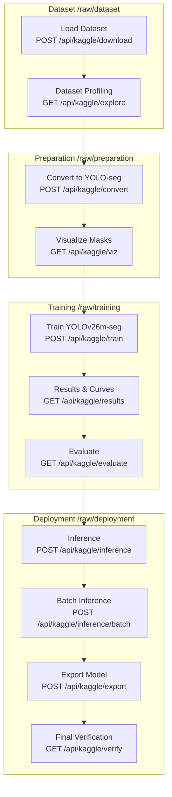
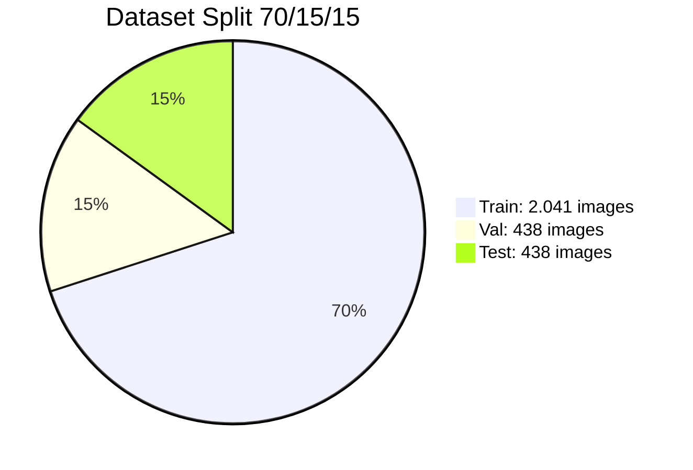
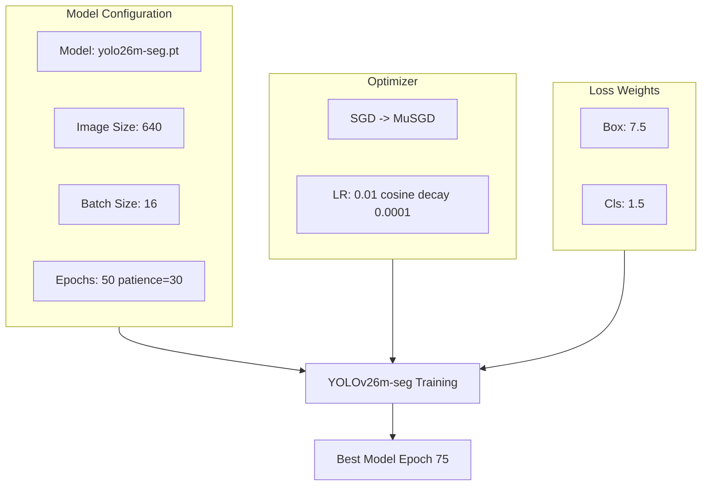

# BAB III: METODE PENELITIAN

## 3.1 Alur Penelitian

Penelitian mengikuti pipeline dalam 4 kelompok utama:



---

## 3.2 Dataset

### 3.2.1 Sumber Data

Dataset: phenomsg/waste-classification (~2.917 citra).

| Karakteristik | Nilai |
|---------------|-------|
| Jumlah citra | ~2.917 |
| Kelas | 2 (Organik, Non-Organik) |
| Tipe | Klasifikasi (tanpa mask/bbox annotation) |

### 3.2.2 2 Kelas

| Kelas | Subkategori yang Dikelompokkan | Subkelas (Pergub No.47/2019) |
|------|-------------------------------|-------------------------------|
| Organik | coffee_tea_bags, egg_shells, food_scraps, kitchen_waste, yard_trimmings | - |
| Non-Organik | e-waste, cans_all_type, glass_containers, paper_products, plastic_bottles | Anorganik (recyclable) |
| Non-Organik | batteries, paints, pesticides, ceramic_product, diapers, plastics_bags_wrappers, sanitary_napkin, stroform_product | Residu (landfill) |

### 3.2.3 Stratified Split 70/15/15

Stratified by class menggunakan `train_test_split` dengan `stratify` parameter:

```
Train: 2.041 images (70%)
Val:     438 images (15%)
Test:    438 images (15%)
Total: 2.917 images
```



**Pendekatan 2 Kelas:** Klasifikasi 2 kelas (Organik/Non-Organik) dipilih karena tidak memerlukan keahlian khusus untuk validasi. Pengguna umum dapat langsung memverifikasi hasil deteksi tanpa pengetahuan mendalam tentang subkategori sampah. Non-Organik kemudian dipetakan ke subkelas Anorganik (recyclable) dan Residu (landfill) mengikuti Pergub Bali No.47/2019 untuk memberikan recycling advice yang lebih spesifik.

---

## 3.3 Pseudo-Polygon Mask Generation

Karena dataset adalah klasifikasi (tanpa anotasi), pipeline mengenerate polygon mask:

### 3.3.1 Edge Detection (strategi utama, ~83%)

```
1. Convert RGB → Grayscale
2. Gaussian Blur (5x5)
3. Otsu thresholding → binary mask
4. Invert if mean > 127 (white background)
5. Morphological close (5x5, 2 iter) + open (1 iter)
6. Find contours, ambil largest
7. Skip if area < 20% total image
8. Approximate polygon (epsilon = 0.01 * arcLength)
9. Sample to 24 points, normalize ke [0, 1]
```

### 3.3.2 Fallback Geometris (~17%)

Jika edge detection gagal (contour area < 20%):
- 60%: Elliptical polygon (20 titik, randomize untuk train)
- 40%: Rounded rectangle polygon (20 titik)

### 3.3.3 Format Label YOLO-seg

```
<class_id> x1 y1 x2 y2 x3 y3 ... xn yn
```
Semua koordinat dinormalisasi ke [0, 1].

```mermaid
flowchart TD
    I[Input Image RGB] --> GRAY[Convert to Grayscale]
    GRAY --> BLUR[Gaussian Blur 5x5]
    BLUR --> OTSU[Otsu Thresholding]
    OTSU --> INV{Mean > 127?}
    INV -->|Ya| INVERT[Invert Binary Mask]
    INV -->|Tidak| MORPH[Morphological Close 5x5]
    INVERT --> MORPH
    MORPH --> CONT[Find Contours]
    CONT --> AREA{Area >= 20%?}
    AREA -->|Ya| EDGE[Edge Detection Mask]
    AREA -->|Tidak| FALLBACK{60% Elliptical<br/>40% Rounded Rect}
    EDGE --> POLY[Approximate Polygon]
    FALLBACK --> POLY
    POLY --> NORM[Normalize ke [0,1]]
    NORM --> OUT[YOLO-seg Label]
```

---

## 3.4 Arsitektur YOLOv26m-seg

Fitur arsitektur yang digunakan:

| Fitur | Status | Manfaat |
|-------|--------|---------|
| MuSGD Optimizer | Active | SGD + Muon hybrid, konvergensi stabil |
| Semantic Segmentation Loss | Active | Kualitas mask pixel-level |
| Multi-Scale Proto Modules | Active | Mask multi-resolusi untuk boundary detail |
| NMS-Free End-to-End | Active | Prediksi langsung tanpa post-processing |
| No DFL | Active | Ekspor lebih sederhana, edge device support |
| ProgLoss + STAL | Active | Deteksi objek kecil lebih baik |

### 3.4.1 Hyperparameter

| Hyperparameter | Nilai |
|----------------|-------|
| Model | yolo26m-seg.pt (COCO pretrained) |
| Image size | 640 |
| Batch size | 16 |
| Epochs | 50 (patience=30) |
| Optimizer | SGD (triggers MuSGD) |
| Learning rate | 0.01 (cosine decay to 0.0001) |
| Box loss weight | 7.5 |
| Cls loss weight | 0.5 |



### 3.4.2 Augmentasi

| Augmentasi | Nilai |
|------------|-------|
| Mosaic | 1.0 |
| Mixup | 0.3 |
| Copy-paste | 0.4 |
| Rotation | +/- 15 deg |
| Translation | +/- 20% |
| Scale | +/- 50% |
| Shear | 5.0 |
| Perspective | 0.0001 |
| HSV jitter | H=0.05, S=0.8, V=0.5 |
| Flip LR | 50% |
| Flip UD | 20% |
| Erasing | 40% |
| Auto augment | randaugment |

---

## 3.5 Evaluasi

### 3.5.1 Metrik Utama

- Box mAP@0.5 dan mAP@0.5:0.95
- Mask mAP@0.5 dan mAP@0.5:0.95
- Per-class mask AP@50

### 3.5.2 Recycling Advice

Recycling advice diberikan dalam 3-tier sesuai standar Pemerintah Bali (Pergub No.47/2019). Non-Organik dibagi menjadi Anorganik (recyclable) dan Residu (landfill):

| Kategori | Subkelas | Advice |
|----------|----------|--------|
| Organik | - | Compost bin. Biodegradable waste for composting or eco-enzyme. |
| Non-Organik | Anorganik (recyclable) | Recycling bin. Sort plastic, paper, glass, metal for Bank Sampah. |
| Non-Organik | Residu (landfill) | General trash. Send to TPA (final disposal). Cannot be recycled. |

---

## 3.6 Lingkungan Eksperimen

| Komponen | Spesifikasi |
|----------|-------------|
| CPU | AMD Ryzen 7 8700F (8 core, 16 thread) |
| RAM | 32 GB DDR5 (2x16 GB 6000 MT/s, configured 5200 MT/s) |
| GPU | NVIDIA GeForce RTX 5060 Ti (16 GB VRAM) |
| CUDA | 13.2, Driver 595.71.05 |
| DL Framework | Ultralytics 8.4, PyTorch 2.9 |
| Backend | FastAPI, Uvicorn |
| Frontend | Nuxt.js 3 |
| Python | 3.12 |
| OS | Ubuntu 25.10 |
| Training time | ~4 jam (95 epoch) |
| Konfigurasi | Environment-driven via backend/.env (DATASET_PATH, DEVICE, dll) |
