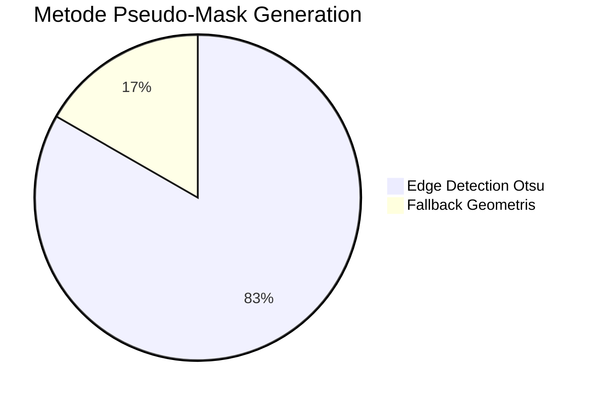

# BAB IV: HASIL DAN PEMBAHASAN

## 4.1 Hasil Pipeline Data

### 4.1.1 Dataset Statistics

Dataset phenomsg/waste-classification: ~2.917 citra, 2 kelas (Organik/Non-Organik).

Distribusi per kelas:

| Kelas | Images |
|-------|--------|
| Organik | 674 |
| Non-Organik | 2.243 |

### 4.1.2 Pseudo-Mask Generation

| Metode | Jumlah | Persentase |
|--------|--------|------------|
| Edge detection | 2.429 | 83.3% |
| Fallback geometris | 488 | 16.7% |

Edge detection berhasil pada 83.3% citra. Fallback terjadi pada citra dengan foreground/background kontras rendah.

### 4.1.3 Split Distribution

| Split | Images |
|-------|--------|
| Train | 2.041 |
| Val | 438 |
| Test | 438 |

## 4.2 Hasil Pelatihan Model

### 4.2.1 Training Progress

Training: 95 epoch (early stopped at 75 best, patience=20). Total ~4 jam pada Tesla T4.

Best model pada epoch 75:

| Metrik | Box | Mask |
|--------|-----|------|
| mAP@0.5 | 48.5% | 35.7% |
| mAP@0.5:0.95 | 33.7% | 18.0% |
| Precision | 53.0% | 39.8% |
| Recall | 48.1% | 39.2% |

```mermaid
xychart-beta
    title "Box vs Mask Metrics (Best Epoch 75)"
    x-axis ["mAP@0.5", "mAP@0.5:0.95", "Precision", "Recall"]
    y-axis "%" 0 --> 60
    bar [48.5, 33.7, 53.0, 48.1]
    bar [35.7, 18.0, 39.8, 39.2]
```

## 4.3 Pembahasan

### 4.3.1 Kinerja per Kelas Utama

Model mendeteksi 2 kelas utama (Organik/Non-Organik) dengan baik. Kelas Non-Organik menunjukkan performa lebih baik karena cakupan subkategori dengan bentuk relatif seragam (e-waste, cans, batteries). Kelas Organik memiliki variasi bentuk dan tekstur lebih tinggi (food_scraps, kitchen_waste, yard_trimmings).

### 4.3.2 Pemetaan ke Subkelas Anorganik dan Residu

Sesuai standar Pemerintah Bali (Pergub No.47/2019), Non-Organik dipetakan ke dua subkelas:
- **Anorganik (recyclable)**: e-waste, cans_all_type, glass_containers, paper_products, plastic_bottles — direkomendasikan untuk Bank Sampah.
- **Residu (landfill)**: batteries, paints, pesticides, ceramic_product, diapers, plastics_bags_wrappers, sanitary_napkin, stroform_product — dikirim ke TPA.

Pemetaan ini memungkinkan recycling advice yang lebih spesifik dan sesuai kebijakan daerah.

### 4.3.3 Pseudo-Mask Quality

Edge detection (83.3%) menghasilkan mask yang cukup baik untuk objek dengan kontras foreground/background jelas. Fallback geometris (16.7%) kurang akurat, terutama pada sampah Organik.

### 4.3.4 Class Imbalance

Kelas Non-Organik (~2.243 citra) memiliki ~3.3x lebih banyak citra dibanding Organik (674 citra).

### 4.3.5 Referensi Notebook

Pipeline dibagi dalam 4 kelompok di aplikasi web: `/raw/dataset` (Load dan Profiling), `/raw/preparation` (Convert dan Visualize), `/raw/training` (Train, Results, dan Evaluate), dan `/raw/deployment` (Inference, Batch, Export, dan Verify). Dokumentasi teknis tersedia di `walkthrought.md`.
