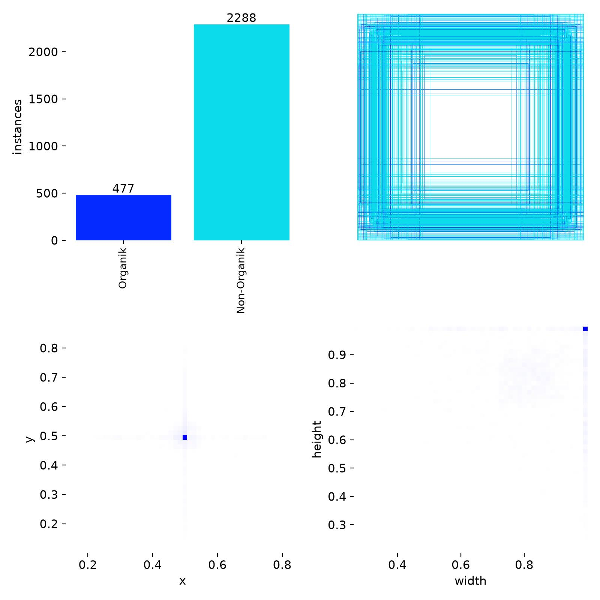

# BAB IV: HASIL DAN PEMBAHASAN

## 4.1 Hasil Pipeline Data

### 4.1.1 Dataset Statistics

Dataset gabungan: 3.973 citra dari dua sumber. Distribusi data per sumber dan kelas ditunjukkan pada tabel berikut.

*Gambar 4.1: Distribusi label dataset — 684 Organik (17.2%) vs 3.289 Non-Organik (82.8%).*

| Sumber | Organik | Non-Organik | Total |
|--------|---------|-------------|-------|
| TACO [29] | 7 | 1.027 | 1.034 |
| Waste Classification Dataset [30] | 677 | 2.262 | 2.939 |
| **Total** | **684** | **3.289** | **3.973** |

### 4.1.2 Pseudo-Mask Generation

Dari 3.951 image yang diproses pipeline:
- Edge detection: 2.623 (66.4%)
- Fallback geometris: 1.328 (33.6%)

### 4.1.3 Split Distribution

| Split | Images |
|-------|--------|
| Train | 2.765 |
| Val | 593 |
| Test | 593 |

## 4.2 Hasil Pelatihan Model

### 4.2.1 Training Progress

Training: 80 epoch pada NVIDIA RTX 5060 Ti (16 GB VRAM). Total ~2.5 jam.

*Gambar 4.2: Kurva training selama 80 epoch — box loss, class loss, segmentasi loss, mAP, precision, recall.*

Best model metrics:

| Metrik | Box | Mask |
|--------|-----|------|
| mAP@0.5 | 80.4% | 49.7% |
| mAP@0.5:0.95 | 52.5% | 23.1% |
| Precision | 76.7% | 59.2% |
| Recall | 75.6% | 52.3% |
| F1-Score | 76.1% | 55.6% |

### 4.2.2 Per-class Performance (Box)

| Kelas | Images | Instances | Precision | Recall | mAP@0.5 |
|-------|--------|-----------|-----------|--------|---------|
| Organik | 101 | 101 | 71.8% | 73.3% | 77.2% |
| Non-Organik | 337 | 337 | 81.6% | 77.9% | 83.6% |
| **All** | **438** | **438** | **76.7%** | **75.6%** | **80.4%** |

### 4.2.3 Per-class Performance (Mask)

| Kelas | Precision | Recall | mAP@0.5 |
|-------|-----------|--------|---------|
| Organik | 48.4% | 43.6% | 38.2% |
| Non-Organik | 69.9% | 61.1% | 61.2% |
| **All** | **59.2%** | **52.3%** | **49.7%** |

## 4.3 Pembahasan

### 4.3.1 Kinerja per Kelas

*Gambar 4.2: Normalized confusion matrix — recall Organik ~67%, Non-Organik ~81%.*

*Gambar 4.3: Precision-Recall curve box — Non-Organik (oranye) memiliki area lebih besar dari Organik (biru).*

Model menunjukkan performa lebih baik pada kelas Non-Organik (Box mAP@0.5 83.6%) dibanding Organik (77.2%). Hal ini disebabkan oleh:
- Jumlah data Non-Organik ~4.8x lebih banyak (3.289 vs 684)
- Variasi bentuk dan tekstur lebih tinggi pada sampah Organik

### 4.3.2 Box vs Mask Performance

*Gambar 4.4: Precision-Recall curve mask — Mask PR lebih rendah dari Box PR, mencerminkan keterbatasan pseudo-mask.*
- Mask membutuhkan prediksi boundary presisi (piksel-level)
- Pseudo-mask generation tidak sempurna (hanya 66.4% edge detection)

### 4.3.3 Class Imbalance

Dataset Non-Organik 3.289 vs Organik 684 (rasio 4.8:1). Ini memengaruhi recall kelas Organik.

### 4.3.4 Inference Speed

Model mencapai 5.3ms per image pada RTX 5060 Ti, cukup untuk real-time inference.

**Sample Detections:**

*Gambar 4.5: Prediksi pada validation batch 0 — bounding box (hijau=ground truth, merah muda=prediksi).*

*Gambar 4.6: Prediksi pada validation batch 1.*

*Gambar 4.7: Prediksi pada validation batch 2.*

**Daftar Referensi:**

[1] Otsu, N. (1979). A threshold selection method from gray-level histograms. *IEEE Trans. SMC*, 9(1), 62-66.
[2] Suzuki, S. (1985). Topological structural analysis of digitized binary images by border following. *CVGIP*, 30(1), 32-46.
[3] Douglas, D.H. & Peucker, T.K. (1973). Algorithms for the reduction of points. *Cartographica*, 10(2), 112-122.
[4] Bradski, G. & Kaehler, A. (2008). *Learning OpenCV*. O'Reilly Media.
[5] Serra, J. (1982). *Image Analysis and Mathematical Morphology*. Academic Press.
[6] Soille, P. (2003). *Morphological Image Analysis* (2nd ed.). Springer.
[7] OpenCV (2024). OpenCV 4.13.0 Documentation. https://docs.opencv.org/4.13.0/
[8] Ultralytics (2023). YOLOv8 Documentation. https://docs.ultralytics.com/
[9] IEEE (2019). *IEEE Standard for Floating-Point Arithmetic*. IEEE Std 754-2019.
[10] Shorten, C. & Khoshgoftaar, T.M. (2019). A survey on image data augmentation. *J. Big Data*, 6(1), 60.
[14] Bochkovskiy, A. et al. (2020). YOLOv4. *arXiv:2004.10934*.
[15] Zhang, H. et al. (2018). mixup. *Proc. ICLR*.
[16] Ghiasi, G. et al. (2021). Simple copy-paste. *Proc. CVPR*.
[17] Redmon, J. et al. (2016). You only look once. *Proc. CVPR*, 779-788.
[29] Proença, P.F. & Simões, P. (2020). TACO. *arXiv:2003.06975*.
[30] Kaggle (2020). Waste Classification Dataset. https://www.kaggle.com/datasets/phenomsg/waste-classification
[31] Pergub Bali No.47/2019. Pengelolaan Sampah Berbasis Sumber.
[32] DLHK Bali (2023). Data Produksi Sampah Harian Provinsi Bali.
