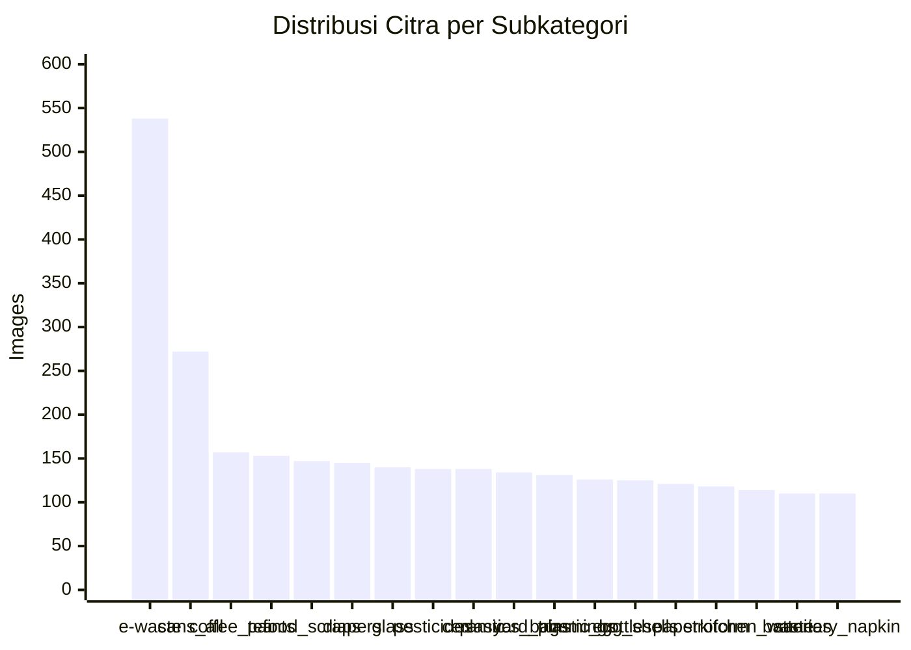
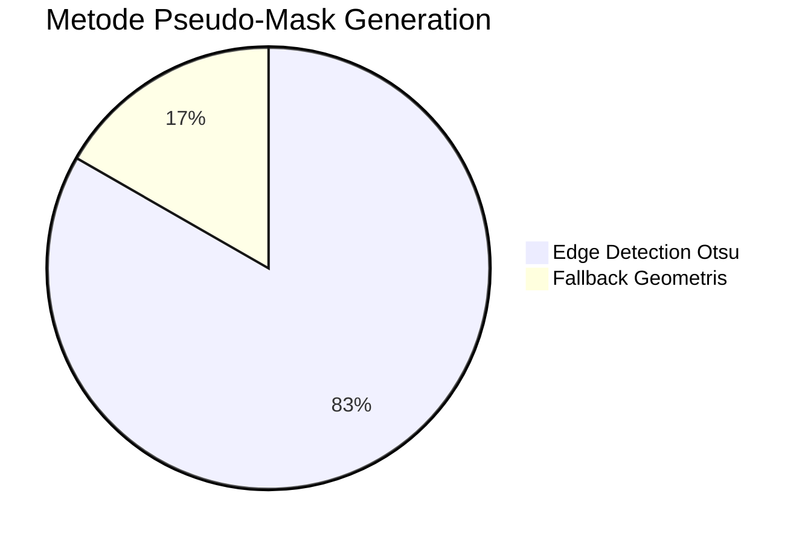
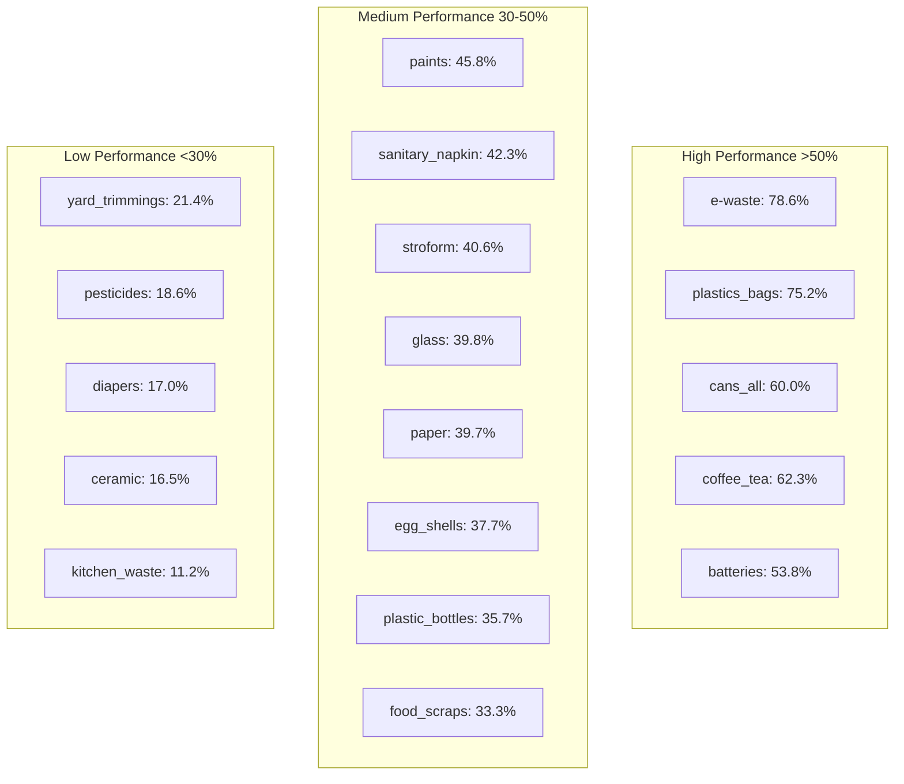
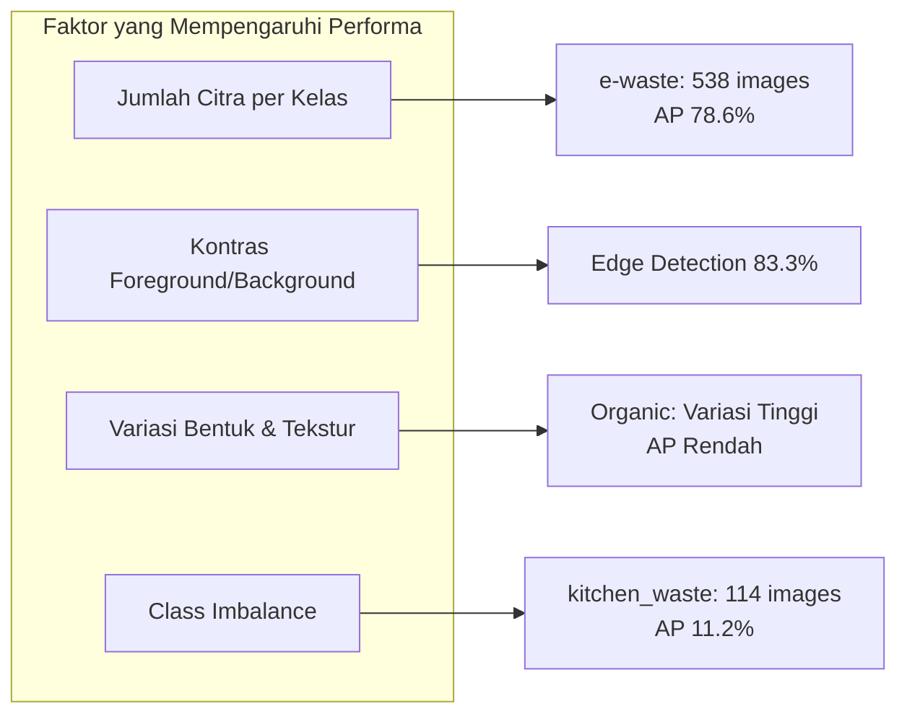

# BAB IV: HASIL DAN PEMBAHASAN

## 4.1 Hasil Pipeline Data

### 4.1.1 Dataset Statistics

Dataset phenomsg/waste-classification: ~2.917 citra, 18 subkategori, 4 kategori utama.

Distribusi per subkategori:

| Subkategori | Images | Main Category |
|-------------|--------|---------------|
| e-waste | 538 | Hazardous |
| cans_all_type | 272 | Recyclable |
| coffee_tea_bags | 157 | Organic |
| paints | 153 | Hazardous |
| food_scraps | 147 | Organic |
| diapers | 145 | Non-Recyclable |
| glass_containers | 140 | Recyclable |
| pesticides | 138 | Hazardous |
| ceramic_product | 138 | Non-Recyclable |
| platics_bags_wrappers | 134 | Non-Recyclable |
| yard_trimmings | 131 | Organic |
| plastic_bottles | 126 | Recyclable |
| egg_shells | 125 | Organic |
| paper_products | 121 | Recyclable |
| stroform_product | 118 | Non-Recyclable |
| kitchen_waste | 114 | Organic |
| batteries | 110 | Hazardous |
| sanitary_napkin | 110 | Non-Recyclable |

### 4.1.2 Pseudo-Mask Generation

| Metode | Jumlah | Persentase |
|--------|--------|------------|
| Edge detection | 2.429 | 83.3% |
| Fallback geometris | 488 | 16.7% |

Edge detection berhasil pada 83.3% citra. Fallback terjadi pada citra dengan foreground/background kontras rendah.

### 4.1.3 Split Distribution

| Split | Images |
|-------|--------|
| Train | 2.041 |
| Val | 438 |
| Test | 438 |

## 4.2 Hasil Pelatihan Model

### 4.2.1 Training Progress

Training: 95 epoch (early stopped at 75 best, patience=20). Total ~4 jam pada Tesla T4.

Best model pada epoch 75:

| Metrik | Box | Mask |
|--------|-----|------|
| mAP@0.5 | 48.5% | 35.7% |
| mAP@0.5:0.95 | 33.7% | 18.0% |
| Precision | 53.0% | 39.8% |
| Recall | 48.1% | 39.2% |

```mermaid
xychart-beta
    title "Box vs Mask Metrics (Best Epoch 75)"
    x-axis ["mAP@0.5", "mAP@0.5:0.95", "Precision", "Recall"]
    y-axis "%" 0 --> 60
    bar [48.5, 33.7, 53.0, 48.1]
    bar [35.7, 18.0, 39.8, 39.2]
```

### 4.2.2 Per-Class Mask AP@50 (Test Set)

| Subkategori | Mask AP@50 | Category |
|-------------|------------|----------|
| e-waste | 78.6% | Hazardous |
| platics_bags_wrappers | 75.2% | Non-Recyclable |
| cans_all_type | 60.0% | Recyclable |
| coffee_tea_bags | 62.3% | Organic |
| batteries | 53.8% | Hazardous |
| paints | 45.8% | Hazardous |
| sanitary_napkin | 42.3% | Non-Recyclable |
| stroform_product | 40.6% | Non-Recyclable |
| glass_containers | 39.8% | Recyclable |
| paper_products | 39.7% | Recyclable |
| egg_shells | 37.7% | Organic |
| plastic_bottles | 35.7% | Recyclable |
| food_scraps | 33.3% | Organic |
| yard_trimmings | 21.4% | Organic |
| pesticides | 18.6% | Hazardous |
| diapers | 17.0% | Non-Recyclable |
| ceramic_product | 16.5% | Non-Recyclable |
| kitchen_waste | 11.2% | Organic |

## 4.3 Pembahasan

### 4.3.1 Kinerja per Kategori

Kategori Hazardous (e-waste 78.6%, batteries 53.8%) dan Recyclable (cans 60.0%) menunjukkan performa terbaik karena bentuk objek yang relatif seragam.

Kategori Organic (kitchen_waste 11.2%, food_scraps 33.3%) menunjukkan performa terendah karena variasi bentuk dan tekstur yang tinggi.

### 4.3.2 Pseudo-Mask Quality

Edge detection (83.3%) menghasilkan mask yang cukup baik untuk objek dengan kontras foreground/background jelas. Fallback geometris (16.7%) kurang akurat, terutama pada kitchen_waste dan food_scraps.

### 4.3.3 Class Imbalance

Subkategori dengan jumlah citra sedikit (kitchen_waste 114, batteries 110, sanitary_napkin 110) cenderung memiliki mask AP lebih rendah. e-waste (538 citra) memiliki performa terbaik.

### 4.3.4 Referensi Notebook

Pipeline dibagi dalam 4 kelompok di aplikasi web: `/raw/dataset` (Load + Profiling), `/raw/preparation` (Convert + Visualize), `/raw/training` (Train + Results + Evaluate), dan `/raw/deployment` (Inference + Batch + Export + Verify). Dokumentasi teknis tersedia di `walkthrought.md`.
