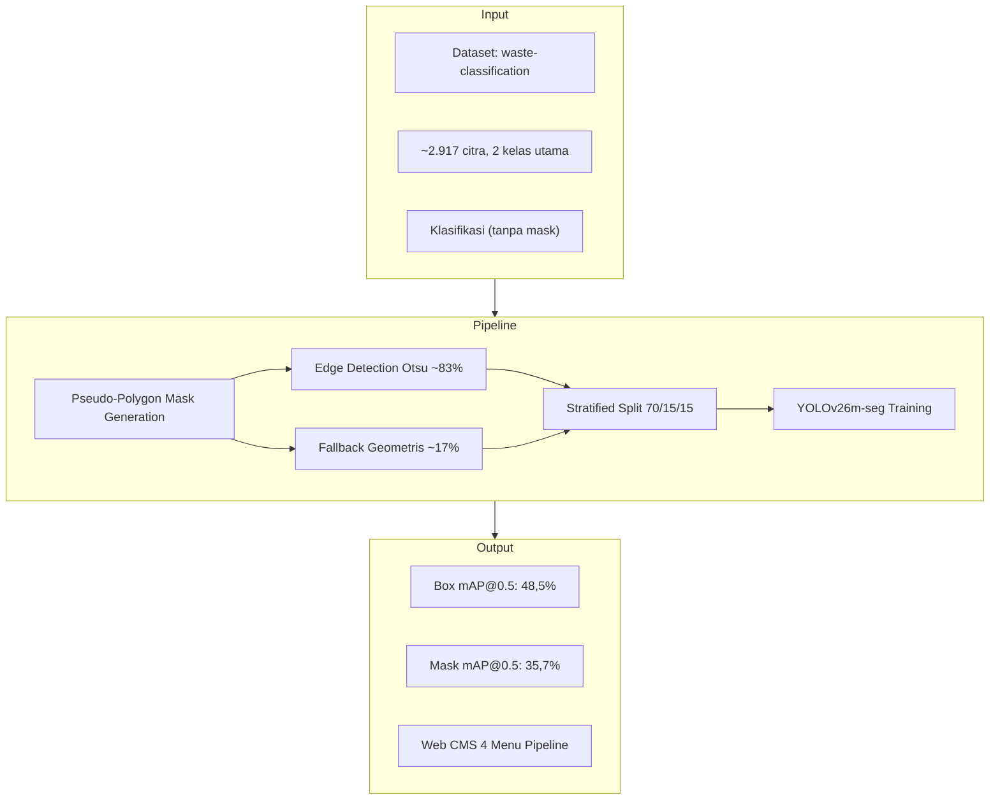
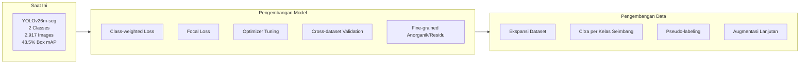
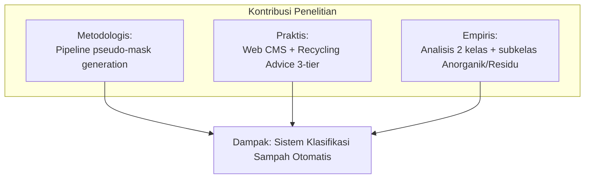

# BAB V: PENUTUP

## 5.1 Kesimpulan

Berdasarkan penelitian yang telah dilakukan:

1. **Pipeline konversi dataset klasifikasi ke instance segmentation** berhasil diimplementasikan dengan pseudo-polygon mask generation menggunakan Otsu thresholding edge detection (~83,3%) dan fallback geometris (~16,7%). Dataset phenomsg/waste-classification dengan 2.917 citra dan 2 kelas (Organik/Non-Organik) berhasil dikonversi ke format YOLO-seg dengan stratified split 70/15/15 (train 2.041, val 438, test 438).

2. **Augmentasi data online** - mosaic 1.0, mixup 0.3, copy-paste 0.4, HSV jitter, geometric transform, random erasing 0.4, dan auto augment randaugment - diterapkan untuk mengatasi keterbatasan dataset ~2.917 citra. Close mosaic di epoch akhir (epochs // 2) mencegah distribusi shift.

3. **Arsitektur YOLOv26m-seg** (21,2M parameter) diimplementasikan sebagai one-stage segmentasi dengan backbone CSPNet, neck concatenation-based FPN, decoupled head dengan segmentation branch, serta fitur MuSGD Optimizer, Semantic Segmentation Loss, Multi-Scale Proto Modules, dan NMS-Free End-to-End. Klasifikasi 2 kelas utama (Organik/Non-Organik) dipetakan ke subkelas Anorganik dan Residu sesuai Pergub No.47/2019 untuk recycling advice yang lebih spesifik.

4. **GPU memory management** menggunakan FP16 mixed precision training dan `cache=True` mengoptimalkan utilisasi VRAM ~11,3GB pada Tesla T4 (15,6 GB). Batch size 16 feasible dengan image size 640.

5. **Model dievaluasi** dengan metrik box dan mask: Box mAP@0.5=48,5%, Mask mAP@0.5=35,7%.

## 5.2 Saran

### 5.2.1 Pengembangan Model

1. **Class-weighted loss:** Implementasikan `cls_pw` untuk menangani class imbalance - beri bobot lebih pada kelas Organik (674 citra) dibanding Non-Organik (2.243 citra).
2. **Focal Loss:** Gantikan BCE dengan focal loss untuk down-weight easy negatives dan fokus ke hard positives.
3. **Optimizer tuning:** Ekspos optimizer (AdamW, MuSGD auto) melalui API untuk eksperimen lebih lanjut.
4. **Cross-dataset validation:** Validasi pada dataset sampah lain (TrashNet, WaDaBa, TACO).
5. **Fine-grained classification:** Kembangkan model untuk membedakan langsung subkelas Anorganik dan Residu dalam satu arsitektur.

### 5.2.2 Pengembangan Data

1. **Ekspansi dataset:** Tambah citra dari lingkungan berbeda (pantai, pasar, jalan, rumah tangga).
2. **Citra per kelas seimbang:** Target distribusi lebih seimbang antara Organik dan Non-Organik.
3. **Pseudo-labeling:** Gunakan model trained untuk memperluas dataset dengan data tambahan.
4. **Augmentasi lanjutan:** Eksplorasi CutMix dan MixUp dengan rasio berbeda.

### 5.2.3 Pengembangan Aplikasi

1. **Parameter tuning via API:** Tambahkan endpoint untuk mengontrol optimizer, learning rate scheduler, dan augmentation toggle dari frontend CMS.
2. **Real-time inference:** Implementasi webcam detection via WebSocket streaming.
3. **Cloud deployment:** Deployment REST API ke cloud untuk akses luas.

## 5.3 Kontribusi Penelitian

1. **Kontribusi Metodologis:** Pipeline end-to-end untuk konversi dataset klasifikasi sampah 2 kelas (Organik/Non-Organik) ke instance segmentation menggunakan pseudo-polygon mask generation - mencakup edge detection Otsu, fallback geometris, konfigurasi augmentasi, dan hyperparameter YOLOv26m-seg.

2. **Kontribusi Praktis:** Web CMS dengan 4 menu pipeline (/raw/dataset, /raw/preparation, /raw/training, /raw/deployment) yang menyederhanakan 12 langkah teknis menjadi antarmuka visual untuk pengguna non-teknis, dilengkapi recycling advice 3-tier (Organik, Anorganik, Residu) sesuai Pergub No.47/2019.

3. **Kontribusi Empiris:** Analisis performa segmentasi pada 2 kelas sampah (Organik/Non-Organik) dengan YOLOv26m-seg, termasuk identifikasi faktor-faktor yang memengaruhi performa seperti class imbalance dan pseudo-mask quality, serta pemetaan ke subklasifikasi Anorganik dan Residu.

