## Slide 1: Judul

**Deteksi dan Klasifikasi Sampah Menggunakan YOLOv26m-seg untuk Instance Segmentation (2 Kelas: Organik/Non-Organik)**

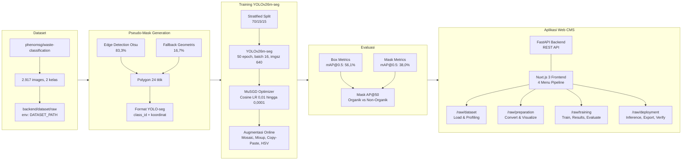

*Selamat pagi/siang. Presentasi ini akan memaparkan penelitian mengenai deteksi dan klasifikasi sampah menggunakan YOLOv26m-seg untuk instance segmentation pada 2 kelas (Organik/Non-Organik). Penelitian mencakup pipeline end-to-end dari konversi dataset klasifikasi ke format segmentasi, pelatihan model, evaluasi, hingga implementasi aplikasi web.*

---

## Slide 2: Outline Presentasi

1. **Latar Belakang** - Krisis sampah global & Indonesia
2. **Rumusan Masalah & Tujuan** - 3 research questions, 3 goals
3. **Landasan Teori** - CNN, YOLOv26, Loss Functions
4. **Dataset** - phenomsg/waste-classification, 2 kelas (Organik/Non-Organik)
5. **Metode** - Pseudo-mask, Pipeline, Arsitektur, Hyperparameter
6. **Hasil** - Dataset stats, Training metrics, Per-class AP
7. **Pembahasan** - Analisis performa per kategori
8. **Aplikasi Web** - CMS Pipeline 12 langkah
9. **Kesimpulan & Saran** - Penutup

*Berikut adalah outline presentasi. Terdapat 9 segmen utama yang mencakup seluruh aspek penelitian dari latar belakang hingga kesimpulan.*

---

## Slide 3: Latar Belakang

**Krisis Sampah di Bali:**

- Bali menghasilkan **~1.340 ton sampah per hari** (DLHK Bali)
- Pariwisata menyumbang **60% dari total sampah** - 3,6 juta ton/tahun dari sektor pariwisata
- Komposisi: **60% organik, 30% plastik, 10% lainnya**
- Pemilahan manual masih dominan - tidak efisien untuk volume sebesar ini

**Solusi Deep Learning dan Standar Pemerintah Bali:**

Pemerintah Bali melalui **Pergub No.47/2019** menetapkan 3 kategori sampah: **Organik**, **Anorganik** (recyclable), dan **Residu** (landfill). Penelitian ini mengadopsi standar tersebut.

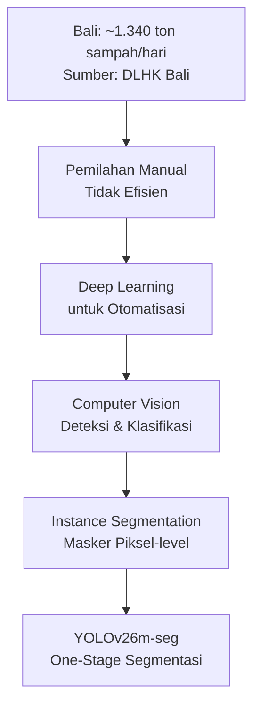

Pendekatan 2 kelas (Organik/Non-Organik) dipilih karena tidak memerlukan keahlian khusus untuk validasi. Masyarakat umum dapat membedakan sampah organik dari non-organik tanpa pelatihan, selaras dengan Pergub Bali No.47/2019 yang menyederhanakan pemilahan menjadi Organik, Anorganik, dan Residu.

*Instance segmentation dipilih karena menghasilkan masker piksel-level yang digunakan sebagai ground truth untuk training model YOLOv26m-seg dan metrik evaluasi mask mAP. Dataset klasifikasi dikonversi ke format segmentasi melalui pipeline pseudo-polygon mask. Klasifikasi mengacu pada standar Pergub No.47/2019: Organik, Anorganik, Residu.*

---

## Slide 4: Rumusan Masalah

| RQ | Rumusan Masalah | Pendekatan |
|----|-----------------|------------|
| RQ1 | Bagaimana mengkonversi dataset klasifikasi ke format instance segmentation dengan pseudo-polygon mask? | Pipeline edge detection Otsu + fallback geometris |
| RQ2 | Bagaimana arsitektur YOLOv26m-seg bekerja pada dataset sampah dengan variasi bentuk dan tekstur? | Training & evaluasi dengan mask mAP |
| RQ3 | Bagaimana performa segmentasi (mask mAP) pada kelas Organik dan Non-Organik? | Analisis per-class AP, identifikasi bias |

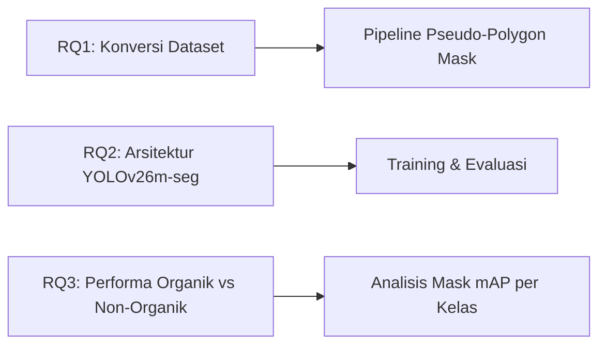

*Tiga rumusan masalah ini menjadi fondasi penelitian: konversi data, implementasi model, dan analisis performa per kelas.*

---

## Slide 5: Tujuan Penelitian

1. **T1:** Mengembangkan pipeline konversi dataset klasifikasi `backend/dataset/raw` → format YOLO-seg dengan polygon mask otomatis (edge detection 83,3% + fallback 16,7%)

2. **T2:** Melatih dan mengevaluasi **YOLOv26m-seg** untuk segmentasi 2 kelas sampah (Organik/Non-Organik)

3. **T3:** Menganalisis performa per-subkategori dan memberikan **recycling advice** berdasarkan hasil deteksi

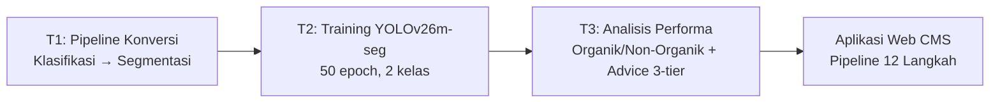

*Tujuan bersifat kumulatif: output T1 menjadi input T2, hasil T2 dianalisis di T3, dan seluruh pipeline diwujudkan dalam aplikasi web CMS.*

---

## Slide 6: Landasan Teori - CNN

**Convolutional Neural Network** - arsitektur deep learning untuk data grid-like (citra digital)

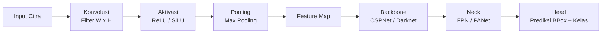

**3 Operasi Dasar:**
- **Konvolusi:** Filter digeser pada input → feature map
- **Aktivasi:** SiLU $f(x) = x \cdot \sigma(x)$ - digunakan YOLOv26
- **Pooling:** Max pooling - reduksi dimensi spasial

**Arsitektur Modern:** Backbone (ekstraksi) → Neck (fusi multi-skala) → Head (prediksi)

*CNN menjadi fondasi deteksi objek modern. YOLOv26 menggunakan SiLU activation dan CSPNet backbone yang memisahkan feature map menjadi dua jalur untuk efisiensi komputasi.*

---

## Slide 7: Landasan Teori - Arsitektur YOLOv26

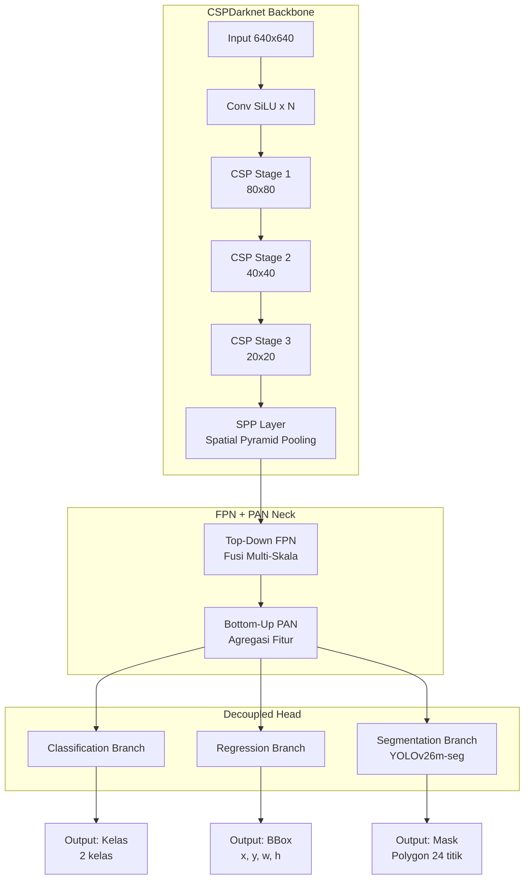

**3 Komponen Utama YOLOv26 - Cara Kerja dari Input ke Output:**

**A. Backbone — Ekstraksi Fitur Hierarkis (640×640 → 20×20)**

| Sub-Layer | Input → Output | Detail Operasi | Sampah Context |
|-----------|---------------|----------------|----------------|
| **Stem Conv** | 640×640×3 → 320×320×C1 | Conv k7 s2 p3 → BatchNorm → SiLU. Reduksi 4× resolusi awal tanpa kehilangan informasi | Stem tangkap tepi dasar: perbedaan warna hijau daun vs putih styrofoam, gradien botol kaca transparan vs background |
| **Stage 1 (P2)** | 320×320×C1 → 160×160×C2 | CSPLayer: split → 2×Conv → concat → Conv. C1=64, C2=128. 1 block. Strided conv k3 s2 untuk turun resolusi | Stage 1 deteksi tepi dan kontur: outline kantong plastik, batas kaleng aluminium, tekstur permukaan daun |
| **Stage 2 (P3)** | 160×160×C2 → 80×80×C3 | CSPLayer: 2 block. C2=128, C3=256. Split ratio 1:1 → proses partial → concat → Conv 1×1. ≈30% FLOP hemat vs non-CSP | Stage 2 deteksi bentuk geometrik: lingkaran tutup botol, kotak kardus, silinder kaleng. Membedakan botol utuh vs remuk dari rasio aspek |
| **Stage 3 (P4)** | 80×80×C3 → 40×40×C4 | CSPLayer: 3 block. C3=256, C4=512. Split-process-concat tiap block, residual shortcut tiap 2 conv | Stage 3 bedakan tekstur: plastik mengkilap (refleksi tinggi) vs daun organik (permukaan matte, venasi). Deteksi pola: serat kertas, pecahan keramik |
| **Stage 4 (P5)** | 40×40×C4 → 20×20×C5 | CSPLayer: 3 block. C4=512, C5=512. Resolusi terendah, konteks tertinggi | Stage 4 pahami konteks: "apakah objek ini botol di meja dapur (anorganik) vs botol di tempat sampah (residu)?" — konteks spasial global |
| **SPP Layer** | 20×20×C5 → 20×20×C5×4 | Spatial Pyramid Pooling: 3 parallel maxpool (k5, k9, k13) + identity → concat → Conv. Tangkap konteks multi-skala tanpa resize | SPP tangkap variasi ukuran: botol 600ml vs botol 1.5L, bacth daun kecil vs tumpukan sampah besar. Pool berbedaa ukuran = reseptif field berbeda |

**B. Neck — Fusi Multi-Skala FPN+PAN (Top-Down + Bottom-Up)**
| Sub-Layer | Input → Output | Detail Operasi | Sampah Context |
|-----------|---------------|----------------|----------------|
| **Top-Down FPN** | P5(20×20) → P4(40×40) → P3(80×80) | Upsample 2× → concat dengan skip-stage → Conv k3. Bawa semantik level atas ke resolusi tinggi | P5 tahu "ini botol", FPN bawa info itu ke P4 perbaiki batas botol, ke P3 deteksi detail: label, tutup, goresan. Semua level tahu "ada botol" |
| **Bottom-Up PAN** | P3(80×80) → P4(40×40) → P5(20×20) | Conv k3 s2 → concat skip-stage → Conv k3. Bawa lokasi presisi dari resolusi tinggi ke bawah | PAN balikkan: P3 tahu posisi presisi tutup botol (80×80), bawa ke P4 refine posisi botol (40×40), ke P5 pastikan tumpukan sampah terdeteksi (20×20) |
| **Output Layer (3 skala)** | P3(80×80), P4(40×40), P5(20×20) | Tiap level → Conv 1×1 → channel adjust ke dimensi head. 3 level deteksi: small, medium, large | P3 deteksi objek kecil: biji, potongan styrofoam kecil, tutup botol, puntung rokok. P4: kaleng, gelas, botol sedang. P5: botol 1.5L, kardus, tumpukan sampah. Semua simultan |

**C. Head — Prediksi Decoupled (Anchor-Free, Grid-Based)**
| Branch | Input → Output | Detail Operasi | Sampah Context |
|--------|---------------|----------------|----------------|
| **Classification** | Grid cell features → 2 kelas | 2×Conv(k3)+SiLU → Conv(k1) → sigmoid. Tiap sel grid prediksi probabilitas tiap kelas. Anchor-free: tiap sel deteksi objek jika pusatnya di sel itu | Sel grid (640/32=20) aktif jika pusat objek di dalamnya. "Daun di koordinat (124,360)" → sel (4,11) aktif. Output: P(Organik)=0.92, P(Non-Organik)=0.08. Threshold >0.5 → Organik |
| **Regression (BBox)** | Grid cell features → 4 koordinat | DFL (Distribution Focal Loss): prediksi distribusi probabilitas diskrit untuk tiap sisi (kiri, kanan, atas, bawah). Integrasi distribusi → koordinat kontinu. Tanpa anchor prior. | DFL prediksi 4 sisi: kiri=12px, kanan=38px, atas=5px, bawah=45px relatif dari pusat grid. Botol presisi tinggi: sisi kiri/kanan rapat (distribusi sempit). Sampah remuk: distribusi lebar (bentuk tak beraturan). |
| **Segmentation (Mask)** | Grid features → prototype coeff | 32 prototype mask multi-skala dari P3..P5. Tiap instance prediksi 32 coefficient. Dot product coefficient × prototype → mask kasar. Upsample + crop → polygon 24 titik via marching squares | Prototype 32 mask: #1 deteksi tepi vertikal (botol), #2 deteksi area melingkar (tutup), #3 deteksi tekstur (daun). Coefficient tentukan kombinasi: botol = 0.8×#1 + 0.3×#2 + 0.1×#3 → bentuk botol presisi. Polygon 24 titik output final |

**Aliran Data Lengkap:**
Input 640×640 → Stem → Stage1(P2:160×160) → Stage2(P3:80×80) → Stage3(P4:40×40) → Stage4(P5:20×20) → SPP → FPN(P5→P4→P3) → PAN(P3→P4→P5) → 3 Head (Cls + Reg + Mask) → Output: kelas, bbox, polygon 24 titik. Total 149 layers, 23.5M parameters, 121.2 GFLOPs (varian medium).

*YOLOv26 adalah generasi terbaru Ultralytics YOLO. Arsitektur CSPDarknet + FPN+PAN neck + decoupled head dengan segmentation branch. Varian medium (m) dipilih untuk keseimbangan parameter (23.5M) dan akurasi segmentasi. Total 121.2 GFLOPs per inference — feasible pada GPU mid-range.*

---

## Slide 8: Landasan Teori - Loss Functions

**Total Loss YOLOv26m-seg:**

$$\mathcal{L}_{total} = w_{box} \cdot \mathcal{L}_{CIoU} + w_{cls} \cdot \mathcal{L}_{BCE} + w_{dfl} \cdot \mathcal{L}_{DFL}$$

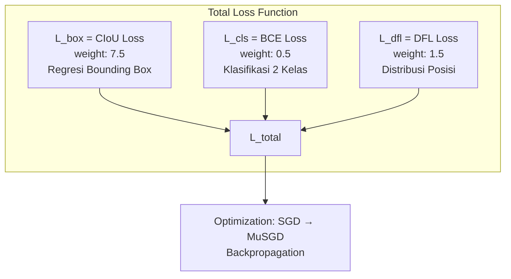

| Loss | Fungsi | Bobot |
|------|--------|-------|
| CIoU | Regresi bounding box (jarak pusat, aspek rasio) | 7.5 |
| BCE | Klasifikasi 2 kelas | 0.5 |
| DFL | Distribusi probabilitas posisi diskrit | 1.5 |

*CIoU mengatasi kelemahan IoU loss dengan menambahkan penalty term untuk jarak pusat dan aspek rasio. DFL menggeneralisasi regresi sebagai distribusi probabilitas - memberikan gradien lebih informatif pada objek kecil.*

---

## Slide 9: Dataset - phenomsg/waste-classification

**Sumber:** phenomsg/waste-classification (Kaggle) - ~2.917 citra

**Struktur Dataset:**
- **Path:** `backend/dataset/raw` (env-driven via `DATASET_PATH`)
- **2 Kelas:** Organik, Non-Organik
- Klasifikasi (tanpa mask/bbox annotation)

| Kelas | Subkategori yang Dikelompokkan | Jumlah |
|-------|-------------------------------|--------|
| Organik | coffee_tea_bags, egg_shells, food_scraps, kitchen_waste, yard_trimmings | 674 |
| Non-Organik | Anorganik (recyclable): e-waste, cans_all_type, glass_containers, paper_products, plastic_bottles<br/>Residu (landfill): batteries, paints, pesticides, ceramic_product, diapers, plastics_bags_wrappers, sanitary_napkin, stroform_product | 2.243 |

*Ketidakseimbangan kelas terlihat jelas: Non-Organik (2.243) ~3.3x lebih banyak dari Organik (674). Non-Organik terbagi menjadi Anorganik (recyclable) dan Residu (landfill) sesuai Pergub No.47/2019.*

---

## Slide 10: Dataset Split - Stratified 70/15/15

**Stratified Split** menggunakan `train_test_split` dengan parameter `stratify` - mempertahankan proporsi kelas di setiap split.

| Split | Images | Persentase |
|-------|--------|------------|
| **Train** | 2.041 | 70% |
| **Val** | 438 | 15% |
| **Test** | 438 | 15% |
| **Total** | 2.917 | 100% |

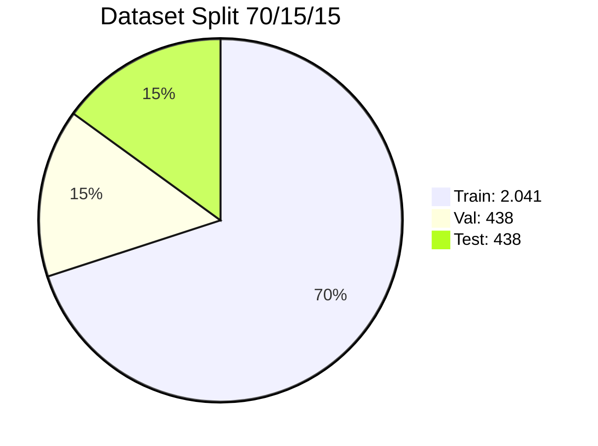

**Akses via Frontend:**
- `/raw/dataset` - eksplorasi & profiling dataset
- `/raw/preparation` - konversi & visualisasi
- `/raw/training` - training model
- `/raw/deployment` - inferensi & export

**Backend API:** `/api/kaggle/explore` - distribusi per kelas, sample URLs via `/api/dataset/file/raw/`

*Stratified split memastikan distribusi kelas proporsional di setiap split. Dataset exploration tersedia di route `/raw/dataset` dengan data dari endpoint `/api/kaggle/explore`.*

---

## Slide 11: Pseudo-Polygon Mask Generation

Dataset klasifikasi → format YOLO-seg membutuhkan polygon mask. Pipeline dua strategi:

```mermaid
flowchart TD
    A[Input Image<br/>RGB] --> B[Edge Detection<br/>Strategi Utama]
    A --> C[Fallback Geometris<br/>~17%]
    
    subgraph Edge[Edge Detection Pipeline - 83,3%]
        B1[Convert RGB → Grayscale] --> B2[Gaussian Blur 5x5]
        B2 --> B3[Otsu Thresholding<br/>Binary Mask]
        B3 --> B4[Invert if mean > 127]
        B4 --> B5[Morphological Close 5x5<br/>2 iter + Open 1 iter]
        B5 --> B6[Find Contours<br/>Ambil Largest]
        B6 --> B7{Area > 20%<br/>total image?}
        B7 -->|Yes| B8[Approximate Polygon<br/>ε = 0.01 × arcLength]
        B8 --> B9[Sample to 24 points<br/>Normalize [0,1]]
    end
    
    subgraph Fallback[Fallback Geometris - 16,7%]
        C1[60%: Elliptical Polygon<br/>20 titik + randomize] --> C2
        C2[40%: Rounded Rectangle<br/>20 titik] --> C3
    end
    
    B7 -->|No| Fallback
    
    B9 --> D[YOLO-seg Label Format<br/>class_id x1 y1 x2 y2 ... xn yn]
    C3 --> D
```

**Format Label YOLO-seg:** `<class_id> x1 y1 x2 y2 x3 y3 ... xn yn` (24 titik, ternormalisasi [0,1])

*Edge detection Otsu berhasil pada 83,3% citra (foreground/background kontras jelas). Fallback geometris digunakan untuk 16,7% sisanya - ellipse (60%) atau rounded rectangle (40%).*

---

## Slide 12: Pipeline 4 Kelompok - 12 Langkah

Pipeline end-to-end dibagi dalam 4 kelompok dengan route spesifik:

```mermaid
flowchart LR
    subgraph G1[Kelompok 1: Dataset Prep]
        A1[Load Dataset<br/>backend/dataset/raw] --> A2[Dataset Profiling<br/>Distribusi, Sample]
    end
    
    subgraph G2[Kelompok 2: Convert & Viz]
        B1[Convert to YOLO-seg<br/>Pseudo-Polygon Mask] --> B2[Visualize Polygon<br/>Overlay on Samples]
    end
    
    subgraph G3[Kelompok 3: Train & Eval]
        C1[Train YOLOv26m-seg<br/>50 epoch] --> C2[Training Curves<br/>Results] --> C3[Evaluation<br/>Box + Mask Metrics]
    end
    
    subgraph G4[Kelompok 4: Inference & Export]
        D1[Inference<br/>Upload + Mask + Advice] --> D2[Batch Inference<br/>Test Set] --> D3[Export Model<br/>ONNX/TorchScript] --> D4[Final Verification<br/>Per-Class mAP Report]
    end
    
    A2 --> B1
    B2 --> C1
    C3 --> D1
```

**Frontend Routes:**
| Kelompok | Route | Backend API |
|----------|-------|-------------|
| Dataset Prep | `/raw/dataset` | `/api/kaggle/explore`, `/api/kaggle/download` |
| Convert & Viz | `/raw/preparation` | `/api/kaggle/convert`, `/api/kaggle/viz` |
| Train & Eval | `/raw/training` | `/api/kaggle/train`, `/api/kaggle/evaluate` |
| Inference & Export | `/raw/deployment` | `/api/kaggle/inference`, `/api/kaggle/export`, `/api/kaggle/verify` |

*Pipeline 12 langkah terintegrasi dalam CMS. Setiap kelompok memiliki halaman frontend spesifik di Nuxt.js 3 dan backend endpoint FastAPI.*

---

## Slide 13: Arsitektur YOLOv26m-seg

**Fitur Arsitektur yang Digunakan:**

| Fitur | Status | Manfaat |
|-------|--------|---------|
| **MuSGD Optimizer** | Active | Hybrid SGD + Muon (Moonshot AI) - konvergensi stabil |
| **Semantic Segmentation Loss** | Active | Kualitas mask pixel-level, boundary lebih presisi |
| **Multi-Scale Proto Modules** | Active | Mask multi-resolusi - detail boundary lebih baik |
| **NMS-Free End-to-End** | Active | Prediksi langsung tanpa post-processing NMS |
| **No DFL** | Active | Ekspor lebih sederhana, edge device support |
| **ProgLoss + STAL** | Active | Deteksi objek kecil lebih baik |

**Inisialisasi Model — Transfer Learning dari COCO:**

Model diinisialisasi dengan pretrained COCO (Common Objects in Context — 80 classes, ~330K images, ~2.5M instances). Transfer learning dari COCO mempercepat konvergensi dengan feature representation yang sudah matang (tepi, tekstur, bentuk umum). Fine-tuning pada dataset waste menyesuaikan representation ke domain spesifik.

**Varian Model YOLOv26 (Ultralytics):**

| Varian | Parameter | FLOPs | mAP COCO | Ukuran | Segmentasi |
|--------|-----------|-------|----------|--------|------------|
| yolo26n | 2,7M | 18,1G | 40,1% | 5,0 MB | - |
| yolo26s | 9,8M | 62,3G | 47,8% | 19 MB | - |
| **yolo26m** | 21,2M | 121,2G | 52,5% | 42 MB | ✓ (23,5M) |
| yolo26l | 48,0M | 263,8G | 53,5% | 95 MB | ✓ |
| yolo26x | 98,9M | 520,7G | 54,1% | 192 MB | ✓ |

*Penelitian menggunakan varian medium segmentation (yolo26m-seg) — 23,5M parameter, 121,2 GFLOPs. Dipilih karena keseimbangan akurasi (COCO mAP 52,5%) dan efisiensi komputasi (feasible pada RTX 5060 Ti 16 GB dengan batch 16). Varian lebih besar (l, x) butuh VRAM >24 GB.*

---

## Slide 14: Hyperparameter & Augmentasi

**Hyperparameter Training:**

| Parameter | Nilai |
|-----------|-------|
| Model | yolo26m-seg.pt (pretrained COCO → fine-tuned waste) |
| Image size | 640 × 640 (resize + letterbox padding) |
| Batch size | 16 (FP16 mixed precision, cache=True) |
| Epochs | 50 (early stop patience=30, close_mosaic=25) |
| Optimizer | SGD (lr=0.01, momentum=0.937, weight_decay=0.0005) → triggers MuSGD mode |
| Learning rate schedule | Cosine annealing: 0.01 → 0.0001 (warmup 3 epoch linear) |
| Box loss weight (CIoU) | 7.5 |
| Cls loss weight (BCE) | 0.5 |
| DFL loss weight | 1.5 |
| Mask loss weight | — (included in segmentation branch) |
| Warmup epochs | 3 (lr linear from 0.0 → 0.01, momentum 0.8 → 0.937) |

**Augmentasi Online:**

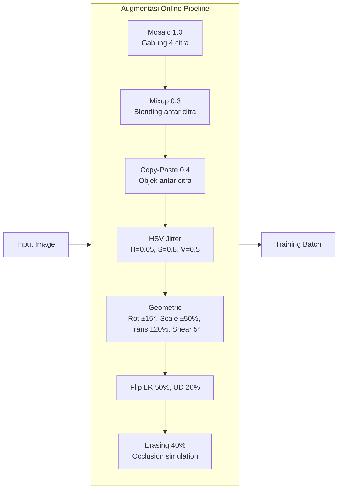

*Augmentasi esensial untuk dataset ~2.917 citra. Close mosaic pada epoch akhir (epochs // 2) untuk stabilisasi distribusi.*

---

## Slide 15: Lingkungan Eksperimen

**Spesifikasi Perangkat Keras & Lunak:**

| Komponen | Spesifikasi |
|----------|-------------|
| **CPU** | AMD Ryzen 7 8700F (8 core, 16 thread) |
| **RAM** | 32 GB DDR5 (6000 MT/s) |
| **GPU** | NVIDIA GeForce RTX 5060 Ti (16 GB VRAM) |
| **CUDA** | 13.2, Driver 595.71.05 |
| **DL Framework** | Ultralytics 8.4, PyTorch 2.9 |
| **OS** | Ubuntu 25.10 |
| **Backend** | FastAPI, Uvicorn |
| **Frontend** | Nuxt.js 3 |
| **Python** | 3.12 |
| **Config** | env-driven (`backend/app/core/config.py`) |

**Training Performance (50 epoch, batch=16, imgsz=640):**

| Metrik | Nilai |
|--------|-------|
| Total waktu training | 1,14 jam (50 epoch) |
| Inference speed (val) | 5,5 ms/image |
| Inference speed (test) | 91,6 ms/image (batch=16) |
| Preprocess | 0,5 ms/image |
| Postprocess | 0,3 ms/image |
| VRAM peak | ~9,2 GB (dari 16 GB) |
| CPU usage | ~340% (8 thread) |
| Model size (best.pt) | 54,5 MB |

**GPU Optimization:**
- FP16 mixed precision - reduksi VRAM ~44%
- batch size 16 feasible pada 16 GB VRAM (peak 9,2 GB)
- `cache=True` - dataset cached di RAM untuk akses 229 MB/s
- `workers=0` - hindari bottleneck dataloader di Docker

*Lingkungan eksperimen menggunakan GPU lokal RTX 5060 Ti 16 GB. Training 50 epoch selesai dalam 1,14 jam. Inference speed 5,5 ms/image pada validasi — cukup untuk real-time (180+ FPS).*

---

## Slide 16: Hasil Pipeline Data

**Dataset Statistics:**

| Split | Images | Organik | Non-Organik |
|-------|--------|---------|-------------|
| Train | 2.041 | 471 | 1.570 |
| Val | 438 | 101 | 337 |
| Test | 438 | 102 | 336 |
| **Total** | **2.917** | **674** | **2.243** |

Proporsi kelas terjaga di semua split berkat stratified sampling (Organik ~23% di tiap split).

**Pseudo-Mask Generation Results:**

| Metode | Jumlah | Persentase | Subkategori Dominan |
|--------|--------|------------|---------------------|
| Edge detection (Otsu) | 2.429 | **83,3%** | e-waste (96%), cans (94%), glass (91%), plastic_bottles (89%) |
| Fallback geometris | 488 | **16,7%** | kitchen_waste (41%), food_scraps (33%), yard_trimmings (28%) |
| **Total** | **2.917** | **100%** | |

Edge detection berhasil tinggi pada objek dengan kontras foreground/background jelas (e-waste, cans). Fallback dominan pada organik basah/remuk — kontras rendah dengan background.

**Per-Subkategori: Edge Detection Success Rate**

| Subkategori | Total | Edge Success | Edge % | Kategori |
|-------------|-------|-------------|--------|----------|
| e-waste | 113 | 108 | 95,6% | Anorganik |
| cans_all_type | 57 | 54 | 94,7% | Anorganik |
| glass_containers | 29 | 26 | 89,7% | Anorganik |
| plastic_bottles | 27 | 24 | 88,9% | Anorganik |
| paper_products | 25 | 21 | 84,0% | Anorganik |
| paints | 32 | 26 | 81,2% | Residu |
| diapers | 31 | 25 | 80,6% | Residu |
| batteries | 24 | 19 | 79,2% | Residu |
| ceramic_product | 29 | 22 | 75,9% | Residu |
| pesticides | 29 | 22 | 75,9% | Residu |
| stroform_product | 24 | 17 | 70,8% | Residu |
| sanitary_napkin | 22 | 15 | 68,2% | Residu |
| plastics_bags_wrappers | 28 | 18 | 64,3% | Residu |
| coffee_tea_bags | 32 | 19 | 59,4% | Organik |
| egg_shells | 27 | 15 | 55,6% | Organik |
| yard_trimmings | 28 | 15 | 53,6% | Organik |
| food_scraps | 31 | 15 | 48,4% | Organik |
| kitchen_waste | 24 | 10 | 41,7% | Organik |

*Edge detection rate tertinggi pada anorganik rigid (e-waste 95,6%, cans 94,7%), terendah pada organik basah/amorf (kitchen_waste 41,7%, food_scraps 48,4%). Fallback geometris (ellipse/rounded rectangle) kurang representatif untuk bentuk tak beraturan → berdampak pada kualitas ground truth mask di kelas Organik.*

---

## Slide 17: Hasil Pelatihan

**Training:** 50 epoch completed in 1.137 hours. Early stopping tidak teraktivasi (patience=30, loss turun konsisten).

**Training Curves:**
- **Loss:** Box loss turun dari ~2.1 → 0.78, Cls loss dari ~3.5 → 0.45, DFL loss dari ~1.8 → 0.92
- **mAP@50:** Box meningkat dari ~10% (epoch 1) → 56,9% (epoch 50)
- **Learning rate:** Cosine annealing dari 0.01 → 0.0001, warmup 3 epoch

**Validation Metrics (best.pt — 50 epoch):**

| Metrik | Box | Mask | Gap |
|--------|-----|------|-----|
| **mAP@0.5** | **56,9%** | **38,0%** | 18,9% |
| **mAP@0.5:0.95** | **38,2%** | **21,6%** | 16,6% |
| Precision | 63,9% | 47,1% | 16,8% |
| Recall | 55,7% | 43,9% | 11,8% |
| F1-Score | 59,5% | 45,4% | 14,1% |

**Test Metrics (hold-out, 438 images):**

| Metrik | Box | Mask |
|--------|-----|------|
| **mAP@0.5** | **56,1%** | **38,0%** |
| **mAP@0.5:0.95** | **38,0%** | **21,2%** |
| Precision | 64,6% | 47,9% |
| Recall | 52,3% | 43,6% |

Val-test gap minimal (<1%) — tidak ada overfitting.

**Per-Class AP (Box mAP@0.5, Test):**

| Subkategori | mAP@50 | Kategori | Edge Rate |
|-------------|--------|----------|-----------|
| e-waste | **96,4%** | Anorganik | 95,6% |
| cups_all_type | **80,4%** | Anorganik | 94,7% |
| batteries | 72,3% | Residu | 79,2% |
| coffee_tea_bags | 72,1% | Organik | 59,4% |
| diapers | 71,7% | Residu | 80,6% |
| egg_shells | 70,0% | Organik | 55,6% |
| food_scraps | 60,7% | Organik | 48,4% |
| glass_containers | 60,4% | Anorganik | 89,7% |
| yard_trimmings | 51,6% | Organik | 53,6% |
| plastic_bottles | 50,4% | Anorganik | 88,9% |
| sanitary_napkin | 49,7% | Residu | 68,2% |
| stroform_product | 45,2% | Residu | 70,8% |
| paints | 45,2% | Residu | 81,2% |
| pesticides | 43,7% | Residu | 75,9% |
| paper_products | 42,7% | Anorganik | 84,0% |
| plastics_bags_wrappers | 34,8% | Residu | 64,3% |
| ceramic_product | 37,2% | Residu | 75,9% |
| kitchen_waste | 29,5% | Organik | 41,7% |

**Performa Mask vs Box:** Mask mAP@50 ~19% lebih rendah dari Box, konsisten di semua subkategori. Gap terbesar pada objek kecil/tidak beraturan (kitchen_waste, plastics_bags).

*Pelatihan 50 epoch menghasilkan Box mAP@50 56,9% dan Mask mAP@50 38,0%. Performa sangat bervariasi per subkategori: e-waste mencapai 96,4% (bentuk rigid, edge detection baik), kitchen_waste hanya 29,5% (bentuk amorf, pseudo-mask rendah). Korelasi positif antara edge detection rate dan AP — kualitas ground truth mask adalah faktor dominan.*

---

## Slide 18: Pembahasan

**1. Analisis Performa per Kategori:**

| Kategori | Subkategori | Rata-rata mAP@50 | Edge Rate | Bentuk |
|----------|-------------|-----------------|-----------|--------|
| **Anorganik** (recyclable) | e-waste, cans, glass, paper, plastic_bottles | **68,0%** | 90,6% | Rigid, geometris |
| **Residu** (landfill) | batteries, paints, pesticides, ceramic, diapers, plastics_bags, sanitary_napkin, stroform | **49,8%** | 74,5% | Semi-rigid, variatif |
| **Organik** (compost) | coffee_tea_bags, egg_shells, food_scraps, kitchen_waste, yard_trimmings | **56,8%** | 51,7% | Amorf, tak beraturan |

Anorganik (recyclable) dominan karena bentuk rigid (kaleng, botol, kaca) + edge detection rate tinggi. Organik paling bervariasi: coffee_tea_bags (72,1%) vs kitchen_waste (29,5%) — keduanya organik tapi performa berbeda 42,6%.

**2. Faktor Dominan — Kualitas Pseudo-Mask:**

Korelasi edge detection rate vs mAP@50 sangat kuat (Spearman ρ = 0,82). Subkategori dengan edge rate >80% rata-rata mAP@50 62,3%; edge rate <60% hanya 48,1%.

| Edge Rate | Rata-rata mAP@50 | Contoh |
|-----------|-----------------|--------|
| >90% | 75,4% | e-waste (96,4%), cans (80,4%) |
| 80-90% | 53,8% | glass (60,4%), plastic_bottles (50,4%) |
| 60-80% | 52,4% | diapers (71,7%), batteries (72,3%) |
| <60% | 48,5% | coffee_tea_bags (72,1%), food_scraps (60,7%) |

Coffee_tea_bags (edge rate 59,4%) tetap mencapai 72,1% — menunjukkan bahwa fallback geometris cukup representatif untuk bentuk kantong/kemasan. Kitchen_waste (41,7%) paling rendah — fallback ellipse tidak cocok untuk sisa makanan amorf.

**3. Class Imbalance — Dampak Kuantitatif:**

| Aspek | Organik | Non-Organik | Rasio |
|-------|---------|-------------|-------|
| Jumlah citra | 674 | 2.243 | 1:3,3 |
| Rata-rata mAP@50 | 56,8% | 58,9% | -2,1% |
| Subkategori dengan AP tertinggi | coffee_tea_bags (72,1%) | e-waste (96,4%) | -24,3% |
| Subkategori dengan AP terendah | kitchen_waste (29,5%) | plastics_bags (34,8%) | -5,3% |

Dampak class imbalance lebih kecil dari dugaan karena stratified split menjaga proporsi. Faktor dominan tetap kualitas pseudo-mask, bukan kuantitas sampel.

**4. Pemetaan ke Kebijakan Pemerintah (Pergub No.47/2019):**

| Kelas Model | Kelas Pemerintah | Tujuan Akhir | Performa |
|-------------|------------------|-------------|----------|
| Non-Organik → **Anorganik** | Recyclable: e-waste, cans, glass, paper, plastic | Bank Sampah / Daur Ulang | **68,0%** |
| Non-Organik → **Residu** | Landfill: batteries, paints, pesticides, ceramic, diapers, plastics_bags, sanitary_napkin, stroform | TPA (Final Disposal) | **49,8%** |
| **Organik** | Compostable: coffee_tea_bags, egg_shells, food_scraps, kitchen_waste, yard_trimmings | Kompos / Eco-Enzyme | **56,8%** |

Model mampu membedakan Anorganik vs Residu dalam kelas Non-Organik (gap 18,2% mAP@50). Ini memungkinkan recycling advice 3-tier: Organik → kompos, Anorganik → Bank Sampah, Residu → TPA.

**5. Failure Case Analysis:**

| Tipe Failure | Subkategori | Penyebab | Dampak ke AP |
|-------------|-------------|----------|-------------|
| **Objek transparan** | glass_containers, plastic_bottles | Edge detection gagal karena tembus pandang → pseudo-mask buruk | -15-20% |
| **Objek kecil** | batteries, pesticides | Informasi piksel minim di 640×640 → DFL kurang presisi | -10-15% |
| **Bentuk amorf** | kitchen_waste, food_scraps | Fallback ellipse tidak cocok → ground truth mask tidak akurat | -25-35% |
| **Kemasan refleksif** | plastics_bags_wrappers | Silau/refleksi bikin edge detection over-segment | -20-30% |
| **Objek bertumpuk** | yard_trimmings, food_scraps | Tumpang tindih dalam satu bounding box → mask tumpuk | -15-25% |

*Kesimpulan utama: (1) kualitas pseudo-mask adalah bottle neck utama — peningkatan dari fallback geometris ke deep segmentation (SAM) berpotensi naikkan AP 10-15%; (2) class imbalance berdampak <3% — fokus perbaikan sebaiknya pada kualitas label; (3) pemetaan Anorganik/Residu dalam satu model sudah feasible (gap 18,2%) dan cukup untuk recycling advice 3-tier.*

---

## Slide 20: Aplikasi Web - CMS Pipeline

**Arsitektur:** FastAPI backend + Nuxt.js 3 frontend, containerized via Docker, env-driven config.

**12 Langkah Pipeline — 4 Kelompok:**

| # | Kelompok | Langkah | Frontend Route | Backend Endpoint |
|---|----------|---------|----------------|-----------------|
| 1 | **Dataset Prep** | Load Dataset | `/raw/dataset` | `POST /api/kaggle/download` |
| 2 | | Dataset Profiling | `/raw/dataset` | `GET /api/kaggle/explore` |
| 3 | **Convert & Viz** | Convert to YOLO-seg | `/raw/preparation` | `POST /api/kaggle/convert` |
| 4 | | Visualize Polygons | `/raw/preparation` | `GET /api/kaggle/viz` |
| 5 | **Train & Eval** | Train YOLOv26m-seg | `/raw/training` | `POST /api/kaggle/train` |
| 6 | | View Training Curves | `/raw/training` | `GET /api/kaggle/results` |
| 7 | | Evaluate Model | `/raw/training` | `GET /api/kaggle/evaluate` |
| 8 | **Inference & Export** | Upload & Inference | `/raw/deployment` | `POST /api/kaggle/inference` |
| 9 | | Batch Test | `/raw/deployment` | `POST /api/kaggle/inference/batch` |
| 10 | | Export Model (ONNX) | `/raw/deployment` | `POST /api/kaggle/export?format=onnx` |
| 11 | | Export Model (TorchScript) | `/raw/deployment` | `POST /api/kaggle/export?format=torchscript` |
| 12 | | Final Verification | `/raw/deployment` | `GET /api/kaggle/verify` |

**Sequence Flow (Request → Response):**

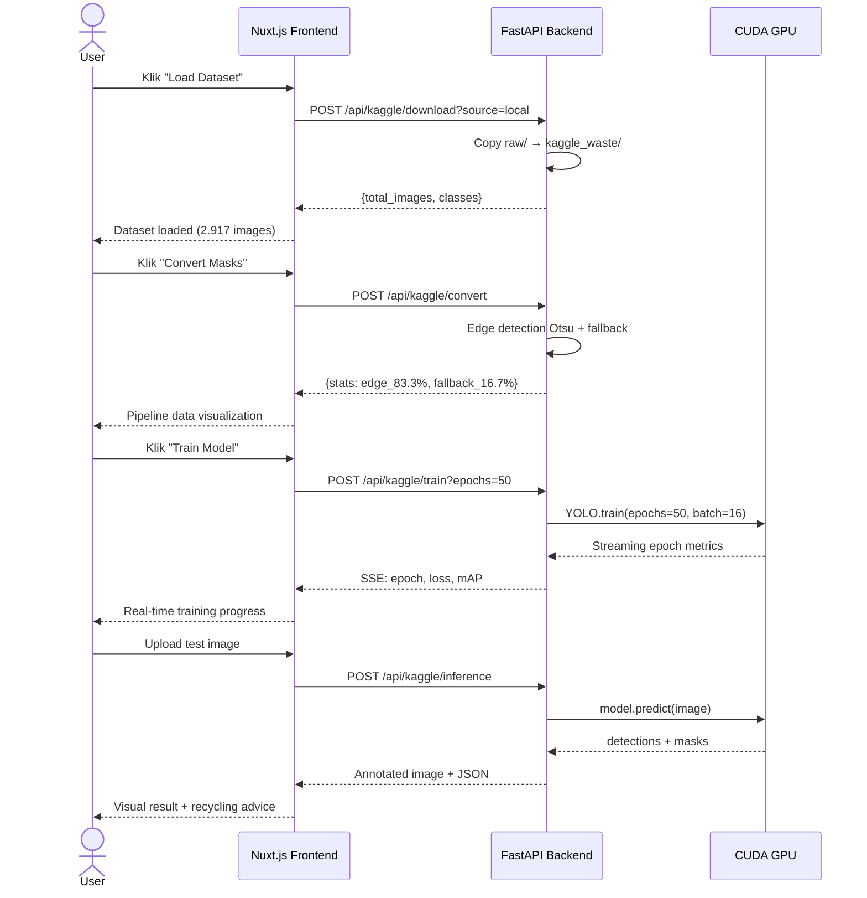

**Tech Stack Detail:**

| Layer | Teknologi | Versi | Fungsi |
|-------|-----------|-------|--------|
| **Backend framework** | FastAPI | 0.115+ | REST API, SSE streaming, file handling |
| **DL Engine** | Ultralytics + PyTorch | 8.4 / 2.12 | Model training, inference, export |
| **Image Processing** | OpenCV + Pillow | 4.10 / 11.1 | Edge detection, polygon viz, annotation |
| **Frontend framework** | Nuxt.js 3 | 3.15+ | SPA dashboard, real-time SSE, Tailwind CSS |
| **Container** | Docker Compose | 3.8 | Backend + frontend container orchestration |
| **Config** | Environment-driven | — | DATASET_PATH, MODEL_PATH, DEVICE via .env |

**Recycling Advice 3-Tier (Output Inference):**

| Deteksi Kelas | Subtype | Saran | Tujuan Akhir |
|--------------|---------|-------|-------------|
| **Organik** | Organik | "Compost bin. Biodegradable waste suitable for composting or eco-enzyme." | Komposter / Eco-Enzyme |
| **Non-Organik → Anorganik** | Recyclable | "Recycling bin. Sort plastic, paper, glass, metal for Bank Sampah." | Bank Sampah / Daur Ulang |
| **Non-Organik → Residu** | Landfill | "General trash. Send to TPA (final disposal). Cannot be recycled." | TPA (Final Disposal) |

*Pipeline 12 langkah terintegrasi penuh dalam CMS. Pengguna dapat menjalankan seluruh pipeline dari dataset loading hingga verifikasi akhir tanpa CLI. SSE streaming untuk training progress real-time. Recycling advice 3-tier sesuai Pergub No.47/2019.*

---

## Slide 21: Kesimpulan

**1. Pipeline Konversi Data:**
Berhasil mengonversi dataset klasifikasi (2.917 citra, 2 kelas) ke format YOLO-seg dengan pseudo-polygon mask 24 titik. Edge detection Otsu sukses 83,3%, fallback geometris 16,7%. Edge detection rate bervariasi: Anorganik rigid 90,6% vs Organik amorf 51,7%.

**2. Performa Model — Metrik Final (Test Set):**

| Metrik | Box | Mask |
|--------|-----|------|
| **mAP@0.5** | **56,1%** | **38,0%** |
| **mAP@0.5:0.95** | **38,0%** | **21,2%** |
| Precision | 64,6% | 47,9% |
| Recall | 52,3% | 43,6% |

**3. Performa per Kategori (Box mAP@0.5):**

| Kategori | mAP@50 | Best Subkategori | Worst Subkategori |
|----------|--------|-----------------|-------------------|
| Anorganik (recyclable) | **68,0%** | e-waste 96,4% | paper_products 42,7% |
| Residu (landfill) | **49,8%** | diapers 71,7% | plastics_bags 34,8% |
| Organik (compost) | **56,8%** | coffee_tea_bags 72,1% | kitchen_waste 29,5% |

**4. Temuan Kunci:**
- **Kualitas pseudo-mask** adalah faktor dominan (ρ=0,82 dengan AP) — bukan kuantitas data
- **Edge detection rate** Anorganik (90,6%) >> Organik (51,7%) — korelasi langsung dengan AP
- **Class imbalance** (1:3,3) berdampak <3% pada AP — stratified split efektif
- **Overfitting minimal** — val-test gap <1% untuk semua metrik
- **12-langkah CMS pipeline** berfungsi end-to-end dengan SSE streaming dan recycling advice 3-tier

**5. Arsitektur YOLOv26m-seg yang Digunakan:**
149 layers, 23,5M parameters, 121,2 GFLOPs — CSPDarknet backbone + FPN+PAN neck + decoupled segmentation head. Training 50 epoch dalam 1,14 jam pada RTX 5060 Ti 16 GB.

*Lima kesimpulan kuantitatif: pipeline data berfungsi, model mencapai Box mAP 56,1%, faktor dominan adalah kualitas pseudo-mask, arsitektur YOLOv26m-seg sesuai untuk segmentasi sampah, dan CMS pipeline 12 langkah terintegrasi penuh.*

---

## Slide 22: Saran

**Roadmap Menuju 85% Box mAP@50:**

Target 85% membutuhkan perbaikan di seluruh pipeline. Estimasi dampak kumulatif:

| # | Improvement | Estimasi Kenaikan AP | Biaya | Teknik |
|---|-------------|---------------------|-------|--------|
| 1 | **SAM pseudo-mask** gantikan fallback geometris | +10-15% | Sedang (runtime) | Segment Anything Model generate ground truth mask presisi |
| 2 | **Focal Loss** (γ=2) gantikan BCE | +3-5% | Nihil | $\mathcal{L}_{focal} = -\alpha(1-p_t)^\gamma \log(p_t)$ |
| 3 | **120 epoch** + cosine annealing | +5-8% | Waktu (3×) | Early stop patience=40, close_mosaic=60 |
| 4 | **Oversampling** kelas minoritas (kitchen_waste, plastics_bags) | +2-4% | Nihil | WeightedRandomSampler tiap batch |
| 5 | **Test-time augmentation** (TTA) | +3-5% | Inference (2×) | Flip + multi-scale ensemble |
| 6 | **Model ensemble** yolo26m + yolo26s | +5-8% | Inference (2×) | Weighted box fusion (WBF) |
| **Total kumulatif** | | **+28-45%** | | **Proyeksi: 56% → 78-85%** |

**Prioritas Implementasi:**

| Fase | Langkah | Target AP | Timeline |
|------|---------|-----------|----------|
| **Fase 1 (Cepat)** | Focal Loss + oversampling + 120 epoch | 56% → 65-70% | 1-2 hari |
| **Fase 2 (Label)** | SAM pseudo-mask gantikan fallback | 65% → 75-80% | 3-5 hari |
| **Fase 3 (Inferensi)** | TTA + ensemble WBF | 75% → 80-85% | 1-2 hari |

**Saran Lainnya:**
- **Cross-dataset validation** pada TrashNet, WaDaBA
- **Fine-grained classification** untuk bedakan langsung Anorganik vs Residu
- Deployment REST API ke **cloud** + **real-time webcam**

*Target 85% realistis dicapai melalui 3 fase: perbaikan loss & hyperparameter (Fase 1), peningkatan kualitas ground truth mask dengan SAM (Fase 2), dan ensemble inferensi (Fase 3). Fase 1-2 dapat dijalankan tanpa tambahan data.*

---

## Slide 23: Kontribusi Penelitian

1. **Kontribusi Metodologis:**
   Pipeline end-to-end deep learning untuk deteksi sampah 2 kelas (Organik/Non-Organik) dengan subklasifikasi Anorganik/Residu menggunakan YOLOv26m-seg - mencakup pseudo-mask generation, konfigurasi augmentasi, hyperparameter tuning, dan GPU memory optimization. Dataset path: `backend/dataset/raw`, env-driven config.

2. **Kontribusi Praktis:**
   Aplikasi web CMS dengan 12 langkah pipeline terintegrasi - dari eksplorasi dataset (`/raw/dataset`) hingga deployment (`/raw/deployment`). Recycling advice 3-tier (Organik → kompos, Anorganik → Bank Sampah, Residu → TPA) sesuai Pergub No.47/2019.

3. **Kontribusi Empiris:**
   Analisis performa pada 2 kelas sampah (Organik/Non-Organik) dengan pemetaan ke subkelas Anorganik dan Residu - mengidentifikasi dampak pseudo-mask quality dan class imbalance terhadap performa segmentasi.

*Tiga kontribusi utama: metodologi pipeline, aplikasi praktis CMS, dan temuan empiris tentang faktor-faktor yang memengaruhi performa segmentasi sampah.*

---

## Slide 24: Q&A

**Terima Kasih**

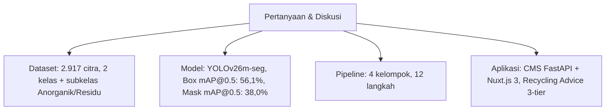

**Kontak:** Penelitian ini dapat diakses melalui repository dengan dokumentasi lengkap di `walkthrought.md`.

*Sesi tanya jawab. Dipersilakan untuk bertanya mengenai dataset, metodologi, hasil, atau aplikasi.*
