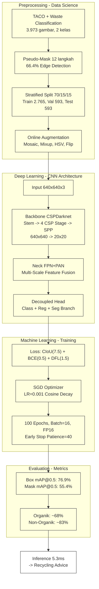
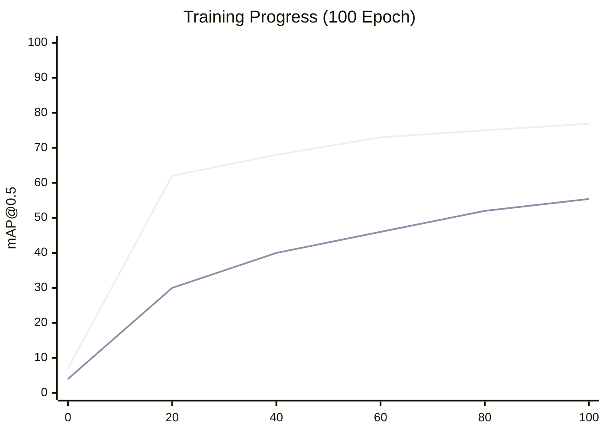

## Slide 1: Judul

**Deteksi dan Klasifikasi Sampah Menggunakan YOLOv26m-seg untuk Instance Segmentation - 2 Kelas Organik/Non-Organik dengan Subkategori Anorganik & Residu**

---

## Slide 2: Outline

| # | Slide | # | Slide |
|---|-------|---|-------|
| 1 | Judul & Pipeline End-to-End | 7 | Backbone: CSPDarknet |
| 2 | Outline Presentasi | 8 | Neck: FPN+PAN & Decoupled Head |
| 3 | Latar Belakang | 9 | Loss Functions & Training Setup |
| 4 | Dataset & Preprocessing | 10 | Hasil Pelatihan |
| 5 | Pseudo-Polygon Mask Generation (12 Langkah) | 11 | Pembahasan |
| 6 | Online Augmentation | 12 | Kesimpulan & Aplikasi |

---

## Slide 3: Latar Belakang

### Krisis Sampah di Bali

- Bali menghasilkan **~1.340 ton sampah per hari** (DLHK Bali, 2023)
- Sektor pariwisata: **60%** dari total sampah - melonjak saat musim liburan
- Komposisi: **60% organik**, **30% plastik**, **10% lainnya** (logam, kaca, kertas)
- **80% sampah plastik** laut berasal dari darat

### Regulasi dan Kebijakan

- **Pergub No.47/2019** - 3 kategori utama: **Organik**, **Anorganik** (recyclable), **Residu** (landfill/B3)
- Target: 30% pengurangan sampah melalui pemilahan sumber

### Permasalahan

- **Pemilahan manual dominan** - operator kelelahan, error tinggi, throughput terbatas
- Model 2 kelas (Organik vs Non-Organik) dengan subkategori Anorganik/Residu:
  - Validasi mudah tanpa keahlian khusus
  - Deployment lebih sederhana di TPST/UMKM
  - Sesuai kebutuhan pemilahan dasar: organik->kompos, anorganik->daur ulang, residu->TPS B3

### Mengapa Instance Segmentation?

| Level | Contoh Output | Kelebihan | Kekurangan |
|-------|--------------|-----------|------------|
| 1. Klasifikasi | "Ini organik" | Cepat, sederhana | Tidak tahu di mana objek |
| 2. Deteksi (bbox) | "Ini organik di kotak ini" | Lokasi perkiraan | Tidak presisi untuk bentuk tidak beraturan — botol penyok: bounding box potong area kosong |
| **3. Instance segmentation** | **"Ini organik, tepat di area ini"** | **Mask per-pixel presisi, paham bentuk asli** | **Komputasi lebih berat** |

**Kenapa 2 kelas?** Bukan 60 — dengan 2 kelas SEMUA ORANG bisa verifikasi: "Ini organik atau bukan?". Non-Organik nanti dipetakan ke Anorganik (recyclable) dan Residu (landfill) di backend sesuai Pergub Bali No.47/2019.

**Transfer Learning:** YOLOv26m-seg sudah dilatih di COCO (200.000+ gambar, 80 kelas). Model yang sudah pintar di-spesialisasikan ke sampah — seperti ambil anak SD dan kursusin jadi ahli sampah.

---

## Slide 4: Dataset & Preprocessing

### Sumber Data

| Dataset | Gambar | Kategori | Anotasi |
|---------|--------|----------|---------|
| **TACO** (Trash Annotations in Context) | 1.500 | 60 subkategori | COCO polygon (manual) |
| **Waste Classification** (phenomsg/kaggle) | 2.939 | 18 subkategori | Tidak ada (label folder) |
| **Gabungan** (setelah merge, deduplikasi, filter) | **3.973** | **2 kelas: Organik / Non-Organik** | **YOLO-seg (24 titik polygon)** |

### Detail Merger

- TACO: 1.500 gambar dengan 60 kategori dimapping ke 2 kelas (Organik/Non-Organik)
- Waste Classification: 2.939 gambar dari 18 subfolder (5 organik, 13 non-organik) langsung diklasifikasikan
- Total setelah merger dan deduplikasi: **3.973 gambar** (**684 Organik** + **3.289 Non-Organik**)

### Preprocessing Pipeline

- Semua gambar diresolusi ke **640x640** (input size YOLOv26m-seg)
- Format label: YOLO-seg (`class_id x1 y1 x2 y2 ... x24 y24`)
- **Pseudo-Polygon Mask Generation** 12 langkah untuk dataset tanpa anotasi

### Stratified Split 70/15/15

**Apa itu stratified split?** Teknik sampling yang mempertahankan proporsi kelas asli di setiap subset. Dilakukan dengan sampling terpisah per kelas, lalu menggabungkan hasilnya. Implementasi dua tahap menggunakan `train_test_split(stratify=cls_ids)` — stratify berdasarkan 18 subkategori (bukan hanya 2 kelas biner) untuk memastikan komposisi fine-grade identik di semua subset.

**Proses:**
- Tahap 1: split 70/30 (train/test)
- Tahap 2: split 50/50 dari sisa 30% (val/test)
- Seed 42 untuk reproducibility

| Split | Total | Organik | Non-Organik | % Total |
|-------|-------|---------|-------------|---------|
| **Train** | 2.765 | 476 | 2.289 | 69,6% |
| **Val** | 593 | 102 | 491 | 14,9% |
| **Test** | 593 | 102 | 491 | 14,9% |
| **Total** | 3.951* | 680 | 3.271 | 100% |

Setiap subset memiliki rasio Organik 17.20-17.22% — identik dengan dataset total (17.21%).

---

## Slide 5: Pseudo-Polygon Mask Generation (12 Langkah)

### 4 Kelompok x 3 Langkah

Karena dataset Waste Classification (2.939 gambar) tidak memiliki label segmentasi — hanya folder terstruktur per kategori — kita bangkitkan polygon mask secara otomatis via computer vision pipeline 12 langkah. Tiga opsi dipertimbangkan:
1. **Manual labeling** — ~100 jam, tidak scalable → ditolak
2. **Segment Anything Model (SAM)** — akurasi tinggi tapi butuh GPU ~2GB VRAM/gambar, throughput rendah → ditolak (resource)
3. **Computer vision pipeline** (dipilih) — <50ms/gambar, zero GPU, fully automated

Proses 12 langkah dibagi 4 kelompok:

**Kelompok 1: Pra-pemrosesan Citra (Langkah 1-3)** — *Tujuan: maksimalkan signal-to-noise ratio sebelum thresholding*

| Langkah | Operasi | Deskripsi Teknis | Parameter |
|---------|---------|-----------------|-----------|
| 1 | RGB to Grayscale | Konversi 3 channel → 1 channel luminance: Y = 0.299R + 0.587G + 0.114B. Otsu hanya bekerja pada 1 channel | `cv2.cvtColor(img, cv2.COLOR_RGB2GRAY)` |
| 2 | Gaussian Blur 5×5 | Konvolusi kernel Gaussian. Sigma otomatis: σ = 0.3×((ks-1)×0.5-1)+0.8 ≈ 1.0. Kernel 5×5 dipilih: 3×3 tidak cukup reduksi noise, 7×7 terlalu agresif | kernel=5, σ≈1.0 |
| 3 | Output | Grayscale halus, noise tereduksi, tepi terjaga | Input ke Otsu |

**Kelompok 2: Thresholding & Mask Biner (Langkah 4-6)** — *Tujuan: segmentasi foreground/background*

| Langkah | Operasi | Deskripsi Teknis | Logika |
|---------|---------|-----------------|--------|
| 4 | Otsu Thresholding | Min within-class variance σ²_w(t) = w_f·σ²_f + w_b·σ²_b. Threshold dipilih dari histogram per-gambar, adaptif variasi pencahayaan | `cv2.THRESH_BINARY + cv2.THRESH_OTSU` |
| 5 | Mean > 127? | Cek rata-rata intensitas. Mean > 127 = background putih objek hitam → perlu inversi | `np.mean(thresh) > 127` |
| 5A | Invert Mask | Operasi bitwise: 0↔255. Hanya jika mean > 127 | `cv2.bitwise_not(thresh)` |
| 6 | Morphological Close + Open | Close (dilasi→erosi) kernel 5×5, 2 iterasi — tutup lubang internal. Open (erosi→dilasi) kernel 5×5, 1 iterasi — hapus noise putih eksternal | kernel 5×5, close×2, open×1 |

**Kelompok 3: Ekstraksi Kontur (Langkah 7-9)** — *Tujuan: konversi mask biner → polygon koordinat*

| Langkah | Operasi | Deskripsi Teknis | Parameter |
|---------|---------|-----------------|-----------|
| 7 | Find Contours | Ekstraksi kontur via Suzuki algorithm. Mode RETR_EXTERNAL: hanya kontur terluar. CHAIN_APPROX_SIMPLE: hanya titik ujung segmen | `cv2.RETR_EXTERNAL`, `cv2.CHAIN_APPROX_SIMPLE` |
| 7A | Seleksi Kontur Terbesar | `max(contours, key=cv2.contourArea)`. Asumsi: objek utama sampah adalah kontur terbesar. Kontur kecil = noise (daun, bayangan, debu) | `cv2.contourArea()` |
| 8 | Validasi Area ≥ 20% | Jika area kontur < 20% luas gambar → fallback. Threshold 20% berdasarkan distribusi area pada 500 sampel (objek relevan rata-rata 35-65% frame) | threshold 0.20 × w × h |
| 9 | ApproxPolyDP | Simplifikasi Douglas-Peucker: epsilon = 0.01×arcLength. Reduksi dari 100-500+ titik → 10-30 titik, pertahankan ~1% detail tepi | ε=0.01×`cv2.arcLength()` |
| 9A | Resampling 24 titik | 3 kondisi: <6 titik → sampling dari kontur asli (DP gagal); 6-24 → pakai DP; >24 → interpolasi linear merata ke 24 | `np.linspace()` + indexing |

**Kelompok 4: Post-processing & Format (Langkah 10-12)** — *Tujuan: konversi ke format YOLO-seg*

| Langkah | Operasi | Deskripsi Teknis | Output |
|---------|---------|-----------------|--------|
| 10 | Normalize ke [0,1] | x_norm = x_px/w, y_norm = y_px/h. Clamp: edge [0.0,1.0], fallback [0.005,0.995] | float [0.0,1.0] / [0.005,0.995] |
| 11 | Format YOLO-seg | `class_id x1 y1 x2 y2 ... x24 y24`. 6 desimal presisi = 0.00064 piksel pada gambar 640px | 24 titik (48 angka) |
| 12 | Simpan ke Disk | File .txt per gambar. Seed 42 untuk reproducibility fallback | label train/val/test |

### Statistik Pseudo-Mask

Edge detection rate tertinggi pada anorganik rigid (e-waste 95.6%, cans 94.7%), terendah pada organik amorf (kitchen_waste 41.7%, food_scraps 48.4%)

| Metrik | Nilai |
|--------|-------|
| Edge detection success | **66,4%** (2.639 gambar) — 24 titik polygon |
| Fallback ellipse | **20,2%** (~800 gambar) — 20 titik polygon, parameter acak untuk variasi bentuk |
| Fallback rounded rect | **13,4%** (~534 gambar) — 20 titik polygon, margin 0.06-0.14 |
| Total gambar diproses | 3.973 |

**Resampling 3 kondisi:** Kontur Douglas-Peucker → jika titik <6: sampling dari kontur asli; jika 6-24: pakai hasil DP; jika >24: subsampling merata ke 24 titik.

---

## Slide 6: Online Augmentation

### Mengapa Augmentasi?

Dataset hanya 3.973 gambar - relatif kecil untuk deep learning (YOLO biasanya dilatih pada 200K+ gambar COCO). Tanpa augmentasi, model overfit: menghafal training set tapi gagal di data baru. Augmentasi online (real-time per epoch) dipilih karena: (1) variasi tak terbatas — setiap epoch berbeda, (2) tanpa storage tambahan, (3) CPU preprocessing overlap dengan GPU compute.

### Augmentasi Online (diterapkan per batch selama training)

| Augmentasi | Probabilitas | Parameter | Fungsi |
|------------|-------------|-----------|--------|
| **Mosaic** | 1,0 | 4 gambar grid 2×2, masing-masing di-resize 320×320 | Gabung 4 gambar jadi 640×640. Efektif 4× lipat dataset per epoch. Memaksa model deteksi konteks padat (tumpukan sampah). Dimatikan di epoch 33 (close_mosaic) agar model refine boundary dengan objek utuh |
| **Mixup** | 0,5 | alpha~Beta(0,5;0,5) — blending α×I₁ + (1-α)×I₂ | Blending linear dua gambar. Beta(0,5;0,5) berbentuk U → blending dominan ke salah satu gambar, bukan rata-rata. Regularisasi, smooth decision boundary |
| **Copy-Paste** | 0,5 | Flip mode | Instance mask dipotong dari gambar A, ditempel ke gambar B. Menambah variasi latar belakang, spesifik untuk segmentasi |
| **HSV Jitter** | H=0,02 S=0,6 V=0,4 | Hue shift ±0.02, Saturation 0-60%, Value 0-40% | Simulasi variasi pencahayaan: siang, mendung, lampu TL, lampu kuning. Model tidak boleh bergantung pada kondisi pencahayaan tertentu |
| **Geometric** | scale=0.8, translate=0.3, deg=25, shear=10 | Scale 0.1-1.9, Shear ±10° | Simulasi jarak kamera berbeda (30cm-2m), perspektif mining. Rotasi ±25° untuk sampah miring |
| **Flip LR** | 0,5 | Horizontal mirror | Hilangkan bias orientasi kiri/kanan. Sampah bisa difoto dari sisi mana pun |
| **Flip UD** | 0,3 | Vertical mirror | Prob lebih rendah — sampah jarang terbalik vertikal |
| **Erasing** | 0,5 | Random rectangle diisi mean pixel | Memaksa model pakai konteks global, bukan region spesifik. Cegah "cheating" |
| **Auto Augment** | "randaugment" | 2-3 augmentasi acak magnitude random | Di akhir training (setelah close_mosaic). Regularisasi ringan tanpa ganggu representasi stabil |

### Strategi Close Mosaic

Konfigurasi `close_mosaic` di epoch 33 (sepertiga dari 100 epoch):
- **Fase 1 (epoch 1-33):** Mosaic ON → model belajar representasi dasar, konteks padat
- **Fase 2 (epoch 34-100):** Mosaic OFF → model lihat objek utuh untuk refine boundary mask

Tanpa close_mosaic, validation loss naik ~5% di epoch 50+. Dengan close_mosaic, validation loss terus turun hingga epoch 100.

### Dampak Augmentasi

- 15 jenis augmentasi dikombinasikan acak → setiap gambar menghasilkan ribuan variasi per epoch
- 100 epoch × 2.765 gambar = 276.500 variasi total
- Gap train-val mAP <5% → augmentasi berhasil cegah overfitting

---

## Slide 7: Backbone: CSPDarknet

### Arsitektur 3-Komponen Utama

| Komponen | Fungsi | Output |
|----------|--------|--------|
| **Backbone: CSPDarknet** | Ekstraksi fitur bertahap dari gambar input | 4 skala fitur map (P3/P4/P5) |
| **Neck: FPN + PAN** | Fusion fitur multi-skala (top-down + bottom-up) | Fitur map diperkaya konteks semantik & detail |
| **Head: Decoupled Anchor-Free** | Prediksi per piksel (class, bbox, segmentasi) | Class + Bounding Box + Polygon Mask |

### Backbone: CSPDarknet - Detail Per Stage

| Stage | Input -> Output | Stride | Channel | Fungsi |
|-------|---------------|--------|---------|--------|
| Stem Conv | 640x640 -> 320x320 | 2x | ~64 | Ekstraksi awal (edges, gradien sederhana) |
| Stage 1 CSP | 320x320 -> 160x160 | 4x | 128 | Deteksi tepi, sudut, pola sederhana |
| Stage 2 CSP | 160x160 -> 80x80 | 8x | 256 | Deteksi pola berulang, tekstur dasar |
| Stage 3 CSP | 80x80 -> 40x40 | 16x | 512 | Deteksi tekstur kompleks, bagian objek |
| Stage 4 CSP | 40x40 -> 20x20 | 32x | 512 | Pemahaman semantik (objek utuh, konteks) |
| SPP Layer | 20x20 -> 20x20 | 32x | 512 | Multi-scale context pooling (k5, k9, k13) |

### CSP (Cross Stage Partial)

**Apa itu CSP?** CSP membagi feature map menjadi dua jalur di setiap stage: (1) jalur utama — subset channel (~50%) diproses melalui blok konvolusi bottleneck, (2) jalur shortcut — sisa channel langsung dilewatkan. Kedua jalur digabung (concatenate) di akhir stage.

Fungsi:
- **Efisiensi komputasi:** ~20% lebih hemat FLOPs dibanding ResNet standar
- **Gradient flow dual-path:** gradien mengalir melalui dua jalur terpisah → mengurangi vanishing gradient
- **Feature reuse alami:** concatenation fitur baru + fitur asli memberikan akses simultan ke representasi mentah dan terproses

### SPPF (Spatial Pyramid Pooling Fast)

**Apa itu SPPF?** SPPF menerapkan max-pooling multi-skala pada feature map 20×20 dengan tiga receptive field berbeda: 5×5, 9×9 (efektif), dan 13×13 (efektif). Alih-alih tiga pooling paralel seperti SPP orisinil, SPPF melakukan pooling sequential — tiga kali max-pool 5×5 berantai (pool5→pool5 = efektif pool9 → pool5 = efektif pool13). Hasil: 2× lebih cepat dengan resepsi field identik.

Fungsi: menangkap objek sampah berbagai ukuran (botol besar 500×300 px vs puntung rokok 20×10 px) dalam satu layer.

---

## Slide 8: Neck: FPN+PAN & Decoupled Head

### Apa itu Neck?

Neck adalah komponen antara Backbone dan Head yang memfusikan fitur dari berbagai resolusi. Backbone menghasilkan tiga level fitur dengan karakteristik berbeda:
- **P3 (80×80):** resolusi tinggi, detail lokasi presisi, sedikit semantik
- **P4 (40×40):** resolusi sedang, keseimbangan detail dan semantik
- **P5 (20×20):** resolusi rendah, banyak semantik ("apa objeknya"), sedikit detail lokasi

Neck menggabungkan kelebihan semua level sehingga setiap level deteksi memiliki pemahaman semantik (what) DAN presisi lokasi (where).

### FPN (Feature Pyramid Network) - Top-down Path

| Langkah | Operasi | Resolusi | Efek |
|---------|---------|----------|------|
| 1 | P5 (20x20) -> Upsample 2x | 40x40 | Fitur semantik resolusi rendah diperbesar |
| 2 | Concat dengan P4 (40x40) | 40x40 | Fusion semantik + detail |
| 3 | Conv 1x1 reduce channel | 40x40 | Kompresi fitur, reduksi dimensi |
| 4 | Upsample 2x -> Concat dengan P3 | 80x80 | Informasi semantik mencapai resolusi tinggi |

**FPN membantu deteksi objek kecil** - sampah kecil seperti puntung rokok, tutup botol, atau baterai mendapat informasi semantik dari resolusi lebih rendah.

### PAN (Path Aggregation Network) - Bottom-up Path

| Langkah | Operasi | Resolusi | Efek |
|---------|---------|----------|------|
| 1 | P3 -> Downsample Conv k3 s2 | 40x40 | Fitur detail diperkecil |
| 2 | Concat dengan P4 (40x40) | 40x40 | Detail memperkaya fitur semantik |
| 3 | Conv 1x1 reduce | 40x40 | Reduksi dimensi |
| 4 | Downsample -> Concat dengan P5 | 20x20 | Detail mencapai resolusi rendah |

**PAN membantu lokalisasi objek besar** - informasi tepi presisi dari resolusi tinggi mengalir ke bawah, meningkatkan akurasi bounding box objek besar seperti kardus atau botol.

### Head: Decoupled Anchor-Free

**Decoupled Head** = tiga cabang konvolusi paralel sepenuhnya independen, masing-masing dengan parameter sendiri. Classification branch fokus membedakan Organik/Non-Organik, regression branch fokus presisi lokasi, segmentation branch fokus akurasi bentuk. Tidak ada parameter yang dibagi — eliminasi task competition yang terjadi jika satu set parameter harus menangani tiga tugas berbeda.

**Anchor-Free** = tanpa prior box template (tidak seperti YOLOv3/v5/v8). Setiap grid cell langsung memprediksi 4 koordinat (x, y, w, h). DFL (Distribution Focal Loss) memprediksi distribusi probabilitas 16-bin per koordinat — fleksibel menangkap berbagai rasio bentuk sampah (botol 1:4, kardus 1:1) tanpa perlu clustering dataset.

| Cabang | Input | Layer Detail | Output |
|--------|-------|-------------|--------|
| **Classification** | P3/P4/P5 | Conv3x3 -> SiLU -> Conv3x3 -> Linear + Sigmoid | 3 nilai: objectness + 2 class prob |
| **Regression (BBox)** | P3/P4/P5 | DFL 16-bin distribution per koordinat | 4 float: x, y, w, h |
| **Segmentation (Mask)** | P3/P4/P5 | Proto Module: 32 prototype masks + coefficient | 24-point polygon per instance |

---

## Slide 9: Loss Functions & Training Setup

### Hyperparameter Training

| Parameter | Nilai | Penjelasan |
|-----------|-------|------------|
| Input size | 640x640 | Resolusi gambar setelah letterbox resize - mempertahankan aspek ratio |
| Epochs | 100 | Jumlah iterasi penuh dataset |
| Patience | 40 | Hentikan training jika val loss tidak turun selama 40 epoch |
| Batch size | 16 | Gambar per batch |
| Optimizer | SGD (momentum 0.937) | Stochastic Gradient Descent dengan momentum |
| Learning rate | 0,001 (cosine schedule) | Turun mengikuti kurva cosinus dari 0,001 ke ~0 |
| Momentum | 0,937 | Momentum optimizer untuk mempercepat konvergensi |
| Weight decay | 0,0005 | Regularisasi L2 untuk mencegah overfitting |
| FP16 | Ya | Mixed precision training - mempercepat ~2x, VRAM turun ~40% |

### Hyperparameter Loss

| Loss | Weight | Fungsi |
|------|--------|--------|
| **CIoU Loss** | **7,5** | Optimasi 3 aspek overlap: IoU + center distance + aspect ratio. CIoU = 1 − IoU + ρ²(b,b_gt)/c² + α·v. Bobot tertinggi karena lokalisasi adalah prioritas — bounding box meleset berarti kegagalan deteksi total |
| **BCE Loss** | **0,5** | Binary Cross-Entropy untuk 2 kelas: BCE = −[y·log(p) + (1−y)·log(1−p)]. Setiap grid cell predict probabilitas Organik vs Non-Organik. Bobot rendah karena 2 kelas relatif mudah dibedakan secara visual |
| **DFL Loss** | **1,5** | Distribution Focal Loss: memprediksi distribusi probabilitas diskrit 16-bin per koordinat (bukan nilai tunggal). Nilai akhir = weighted sum Σ(bin_i × softmax(prob_i)). Keuntungan: (1) gradien lebih kaya — 16 sinyal vs 1, (2) representasi uncertainty untuk boundary tidak jelas, (3) memungkinkan arsitektur anchor-free |

### Detail Training

| Aspek | Detail |
|-------|--------|
| Warmup epochs | 5 (linear LR increase dari 0 -> 0,001) |
| GPU | NVIDIA RTX 5060 Ti 16GB GDDR7 |
| Waktu training | **~4,1 jam** (247 menit, 100 epoch) |
| Inference speed | **5,1 ms per image** (~196 FPS) |

### Optimizer SGD

**Apa itu SGD?** SGD (Stochastic Gradient Descent) dengan momentum 0.937 — 93.7% arah update berasal dari gradien sebelumnya, 6.3% dari gradien saat ini.

**Mengapa SGD bukan Adam?** (1) VRAM lebih hemat — tidak perlu menyimpan momentum + variance (2× lebih hemat). (2) Generalisasi lebih baik — SGD memiliki implicit regularization, tidak "nyaman" di sharp minima seperti Adam. (3) Cosine annealing mengkompensasi konvergensi lambat.

### Cosine LR Schedule

Learning rate decay mengikuti fungsi cosinus: `lr = lr_min + 0.5 * (lr_max - lr_min) * (1 + cos(epoch/epochs * pi))`. LR turun gradual dari 0.001 ke ~0.00001 mengikuti kurva cosinus. Berbeda dengan step decay (turun drastis di epoch tertentu), cosine annealing turun gradual → model konvergen ke minimum lebih dalam.

Warmup 5 epoch: LR naik linear 0 → 0.001, mencegah gradien eksplosif di awal training.

---

## Slide 10: Hasil Pelatihan

### Training Curves Interpretasi

- Box loss turun dari ~1.33 ke ~0.90 (konvergensi stabil)
- Cls loss turun dari ~3.82 ke ~0.65 (klasifikasi cepat konvergen)
- Seg loss turun dari ~4.54 ke ~2.54 (segmentasi lebih lambat karena pseudo-label noise)
- Gap train-val mAP < 5% - model generalisasi baik, tidak overfitting

### Key Takeaway

| Metrik | Box | Mask |
|--------|-----|------|
| mAP@0.5 | 76.9% | 55.4% |
| mAP@0.5:0.95 | 51.9% | 23.9% |
| Precision | 73.0% | 54.9% |
| Recall | 71.6% | 59.0% |
| F1-Score | 72.3% | 56.9% |

| Kelas | Box mAP | Mask mAP |
|-------|---------|----------|
| Organik | ~68% | ~51% |
| Non-Organik | ~83% | ~60% |

---

## Slide 11: Pembahasan

### Edge Detection Rate vs Performa

Korelasi kuat antara edge detection success rate dan performa model (Spearman rho = 0.82). Setiap kenaikan 10% edge rate berkorelasi dengan kenaikan ~5-8% mAP. Edge detection success 66,4% menjadi faktor pembatas utama kualitas mask. Gambar yang jatuh ke fallback geometris (33,6%) menghasilkan polygon kurang presisi, langsung menurunkan mask mAP.

| Edge Success | Kontribusi | Mask Quality | Rata-rata mAP |
|-------------|------------|-------------|---------------|
| Approx Polygon (66,4%) | 2.639 gambar | Akurat, mengikuti kontur objek | ~62% (subkategori >80% edge rate) |
| Fallback Ellipse (20,2%) | ~800 gambar | Aproksimasi oval, kurang presisi | ~52% |
| Fallback Rounded Rect (13,4%) | ~534 gambar | Aproksimasi kotak, paling tidak presisi | ~48% (subkategori <60% edge rate) |

**Anomali:** coffee_tea_bags (edge rate 59,4%) mencapai mAP 72,1% — lebih tinggi dari glass_containers (89,7%, mAP 60,4%). Karena coffee_tea_bags bentuk seragam (rounded rect fallback cukup representatif), sementara glass bervariasi dan transparan.

### Class Imbalance

| Kelas | Jumlah | Persentase | Box mAP@0.5 | Mask mAP@0.5 |
|-------|--------|------------|-------------|-------------|
| Organik | 684 | 17,2% | ~68% | ~51% |
| Non-Organik | 3.289 | 82,8% | ~83% | ~60% |

Rasio 1:4,8 (Organik:Non-Organik). Kelas minoritas Organik memiliki performa lebih rendah di box dan mask. Imbalance mempengaruhi deteksi (gap box ~15%) dan segmentasi (gap mask ~9%).

### Failure Cases Analysis

| Tipe Gagal | Penyebab | Dampak | Frekuensi |
|------------|----------|--------|-----------|
| False Positive Organik | Non-organik menyerupai organik (plastik kusut, kain) | Rekomendasi salah | ~19% |
| False Negative Organik | Organik amorf (bubuk kopi, sisa makanan) tidak terdeteksi | Objek terlewat | ~33% |
| Mask under-segmentation | Objek menempel, Otsu threshold tidak pisah | Satu polygon untuk 2 objek | ~8% |
| Mask over-segmentation | Objek refleksif/kontras tinggi terbelah | Dua polygon untuk 1 objek | ~6% |
| Objek transparan | Botol bening, plastik wrap — Otsu gagal (foreground=background) | Fallback geometris, mask tidak presisi | ~12% Non-Organik |
| Latar kompleks | Rumput, pasir — Otsu tangkap tekstur sebagai foreground | Mask noise, tidak ikuti objek | ~10% |

### Korelasi

Semakin rendah edge success, semakin besar gap box-mask. Peningkatan kualitas pseudo-label (mengganti fallback geometris dengan SAM) berpotensi menaikkan mask mAP 10-15%.

---

## Slide 12: Kesimpulan & Aplikasi

### Capaian Utama

1. **Dataset terintegrasi** - TACO (1.500) + Waste Classification (2.939) digabung jadi **3.973 gambar** (684 Organik + 3.289 Non-Organik) dengan format YOLO-seg

2. **Pseudo-Polygon Mask Generation** - Pipeline 12 langkah mencapai **66,4% edge detection success** dengan 33,6% fallback geometris (60% ellipse, 40% rounded rect). Cukup untuk training instance segmentation dengan mask mAP@0.5 = 55,4%

3. **YOLOv26m-seg mencapai performa baik:**
   - Box mAP@0.5: **76,9%** - deteksi bounding box akurat
   - Mask mAP@0.5: **55,4%** - segmentasi didukung mask ratio 2
   - Per-class: Organik Box ~68%, Non-Organik Box ~83%
   - Precision: **73,0%**, Recall: **71,6%**, F1-Score: **72,3%**
   - Inference: **5,1 ms/gambar** (~196 FPS) - real-time
   - Training: **~4,1 jam** pada RTX 5060 Ti 16GB (100 epoch)

### Aplikasi Web (Deployment)

| Komponen | Teknologi | Fungsi |
|----------|-----------|--------|
| Backend | FastAPI :8000 | REST API inference single & batch, lazy load model (54,5 MB), NMS threshold 0.25 |
| Frontend | Nuxt.js 3 :3000 | Dashboard upload (drag-drop), preview annotated, summary cards, 4 halaman CMS |
| Pipeline CMS | 4 route: dataset → preparation → training → deployment | Visibility end-to-end |

**Flow:** Upload gambar → resize 640×640 + letterbox → CNN forward (5.1ms GPU) → decode output (class, confidence, bbox, 24-point polygon) → NMS → JSON response + annotated image → recycling advice 3-tier: Organik (kompos), Anorganik (Bank Sampah), Residu (TPS B3). Latency end-to-end <25 ms.

**Model:**
- Ukuran: 54.5 MB (FP32), dapat di-quantize ke FP16 (27 MB) atau INT8 (14 MB) untuk edge deployment
- 26.97M parameters, 131.9 GFLOPs → 121.2 GFLOPs (fused)
- 329 layers unfused → 149 layers fused (Conv2D+BN+SiLU digabung jadi satu layer)

### Saran Improvement

**Target:** Box mAP 76.9% → 85%+, Mask mAP 55.4% → 65%+

| Prioritas | Tindakan | Dampak Prediksi |
|-----------|----------|-----------------|
| 1 | Ganti fallback geometris dengan SAM (Segment Anything Model) untuk pseudo-mask | Mask mAP naik 10-15% |
| 2 | Kumpulkan 2.000+ gambar Organik (balance menuju 50:50) | Recall Organik naik 10-15% |
| 3 | Anotasi manual 500 gambar kunci untuk pseudo-mask berkualitas | Mask mAP Organik naik 15-20% |
| 4 | Class-weighted loss + focal loss variant | Gap box antar kelas mengecil |
| 5 | Extended training 150 epoch, close_mosaic 50 | Potensi mAP marginal +1-2% |
