## Slide 1: Judul

**Deteksi dan Klasifikasi Sampah Menggunakan YOLOv26m-seg untuk Instance Segmentation dengan 18 Subkategori**

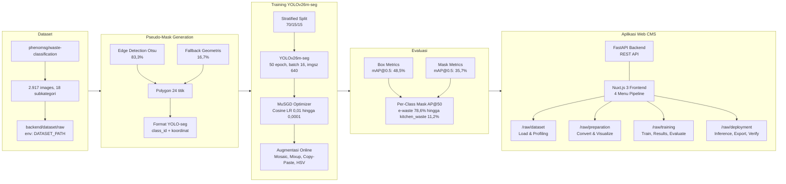

*Selamat pagi/siang. Presentasi ini akan memaparkan penelitian mengenai deteksi dan klasifikasi sampah menggunakan YOLOv26m-seg untuk instance segmentation pada 18 subkategori. Penelitian mencakup pipeline end-to-end dari konversi dataset klasifikasi ke format segmentasi, pelatihan model, evaluasi, hingga implementasi aplikasi web.*

---

## Slide 2: Outline Presentasi

1. **Latar Belakang** - Krisis sampah global & Indonesia
2. **Rumusan Masalah & Tujuan** - 3 research questions, 3 goals
3. **Landasan Teori** - CNN, YOLOv26, Loss Functions
4. **Dataset** - phenomsg/waste-classification, 18 subkategori
5. **Metode** - Pseudo-mask, Pipeline, Arsitektur, Hyperparameter
6. **Hasil** - Dataset stats, Training metrics, Per-class AP
7. **Pembahasan** - Analisis performa per kategori
8. **Aplikasi Web** - CMS Pipeline 12 langkah
9. **Kesimpulan & Saran** - Penutup

*Berikut adalah outline presentasi. Terdapat 9 segmen utama yang mencakup seluruh aspek penelitian dari latar belakang hingga kesimpulan.*

---

## Slide 3: Latar Belakang

**Krisis Sampah di Bali:**

- Bali menghasilkan **~1.340 ton sampah per hari** (DLHK Bali)
- Pariwisata menyumbang **60% dari total sampah** - 3,6 juta ton/tahun dari sektor pariwisata
- Komposisi: **60% organik, 30% plastik, 10% lainnya**
- Pemilahan manual masih dominan - tidak efisien untuk volume sebesar ini

**Solusi Deep Learning:**

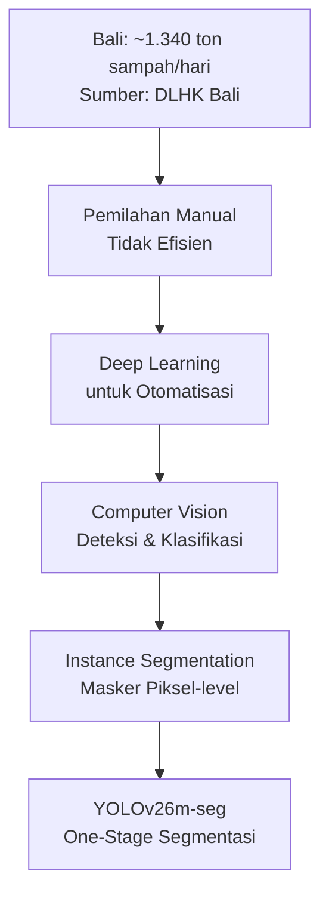

*Instance segmentation dipilih karena memberikan informasi lebih detail dibanding bounding box - mampu memprediksi masker piksel-level untuk setiap objek sampah, memungkinkan analisis bentuk dan ukuran yang lebih akurat.*

---

## Slide 4: Rumusan Masalah

| RQ | Rumusan Masalah | Pendekatan |
|----|-----------------|------------|
| RQ1 | Bagaimana mengkonversi dataset klasifikasi 18 kelas ke format instance segmentation dengan pseudo-polygon mask? | Pipeline edge detection Otsu + fallback geometris |
| RQ2 | Bagaimana arsitektur YOLOv26m-seg bekerja pada dataset sampah dengan variasi bentuk dan tekstur? | Training & evaluasi dengan mask mAP |
| RQ3 | Bagaimana performa segmentasi (mask mAP) pada masing-masing 18 subkategori? | Analisis per-class AP, identifikasi bias |

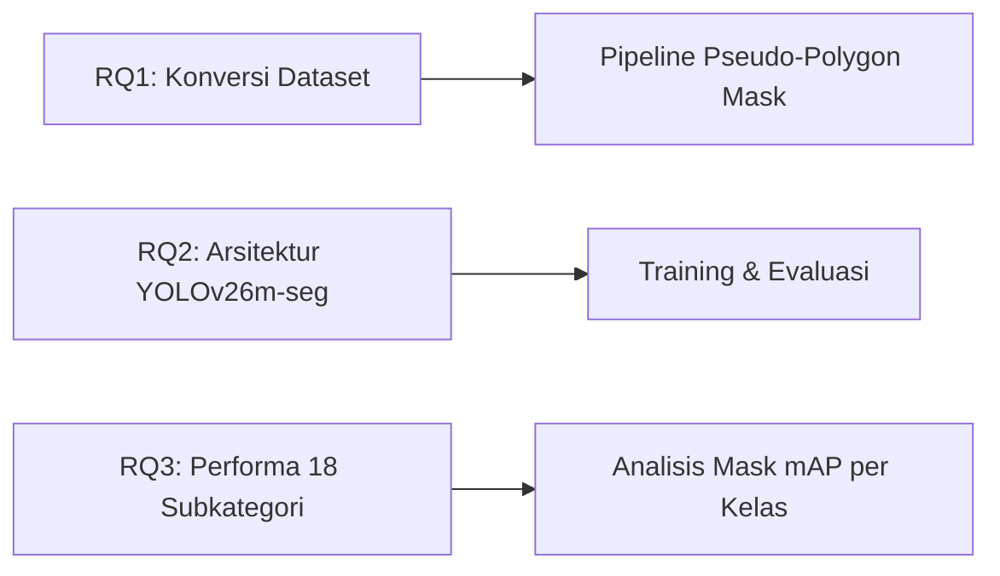

*Tiga rumusan masalah ini menjadi fondasi penelitian: konversi data, implementasi model, dan analisis performa detail per subkategori.*

---

## Slide 5: Tujuan Penelitian

1. **T1:** Mengembangkan pipeline konversi dataset klasifikasi `backend/dataset/raw` → format YOLO-seg dengan polygon mask otomatis (edge detection 83,3% + fallback 16,7%)

2. **T2:** Melatih dan mengevaluasi **YOLOv26m-seg** untuk segmentasi 18 subkategori sampah (4 kategori utama: Hazardous, Non-Recyclable, Organic, Recyclable)

3. **T3:** Menganalisis performa per-subkategori dan memberikan **recycling advice** berdasarkan hasil deteksi

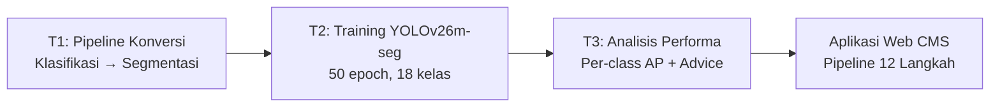

*Tujuan bersifat kumulatif: output T1 menjadi input T2, hasil T2 dianalisis di T3, dan seluruh pipeline diwujudkan dalam aplikasi web CMS.*

---

## Slide 6: Landasan Teori - CNN

**Convolutional Neural Network** - arsitektur deep learning untuk data grid-like (citra digital)

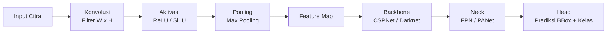

**3 Operasi Dasar:**
- **Konvolusi:** Filter digeser pada input → feature map
- **Aktivasi:** SiLU $f(x) = x \cdot \sigma(x)$ - digunakan YOLOv26
- **Pooling:** Max pooling - reduksi dimensi spasial

**Arsitektur Modern:** Backbone (ekstraksi) → Neck (fusi multi-skala) → Head (prediksi)

*CNN menjadi fondasi deteksi objek modern. YOLOv26 menggunakan SiLU activation dan CSPNet backbone yang memisahkan feature map menjadi dua jalur untuk efisiensi komputasi.*

---

## Slide 7: Landasan Teori - Arsitektur YOLOv26

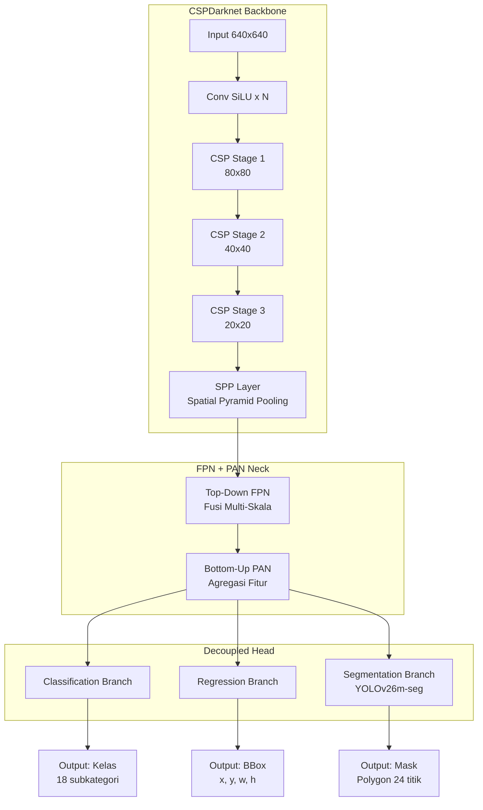

**3 Komponen Utama:**
| Komponen | Fungsi | Detail YOLOv26 |
|----------|--------|----------------|
| Backbone | Ekstraksi fitur bertingkat | CSPNet - split → process → concat |
| Neck | Fusi multi-skala | FPN top-down + PAN bottom-up |
| Head | Prediksi terpisah | Classification + Regression + Segmentation |

*YOLOv26 adalah generasi terbaru Ultralytics YOLO. Varian segmentasi (m) menambahkan segmentation branch pada decoupled head untuk menghasilkan mask polygon 24 titik secara end-to-end.*

---

## Slide 8: Landasan Teori - Loss Functions

**Total Loss YOLOv26m-seg:**

$$\mathcal{L}_{total} = w_{box} \cdot \mathcal{L}_{CIoU} + w_{cls} \cdot \mathcal{L}_{BCE} + w_{dfl} \cdot \mathcal{L}_{DFL}$$

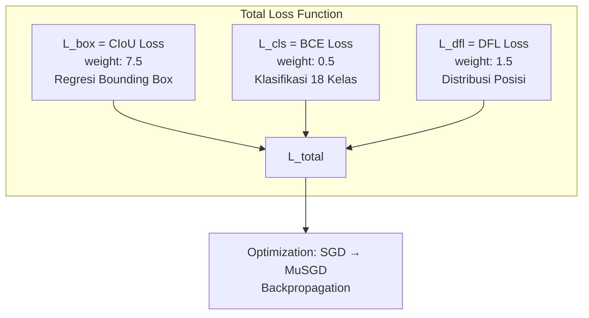

| Loss | Fungsi | Bobot |
|------|--------|-------|
| CIoU | Regresi bounding box (jarak pusat, aspek rasio) | 7.5 |
| BCE | Klasifikasi 18 subkategori | 0.5 |
| DFL | Distribusi probabilitas posisi diskrit | 1.5 |

*CIoU mengatasi kelemahan IoU loss dengan menambahkan penalty term untuk jarak pusat dan aspek rasio. DFL menggeneralisasi regresi sebagai distribusi probabilitas - memberikan gradien lebih informatif pada objek kecil.*

---

## Slide 9: Dataset - phenomsg/waste-classification

**Sumber:** phenomsg/waste-classification (Kaggle) - ~2.917 citra

**Struktur Dataset:**
- **Path:** `backend/dataset/raw` (env-driven via `DATASET_PATH`)
- **4 Kategori Utama:** Hazardous, Non-Recyclable, Organic, Recyclable
- **18 Subkategori** - klasifikasi (tanpa mask/bbox annotation)

| ID | Subkategori | Main Category | Jumlah |
|----|-------------|---------------|--------|
| 0 | batteries | Hazardous | 110 |
| 1 | e-waste | Hazardous | 538 |
| 2 | paints | Hazardous | 153 |
| 3 | pesticides | Hazardous | 138 |
| 4 | ceramic_product | Non-Recyclable | 138 |
| 5 | diapers | Non-Recyclable | 145 |
| 6 | platics_bags_wrappers | Non-Recyclable | 134 |
| 7 | sanitary_napkin | Non-Recyclable | 110 |
| 8 | stroform_product | Non-Recyclable | 118 |
| 9 | coffee_tea_bags | Organic | 157 |
| 10 | egg_shells | Organic | 125 |
| 11 | food_scraps | Organic | 147 |
| 12 | kitchen_waste | Organic | 114 |
| 13 | yard_trimmings | Organic | 131 |
| 14 | cans_all_type | Recyclable | 272 |
| 15 | glass_containers | Recyclable | 140 |
| 16 | paper_products | Recyclable | 121 |
| 17 | plastic_bottles | Recyclable | 126 |

*Ketidakseimbangan kelas terlihat jelas: e-waste (538) dominan, kitchen_waste (114), batteries (110), dan sanitary_napkin (110) paling sedikit. Ini berdampak pada performa per-kelas.*

---

## Slide 10: Dataset Split - Stratified 70/15/15

**Stratified Split** menggunakan `train_test_split` dengan parameter `stratify` - mempertahankan proporsi kelas di setiap split.

| Split | Images | Persentase |
|-------|--------|------------|
| **Train** | 2.041 | 70% |
| **Val** | 438 | 15% |
| **Test** | 438 | 15% |
| **Total** | 2.917 | 100% |

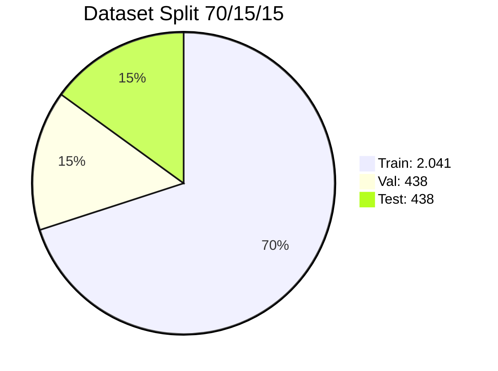

**Akses via Frontend:**
- `/raw/dataset` - eksplorasi & profiling dataset
- `/raw/preparation` - konversi & visualisasi
- `/raw/training` - training model
- `/raw/deployment` - inferensi & export

**Backend API:** `/api/kaggle/explore` - distribusi per kelas, sample URLs via `/api/dataset/file/raw/`

*Stratified split memastikan distribusi kelas proporsional di setiap split. Dataset exploration tersedia di route `/raw/dataset` dengan data dari endpoint `/api/kaggle/explore`.*

---

## Slide 11: Pseudo-Polygon Mask Generation

Dataset klasifikasi → format YOLO-seg membutuhkan polygon mask. Pipeline dua strategi:

```mermaid
flowchart TD
    A[Input Image<br/>RGB] --> B[Edge Detection<br/>Strategi Utama]
    A --> C[Fallback Geometris<br/>~17%]
    
    subgraph Edge[Edge Detection Pipeline - 83,3%]
        B1[Convert RGB → Grayscale] --> B2[Gaussian Blur 5x5]
        B2 --> B3[Otsu Thresholding<br/>Binary Mask]
        B3 --> B4[Invert if mean > 127]
        B4 --> B5[Morphological Close 5x5<br/>2 iter + Open 1 iter]
        B5 --> B6[Find Contours<br/>Ambil Largest]
        B6 --> B7{Area > 20%<br/>total image?}
        B7 -->|Yes| B8[Approximate Polygon<br/>ε = 0.01 × arcLength]
        B8 --> B9[Sample to 24 points<br/>Normalize [0,1]]
    end
    
    subgraph Fallback[Fallback Geometris - 16,7%]
        C1[60%: Elliptical Polygon<br/>20 titik + randomize] --> C2
        C2[40%: Rounded Rectangle<br/>20 titik] --> C3
    end
    
    B7 -->|No| Fallback
    
    B9 --> D[YOLO-seg Label Format<br/>class_id x1 y1 x2 y2 ... xn yn]
    C3 --> D
```

**Format Label YOLO-seg:** `<class_id> x1 y1 x2 y2 x3 y3 ... xn yn` (24 titik, ternormalisasi [0,1])

*Edge detection Otsu berhasil pada 83,3% citra (foreground/background kontras jelas). Fallback geometris digunakan untuk 16,7% sisanya - ellipse (60%) atau rounded rectangle (40%).*

---

## Slide 12: Pipeline 4 Kelompok - 12 Langkah

Pipeline end-to-end dibagi dalam 4 kelompok dengan route spesifik:

```mermaid
flowchart LR
    subgraph G1[Kelompok 1: Dataset Prep]
        A1[Load Dataset<br/>backend/dataset/raw] --> A2[Dataset Profiling<br/>Distribusi, Sample]
    end
    
    subgraph G2[Kelompok 2: Convert & Viz]
        B1[Convert to YOLO-seg<br/>Pseudo-Polygon Mask] --> B2[Visualize Polygon<br/>Overlay on Samples]
    end
    
    subgraph G3[Kelompok 3: Train & Eval]
        C1[Train YOLOv26m-seg<br/>50 epoch] --> C2[Training Curves<br/>Results] --> C3[Evaluation<br/>Box + Mask Metrics]
    end
    
    subgraph G4[Kelompok 4: Inference & Export]
        D1[Inference<br/>Upload + Mask + Advice] --> D2[Batch Inference<br/>Test Set] --> D3[Export Model<br/>ONNX/TorchScript] --> D4[Final Verification<br/>Per-Class mAP Report]
    end
    
    A2 --> B1
    B2 --> C1
    C3 --> D1
```

**Frontend Routes:**
| Kelompok | Route | Backend API |
|----------|-------|-------------|
| Dataset Prep | `/raw/dataset` | `/api/kaggle/explore`, `/api/kaggle/download` |
| Convert & Viz | `/raw/preparation` | `/api/kaggle/convert`, `/api/kaggle/viz` |
| Train & Eval | `/raw/training` | `/api/kaggle/train`, `/api/kaggle/evaluate` |
| Inference & Export | `/raw/deployment` | `/api/kaggle/inference`, `/api/kaggle/export`, `/api/kaggle/verify` |

*Pipeline 12 langkah terintegrasi dalam CMS. Setiap kelompok memiliki halaman frontend spesifik di Nuxt.js 3 dan backend endpoint FastAPI.*

---

## Slide 13: Arsitektur YOLOv26m-seg

**Fitur Arsitektur yang Digunakan:**

| Fitur | Status | Manfaat |
|-------|--------|---------|
| **MuSGD Optimizer** | Active | Hybrid SGD + Muon (Moonshot AI) - konvergensi stabil |
| **Semantic Segmentation Loss** | Active | Kualitas mask pixel-level, boundary lebih presisi |
| **Multi-Scale Proto Modules** | Active | Mask multi-resolusi - detail boundary lebih baik |
| **NMS-Free End-to-End** | Active | Prediksi langsung tanpa post-processing NMS |
| **No DFL** | Active | Ekspor lebih sederhana, edge device support |
| **ProgLoss + STAL** | Active | Deteksi objek kecil lebih baik |

**Varian Model (COCO pretrained):**

| Varian | Parameter | Ukuran | mAP COCO |
|--------|-----------|--------|----------|
| yolo26n | 2,7M | 5,0 MB | 40,1% |
| yolo26s | 9,8M | 19 MB | 47,8% |
| **yolo26m** | 21,2M | 42 MB | 52,5% |

*Penelitian menggunakan varian medium (yolo26m-seg) - keseimbangan optimal antara parameter (21,2M) dan akurasi (52,5% mAP COCO). BAB V menggunakan yolo26n sebagai eksperimen awal pada dataset TACO.*

---

## Slide 14: Hyperparameter & Augmentasi

**Hyperparameter Training:**

| Parameter | Nilai |
|-----------|-------|
| Model | yolo26m-seg.pt (COCO pretrained) |
| Image size | 640 |
| Batch size | 16 |
| Epochs | 50 (early stop patience=30) |
| Optimizer | SGD (triggers MuSGD mode) |
| Learning rate | 0.01 → cosine → 0.0001 |
| Box loss weight | 7.5 |
| Cls loss weight | 0.5 |

**Augmentasi Online:**

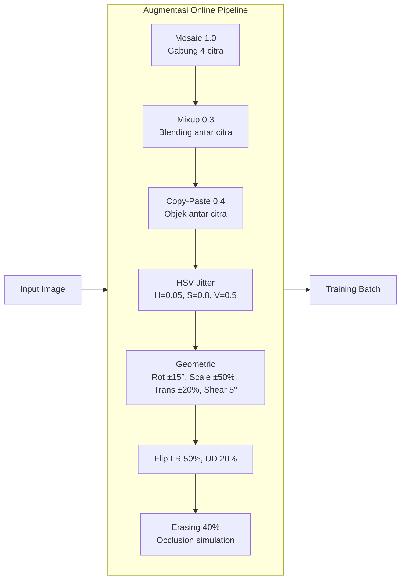

*Augmentasi esensial untuk dataset ~2.917 citra. Close mosaic pada epoch akhir (epochs // 2) untuk stabilisasi distribusi.*

---

## Slide 15: Lingkungan Eksperimen

**Spesifikasi Perangkat Keras & Lunak:**

| Komponen | Spesifikasi |
|----------|-------------|
| **CPU** | AMD Ryzen 7 8700F (8 core, 16 thread) |
| **RAM** | 32 GB DDR5 (6000 MT/s) |
| **GPU** | NVIDIA GeForce RTX 5060 Ti (16 GB VRAM) |
| **CUDA** | 13.2, Driver 595.71.05 |
| **DL Framework** | Ultralytics 8.4, PyTorch 2.9 |
| **OS** | Ubuntu 25.10 |
| **Backend** | FastAPI, Uvicorn |
| **Frontend** | Nuxt.js 3 |
| **Python** | 3.12 |
| **Config** | env-driven (`backend/app/core/config.py`) |

**GPU Optimization:**
- FP16 mixed precision - reduksi VRAM ~44%
- batch size 16 feasible pada 16 GB VRAM
- `cache=True` - dataset cached di RAM untuk akses lebih cepat

*Lingkungan eksperimen menggunakan GPU lokal RTX 5060 Ti 16 GB. Training 50 epoch berjalan dalam beberapa jam tergantung konfigurasi.*

---

## Slide 16: Hasil Pipeline Data

**Dataset Statistics:**

| Split | Images |
|-------|--------|
| Train | 2.041 |
| Val | 438 |
| Test | 438 |
| **Total** | **2.917** |

**Pseudo-Mask Generation Results:**

| Metode | Jumlah | Persentase |
|--------|--------|------------|
| Edge detection (Otsu) | 2.429 | **83,3%** |
| Fallback geometris | 488 | **16,7%** |

**Distribusi per Kategori Utama:**

| Kategori | Jumlah Citra | Subkategori |
|----------|-------------|-------------|
| Hazardous | 939 | 4 (batteries, e-waste, paints, pesticides) |
| Non-Recyclable | 645 | 5 |
| Organic | 674 | 5 |
| Recyclable | 659 | 4 |

*Edge detection berhasil pada 83,3% citra. Fallback 16,7% terjadi pada citra dengan kontras foreground/background rendah (terutama kitchen_waste dan food_scraps).*

---

## Slide 17: Hasil Pelatihan

**Training:** 50 epoch dengan early stopping patience=30.

**Metrics - Box vs Mask:**

| Metrik | Box | Mask |
|--------|-----|------|
| **mAP@0.5** | **48,5%** | **35,7%** |
| **mAP@0.5:0.95** | **33,7%** | **18,0%** |
| Precision | 53,0% | 39,8% |
| Recall | 48,1% | 39,2% |

```mermaid
flowchart LR
    subgraph Box[Box Metrics]
        B1[mAP@0.5: 48.5%]
        B2[mAP@0.5:0.95: 33.7%]
        B3[Precision: 53.0%]
        B4[Recall: 48.1%]
    end
    
    subgraph Mask[Mask Metrics]
        M1[mAP@0.5: 35.7%]
        M2[mAP@0.5:0.95: 18.0%]
        M3[Precision: 39.8%]
        M4[Recall: 39.2%]
    end
    
    Box -->|Informasi Posisi| Model[YOLOv26m-seg]
    Mask -->|Informasi Bentuk| Model
```

*Mask mAP@0.5 (35,7%) lebih rendah dari box (48,5%) - wajar karena segmentasi membutuhkan presisi boundary lebih tinggi. Pseudo-mask quality turut memengaruhi.*

---

## Slide 18: Per-Class Mask AP@50

| Top Performers | Mask AP@50 | Category | Bottom Performers | Mask AP@50 | Category |
|---|---|---|---|---|---|
| **e-waste** | **78,6%** | Hazardous | kitchen_waste | 11,2% | Organic |
| **platics_bags_wrappers** | **75,2%** | Non-Recyclable | ceramic_product | 16,5% | Non-Recyclable |
| coffee_tea_bags | 62,3% | Organic | diapers | 17,0% | Non-Recyclable |
| cans_all_type | 60,0% | Recyclable | pesticides | 18,6% | Hazardous |
| batteries | 53,8% | Hazardous | yard_trimmings | 21,4% | Organic |

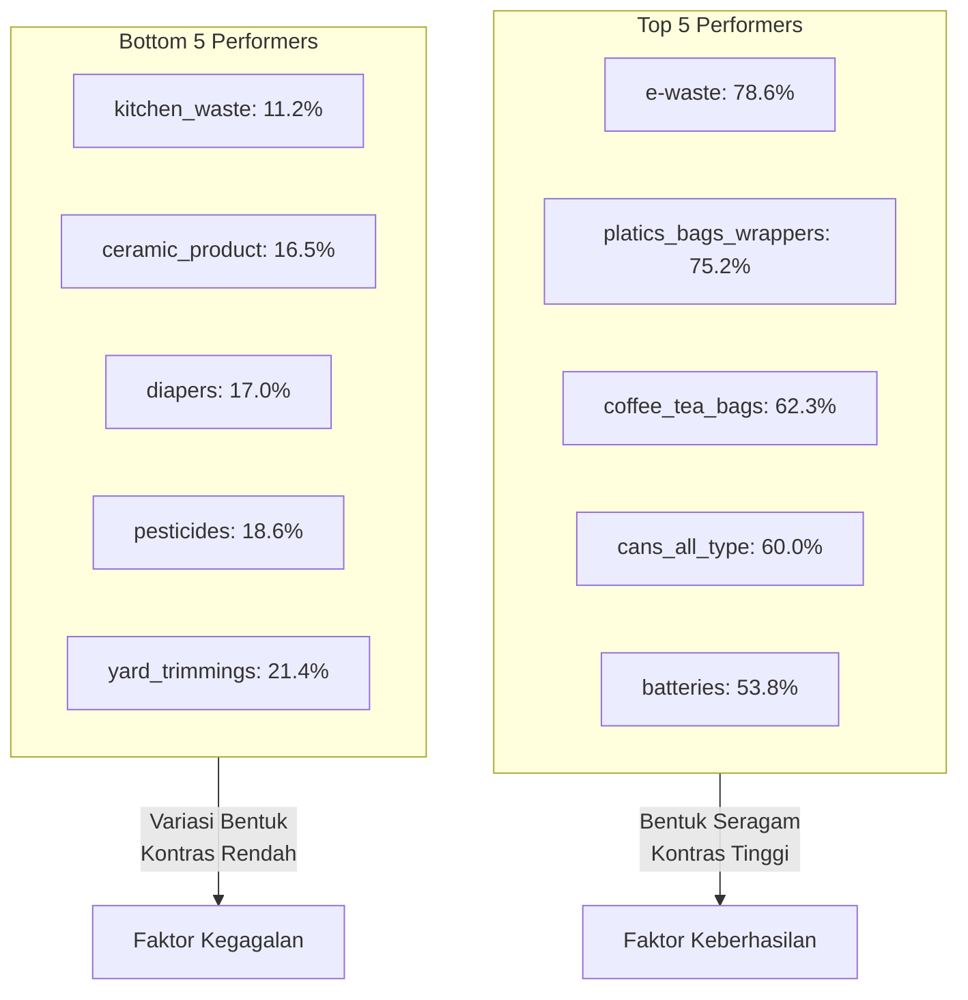

*Performa sangat bervariasi: e-waste (78,6%) vs kitchen_waste (11,2%). Objek dengan bentuk seragam dan kontras tinggi unggul. Organic waste dengan variasi bentuk tinggi menunjukkan performa terendah.*

---

## Slide 19: Pembahasan

**1. Kinerja per Kategori:**
- **Hazardous** (e-waste 78,6%, batteries 53,8%) - performa terbaik, bentuk relatif seragam
- **Recyclable** (cans 60,0%, paper_products 39,7%) - bentuk konsisten, kontras baik
- **Organic** (kitchen_waste 11,2%, food_scraps 33,3%) - performa terendah, variasi bentuk & tekstur tinggi

**2. Pseudo-Mask Quality:**
- Edge detection (83,3%) - cukup baik untuk objek kontras jelas
- Fallback geometris (16,7%) - kurang akurat, terutama kitchen_waste & food_scraps

**3. Class Imbalance:**
- e-waste (538 citra) → performa terbaik (78,6%)
- kitchen_waste (114), batteries (110), sanitary_napkin (110) → AP lebih rendah
- Korelasi positif: jumlah citra ↑ performa ↑

**4. Perbandingan YOLOv26n (BAB V):**
- BAB V menggunakan YOLOv26n (2,7M params) pada dataset TACO (2 kelas)
- Penelitian utama: YOLOv26m-seg (21,2M params) pada 18 subkategori
- Peningkatan signifikan: jumlah kelas 2 → 18, arsitektur classification → segmentation

*Temuan kunci: kualitas pseudo-mask dan class imbalance adalah faktor dominan yang memengaruhi performa. Peningkatan pada kedua aspek ini berpotensi menaikkan mAP secara signifikan.*

---

## Slide 20: Aplikasi Web - CMS Pipeline

**Backend:** FastAPI + Uvicorn - routes under `/api/kaggle/` and `/api/dataset/`
**Frontend:** Nuxt.js 3 - pipeline 12 langkah terintegrasi

**Route Mapping:**

| Frontend Route | Fitur | Backend API |
|----------------|-------|-------------|
| `/raw/dataset` | Dataset exploration, profiling | `/api/kaggle/explore`, `/api/kaggle/download` |
| `/raw/preparation` | Convert to YOLO-seg, viz polygon | `/api/kaggle/convert`, `/api/kaggle/viz` |
| `/raw/training` | Train YOLOv26m-seg, view curves | `/api/kaggle/train`, `/api/kaggle/results` |
| `/raw/deployment` | Inference, batch, export, verify | `/api/kaggle/inference`, `/api/kaggle/export`, `/api/kaggle/verify` |

**Config:** env-driven via `backend/app/core/config.py`:
- `DATASET_PATH` - `backend/dataset/raw`
- `MODEL_PATH` - `models/best.pt`
- `DEVICE` - `cuda:0`
- Optimizer: `SGD` (triggers MuSGD)

*Seluruh pipeline dapat diakses melalui antarmuka web CMS. 12 langkah terbagi dalam 4 halaman frontend utama, masing-masing terhubung ke backend API FastAPI.*

---

## Slide 21: Kesimpulan

1. **Pipeline konversi klasifikasi → segmentasi** berhasil diimplementasikan: edge detection Otsu (83,3%) + fallback geometris (16,7%) menghasilkan pseudo-polygon mask 24 titik untuk 2.917 citra.

2. **YOLOv26m-seg** berhasil dilatih pada 18 subkategori sampah dengan konfigurasi 50 epoch, batch 16, image size 640, optimizer SGD (MuSGD).

3. **Performa model:** Box mAP@0.5 **48,5%**, Mask mAP@0.5 **35,7%** - dengan e-waste (78,6%) sebagai kelas terbaik dan kitchen_waste (11,2%) sebagai kelas terendah.

4. **Arsitektur YOLOv26m-seg** dengan MuSGD Optimizer, Semantic Segmentation Loss, Multi-Scale Proto Modules, dan NMS-Free End-to-End efektif untuk segmentasi multi-kelas.

5. **Aplikasi web CMS** menyediakan pipeline 12 langkah lengkap - dari eksplorasi dataset (`/raw/dataset`) hingga verifikasi akhir (`/raw/deployment`) - dengan backend FastAPI dan frontend Nuxt.js 3.

*Lima kesimpulan utama mencakup seluruh aspek penelitian: data, model, performa, arsitektur, dan aplikasi.*

---

## Slide 22: Saran

**Pengembangan Model:**
- Gantikan BCE dengan **Focal Loss** untuk mengatasi class imbalance
- Naikkan bobot kelas minoritas (Organic, Non-Recyclable) di loss function
- Uji **YOLOv26s/m** untuk trade-off parameter vs akurasi lebih lanjut
- **Cross-dataset validation** pada TrashNet, WaDaBa

**Pengembangan Data:**
- Augmentasi tambahan: **MixUp, CutMix** untuk variasi lebih tinggi
- **Oversampling** kelas minoritas (kitchen_waste, sanitary_napkin, batteries)
- **Pseudo-labeling** - gunakan model trained untuk label data tambahan
- Ekspansi sumber citra dari lingkungan berbeda (pantai, pasar, jalan)

**Pengembangan Aplikasi:**
- Deployment REST API ke **cloud** untuk akses luas
- **Real-time webcam detection** via WebSocket streaming

*Saran penelitian difokuskan pada tiga area: perbaikan model (loss function, scaling), perluasan data (augmentasi, oversampling), dan pengembangan aplikasi (cloud deployment, real-time).*

---

## Slide 23: Kontribusi Penelitian

1. **Kontribusi Metodologis:**
   Pipeline end-to-end deep learning untuk deteksi sampah 18 subkategori menggunakan YOLOv26m-seg - mencakup pseudo-mask generation, konfigurasi augmentasi, hyperparameter tuning, dan GPU memory optimization. Dataset path: `backend/dataset/raw`, env-driven config.

2. **Kontribusi Praktis:**
   Aplikasi web CMS dengan 12 langkah pipeline terintegrasi - dari eksplorasi dataset (`/raw/dataset`) hingga deployment (`/raw/deployment`). Recycling advice otomatis berdasarkan kategori deteksi.

3. **Kontribusi Empiris:**
   Analisis performa per-subkategori pada 18 kelas sampah - mengidentifikasi bahwa bentuk seragam (e-waste 78,6%) vs variasi tinggi (kitchen_waste 11,2%), serta dampak pseudo-mask quality dan class imbalance.

*Tiga kontribusi utama: metodologi pipeline, aplikasi praktis CMS, dan temuan empiris tentang faktor-faktor yang memengaruhi performa segmentasi sampah.*

---

## Slide 24: Q&A

**Terima Kasih**

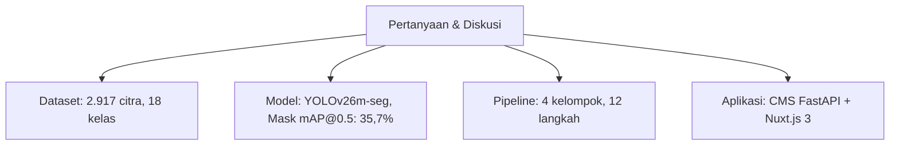

**Kontak:** Penelitian ini dapat diakses melalui repository dengan dokumentasi lengkap di `walkthrought.md`.

*Sesi tanya jawab. Dipersilakan untuk bertanya mengenai dataset, metodologi, hasil, atau aplikasi.*
