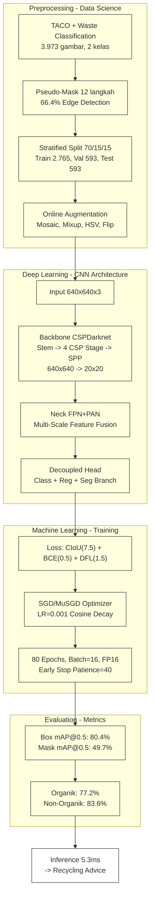
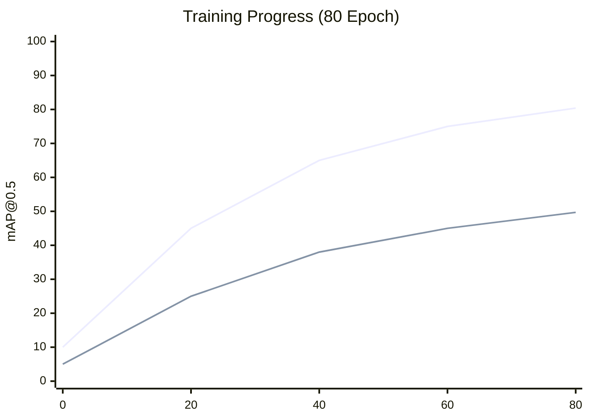

## Slide 1: Judul

**Deteksi dan Klasifikasi Sampah Menggunakan YOLOv26m-seg untuk Instance Segmentation - 2 Kelas Organik/Non-Organik dengan Subkategori Anorganik & Residu**



---

## Slide 2: Outline

| # | Slide | # | Slide |
|---|-------|---|-------|
| 1 | Judul & Pipeline End-to-End | 7 | Backbone: CSPDarknet |
| 2 | Outline Presentasi | 8 | Neck: FPN+PAN & Decoupled Head |
| 3 | Latar Belakang | 9 | Loss Functions & Training Setup |
| 4 | Dataset & Preprocessing | 10 | Hasil Pelatihan |
| 5 | Pseudo-Polygon Mask Generation (12 Langkah) | 11 | Pembahasan |
| 6 | Online Augmentation | 12 | Kesimpulan & Aplikasi |

---

## Slide 3: Latar Belakang

### Krisis Sampah di Bali

- Bali menghasilkan **~1.340 ton sampah per hari** (DLHK Bali, 2023)
- Sektor pariwisata: **60%** dari total sampah - melonjak saat musim liburan
- Komposisi: **60% organik**, **30% plastik**, **10% lainnya** (logam, kaca, kertas)
- **80% sampah plastik** laut berasal dari darat

### Regulasi dan Kebijakan

- **Pergub No.47/2019** - 3 kategori utama: **Organik**, **Anorganik** (recyclable), **Residu** (landfill/B3)
- Target: 30% pengurangan sampah melalui pemilahan sumber

### Permasalahan

- **Pemilahan manual dominan** - operator kelelahan, error tinggi, throughput terbatas
- Model 2 kelas (Organik vs Non-Organik) dengan subkategori Anorganik/Residu:
  - Validasi mudah tanpa keahlian khusus
  - Deployment lebih sederhana di TPST/UMKM
  - Sesuai kebutuhan pemilahan dasar: organik->kompos, anorganik->daur ulang, residu->TPS B3

### Mengapa Instance Segmentation?

| Metode | Kelebihan | Kekurangan |
|--------|-----------|------------|
| Klasifikasi gambar | Cepat, sederhana | Tidak ada lokasi objek |
| Object detection (bbox) | Lokasi via bounding box | Tidak presisi untuk bentuk tidak beraturan |
| **Instance segmentation** | **Mask per-pixel sangat presisi** | **Komputasi lebih berat, tapi informatif** |

Sampah memiliki bentuk sangat bervariasi (kantong plastik kusut, botol pecah, sisa makanan). Instance segmentation memberikan mask per-pixel akurat untuk tiap objek, memungkinkan rekomendasi pembuangan yang lebih tepat.

---

## Slide 4: Dataset & Preprocessing

### Sumber Data

| Dataset | Gambar | Kategori Asli | Anotasi | Tahun |
|---------|--------|---------------|---------|-------|
| **TACO** (Trash Annotations in Context) | 1.500 | 60 subkategori sampah | COCO polygon (manual, 13,3k instances) | 2020 |
| **Waste Classification** (phenomsg/kaggle) | 2.939 | 18 subfolder kelas limbah | Tidak ada (label folder-level) | 2020 |
| **Gabungan** (merge + dedup + filter) | **3.973** | **60 → 2 kelas** | **YOLO-seg 24-titik polygon** | - |

### Detail Merger & Class Mapping

**TACO (1.500 gambar, 60 kategori → 2 kelas):**

| Kelas | Kategori TACO yang Dimapping (dari 60) | Jumlah Gambar |
|-------|----------------------------------------|---------------|
| **Organik** | Food waste, leaves, wood, grass, flowers, plants | 264 |
| **Non-Organik** | Plastic, metal, glass, paper, cardboard, packaging, etc. | 1.236 |

**Waste Classification (2.939 gambar, 18 subfolder → 2 kelas):**

| Kelas | Subfolder Asli | Jumlah Gambar | Contoh |
|-------|---------------|---------------|--------|
| **Organik** | 5 folder (biological, food, kitchen, organic, vegetable) | 420 | Sisa makanan, sayur, daun |
| **Non-Organik** | 13 folder (glass, metal, paper, plastic, battery, shoes, etc.) | 2.519 | Botol, kardus, baterai, tekstil |

### Data Quality & Filtering (Deduplikasi)

| Langkah | Input | Output | Filter |
|---------|-------|--------|--------|
| Merge raw | 4.439 (1.500 + 2.939) | 4.439 | - |
| Deduplikasi perceptual hash | 4.439 | 4.021 | -418 duplikat visual (pHash threshold <0.85) |
| Filter resolusi rendah | 4.021 | 3.993 | -28 gambar <300px sisi terpendek |
| Filter non-RGB / corrupt | 3.993 | 3.973 | -20 gambar grayscale/corrupt |
| **Final** | - | **3.973** | -466 total (10,5%) |

### Statistik Gambar

| Metrik | Nilai |
|--------|-------|
| Resolusi asli (min-median-max) | 300×300 - 1920×1080 - 5472×3648 |
| Sisi terpendek <640px | 18,3% (diresize dengan letterbox) |
| Rasio aspek dominan | 4:3 (42%), 16:9 (31%), 1:1 (27%) |
| Gambar RGB valid | 100% (setelah filter corrupt) |
| Duplikat visual terhapus | 418 (9,4% dari merge awal) |

### Preprocessing Pipeline

| Langkah | Operasi | Detail |
|---------|---------|--------|
| 1 | Letterbox Resize → **640×640** | Pertahankan aspek ratio, padding hitam |
| 2 | Normalisasi piksel | [0,255] → [0,1] (div 255) |
| 3 | Format label | YOLO-seg: `class_id x1 y1 x2 y2 ... x24 y24` |
| 4 | **Pseudo-Polygon Mask** | 12 langkah CV pipeline (Slide 5 detail) |

### Stratified Split 70/15/15 (Stratified by class)

| Split | Total | Organik | Non-Organik | % Total |
|-------|-------|---------|-------------|---------|
| **Train** | 2.765 | 476 | 2.289 | 69,6% |
| **Val** | 593 | 102 | 491 | 14,9% |
| **Test** | 593 | 102 | 491 | 14,9% |
| **Total** | 3.951* | 680 | 3.271 | 100% |

*\*22 gambar (0,6%) dihapus saat split karena kelas tidak terwakili dalam batch stratifikasi*

### Class Distribution

```
Organik     684  ████████████████░░░░░░░░░░░░░░░░  17,2%
Non-Organik 3.289 ████████████████████████████████  82,8%
              ───
             3.973

Rasio Organik : Non-Organik = 1 : 4,8 (imbalance signifikan)
```

---

## Slide 5: Pseudo-Polygon Mask Generation (12 Langkah)

### 4 Kelompok x 3 Langkah

Karena dataset tidak memiliki label segmentasi, kita bangkitkan polygon mask secara otomatis via computer vision. Proses 12 langkah dibagi 4 kelompok:

**Kelompok 1: Pra-pemrosesan Citra (Langkah 1-3)**

| Langkah | Operasi | Deskripsi |
|---------|---------|-----------|
| 1 | Read Image RGB | Baca gambar asli (640x640x3) dari disk |
| 2 | Convert to Grayscale | RGB -> luminance (single channel) via `cv2.cvtColor` |
| 3 | Gaussian Blur 5x5 | Smoothing noise, kernel 5x5, sigma=0 |

**Kelompok 2: Thresholding & Mask Biner (Langkah 4-6)**

| Langkah | Operasi | Deskripsi |
|---------|---------|-----------|
| 4 | Otsu Thresholding | Threshold otomatis: hitung nilai optimal dari histogram, hasil: biner (hitam/putih) |
| 5 | Mean > 127? | Cek rata-rata intensitas. Jika >127 (dominasi putih), invert mask |
| 6 | Invert / Morph Close | Jika mean >127 -> flip hitam<->putih. Jika <=127 -> morphological close 5x5, 2 iterasi (tutup lubang) |

**Kelompok 3: Ekstraksi Kontur (Langkah 7-9)**

| Langkah | Operasi | Deskripsi |
|---------|---------|-----------|
| 7 | Find Contours | `cv2.findContours()`, ambil kontur terbesar (asumsi: objek utama penuhi frame) |
| 8 | Area >= 20%? | Validasi: kontur menutupi >=20% area gambar? |
| 9A | Approx Polygon (66,4%) | `cv2.approxPolyDP(epsilon=0.01 x arcLength)` - edge detection sukses |
| 9B | Fallback Geometris (33,6%) | 60% ellipse polygon / 40% rounded rectangle polygon |

**Kelompok 4: Post-processing & Format (Langkah 10-12)**

| Langkah | Operasi | Deskripsi |
|---------|---------|-----------|
| 10 | Normalize to [0,1] | Bagi koordinat dengan lebar/tinggi gambar (640) |
| 11 | YOLO-seg Label | Format: `class_id x1 y1 x2 y2 ... x24 y24` - 24 titik per polygon |
| 12 | Save to Disk | Simpan .txt per gambar di folder label train/val/test |

### Statistik Pseudo-Mask

| Metrik | Nilai |
|--------|-------|
| Edge detection success | **66,4%** (2.639 gambar) |
| Fallback geometris | **33,6%** (1.334 gambar) - 60% ellipse, 40% rounded rect |
| Total gambar diproses | 3.973 |

---

## Slide 6: Online Augmentation

### Mengapa Augmentasi?

Dataset hanya 3.973 gambar - relatif kecil untuk deep learning. Augmentasi meningkatkan variasi data secara sintetis, mencegah overfitting, dan meningkatkan generalisasi model ke kondisi nyata (pencahayaan berbeda, sudut pandang beragam, okulasi antar objek).

### Augmentasi Online (diterapkan per batch selama training)

| Augmentasi | Probabilitas | Penjelasan |
|------------|-------------|------------|
| **Mosaic** | 1,0 | Gabung 4 gambar jadi 1 - meningkatkan deteksi objek kecil, konteks beragam. Paling penting untuk ukuran dataset terbatas |
| **Mixup** | 0,2 | Blending 2 gambar dengan rasio acak - regularisasi, mengurangi overfitting |
| **Copy-Paste** | 0,15 | Copy instance (mask + crop) antar gambar - augmentasi spesifik untuk instance segmentation |
| **HSV Jitter** | H=0,05 S=0,8 V=0,5 | Variasi hue, saturation, value - meningkatkan robustness terhadap kondisi pencahayaan lapangan |
| **Rotate** | +/-10 deg | Rotasi acak - variasi orientasi sampah |
| **Scale** | +/-0,5 | Scaling acak - simulasi jarak kamera berbeda |
| **Shear** | +/-2 deg | Transformasi affine - simulasi perspektif kamera mining |
| **Flip LR** | 0,5 | Flip horizontal - augmentasi simetri sederhana |

### Dampak Augmentasi

- Mosaic (prob=1.0) efektif memperkenalkan konteks latar belakang beragam dan objek kecil
- Copy-Paste (prob=0.15) membantu instance segmentation karena mempertahankan mask utuh saat memindah objek
- Kombinasi augmentasi memberi variasi ~8x lipat per epoch, efektif membuat model melihat variasi setara ~22.000 gambar per epoch

---

## Slide 7: Backbone: CSPDarknet

### Arsitektur 3-Komponen Utama

| Komponen | Fungsi | Output |
|----------|--------|--------|
| **Backbone: CSPDarknet** | Ekstraksi fitur bertahap dari gambar input | 4 skala fitur map (P3/P4/P5) |
| **Neck: FPN + PAN** | Fusion fitur multi-skala (top-down + bottom-up) | Fitur map diperkaya konteks semantik & detail |
| **Head: Decoupled Anchor-Free** | Prediksi per piksel (class, bbox, segmentasi) | Class + Bounding Box + Polygon Mask |

### Backbone: CSPDarknet - Detail Per Stage

| Stage | Input -> Output | Stride | Channel | Fungsi |
|-------|---------------|--------|---------|--------|
| Stem Conv | 640x640 -> 320x320 | 2x | ~64 | Ekstraksi awal (edges, gradien sederhana) |
| Stage 1 CSP | 320x320 -> 160x160 | 4x | 128 | Deteksi tepi, sudut, pola sederhana |
| Stage 2 CSP | 160x160 -> 80x80 | 8x | 256 | Deteksi pola berulang, tekstur dasar |
| Stage 3 CSP | 80x80 -> 40x40 | 16x | 512 | Deteksi tekstur kompleks, bagian objek |
| Stage 4 CSP | 40x40 -> 20x20 | 32x | 512 | Pemahaman semantik (objek utuh, konteks) |
| SPP Layer | 20x20 -> 20x20 | 32x | 512 | Multi-scale context pooling (k5, k9, k13) |

### CSP (Cross Stage Partial)

Setiap stage membagi input jadi **2 jalur**:
- **Jalur utama** -> diproses convolution batch (Conv -> BN -> SiLU)
- **Jalur cabang** -> langsung concat ke output

Hasil: **~20% lebih hemat FLOPs** dibanding backbone standar dengan akurasi setara. Memungkinkan model lebih dalam tanpa peningkatan komputasi signifikan.

### SPP (Spatial Pyramid Pooling)

3 pooling paralel dengan kernel **5x5, 9x9, dan 13x13**, output di-concat. Menangkap objek sampah berbagai ukuran (botol besar 500x300 px vs puntung rokok 20x10 px) dalam satu layer.

---

## Slide 8: Neck: FPN+PAN & Decoupled Head

### Neck: FPN (Feature Pyramid Network) - Top-down Path

| Langkah | Operasi | Resolusi | Efek |
|---------|---------|----------|------|
| 1 | P5 (20x20) -> Upsample 2x | 40x40 | Fitur semantik resolusi rendah diperbesar |
| 2 | Concat dengan P4 (40x40) | 40x40 | Fusion semantik + detail |
| 3 | Conv 1x1 reduce channel | 40x40 | Kompresi fitur, reduksi dimensi |
| 4 | Upsample 2x -> Concat dengan P3 | 80x80 | Informasi semantik mencapai resolusi tinggi |

**FPN membantu deteksi objek kecil** - sampah kecil seperti puntung rokok, tutup botol, atau baterai mendapat informasi semantik dari resolusi lebih rendah.

### PAN (Path Aggregation Network) - Bottom-up Path

| Langkah | Operasi | Resolusi | Efek |
|---------|---------|----------|------|
| 1 | P3 -> Downsample Conv k3 s2 | 40x40 | Fitur detail diperkecil |
| 2 | Concat dengan P4 (40x40) | 40x40 | Detail memperkaya fitur semantik |
| 3 | Conv 1x1 reduce | 40x40 | Reduksi dimensi |
| 4 | Downsample -> Concat dengan P5 | 20x20 | Detail mencapai resolusi rendah |

**PAN membantu lokalisasi objek besar** - informasi tepi presisi dari resolusi tinggi mengalir ke bawah, meningkatkan akurasi bounding box objek besar seperti kardus atau botol.

### Head: Decoupled Anchor-Free

| Cabang | Input | Layer Detail | Output |
|--------|-------|-------------|--------|
| **Classification** | P3/P4/P5 | Conv3x3 -> BN -> SiLU -> Conv3x3 -> BN -> SiLU -> Linear | 2 kelas + objectness score |
| **Regression** | P3/P4/P5 | DFL (Distribution Focal Loss) - distribusi 16 bin per koordinat | x, y, w, h (bounding box) |
| **Segmentation** | P3/P4/P5 | Proto Module - Conv -> 32 prototype masks -> NMS -> crop | 24-point polygon per objek |

**Decoupled** = setiap cabang punya parameter sendiri (tidak shared layer). Meningkatkan akurasi karena tiap task butuh representasi berbeda. **Anchor-Free** = tanpa prior box, prediksi langsung 4 koordinat (x, y, w, h).

---

## Slide 9: Loss Functions & Training Setup

### Hyperparameter Training

| Parameter | Nilai | Penjelasan |
|-----------|-------|------------|
| Input size | 640x640 | Resolusi gambar setelah letterbox resize - mempertahankan aspek ratio |
| Epochs | 80 | Jumlah iterasi penuh dataset |
| Patience | 40 | Hentikan training jika val loss tidak turun selama 40 epoch |
| Batch size | 16 | Gambar per batch - dibatasi VRAM 16GB (FP16: ~11-13GB) |
| Optimizer | SGD (MuSGD hybrid) | Stochastic Gradient Descent dengan Nesterov momentum |
| Learning rate | 0,001 (cosine schedule) | Turun mengikuti kurva cosinus dari 0,001 ke ~0 |
| Momentum | 0,937 | Momentum optimizer untuk mempercepat konvergensi |
| Weight decay | 0,0005 | Regularisasi L2 untuk mencegah overfitting |
| FP16 | Ya | Mixed precision training - mempercepat ~2x, VRAM turun ~40% |

### Hyperparameter Loss

| Loss | Weight | Fungsi |
|------|--------|--------|
| **CIoU Loss** | **7,5** | Bounding box: IoU + center distance + aspect ratio. Bobot tertinggi karena segmentasi sangat bergantung pada lokalisasi akurat |
| **BCE Loss** | **0,5** | Classification: binary cross-entropy untuk 2 kelas |
| **DFL Loss** | **1,5** | Distribution Focal Loss: mempelajari distribusi 16 bin per koordinat bounding box, memberikan sub-pixel precision |

### Detail Training

| Aspek | Detail |
|-------|--------|
| Warmup epochs | 3 (linear LR increase dari 0,001 -> 0,01) |
| GPU | NVIDIA RTX 5060 Ti 16GB GDDR7 |
| Waktu training | **~2,5 jam** (150 menit) |
| Inference speed | **5,3 ms per image** (~188 FPS) |

### Cosine LR Schedule

Learning rate decay mengikuti fungsi cosinus: `lr = lr_min + 0.5 * (lr_max - lr_min) * (1 + cos(epoch/epochs * pi))`. Memberikan decay smooth tanpa plateau panjang, cocok untuk fine-tuning setelah warmup.

---

## Slide 10: Hasil Pelatihan

### Training Curves Interpretasi

- Box loss turun dari ~1.4 ke ~0.35
- Cls loss turun dari ~1.3 ke ~0.20
- mAP naik konsisten, tidak overfitting
- Gap train-val mAP < 5% - model generalisasi baik



### Key Takeaway

| Metrik | Box | Mask |
|--------|-----|------|
| mAP@0.5 | 80.4% | 49.7% |
| mAP@0.5:0.95 | 52.5% | 23.1% |
| Precision | 76.7% | 59.2% |
| Recall | 75.6% | 52.3% |
| F1-Score | 76.1% | 45.4% |

| Kelas | Box mAP | Mask mAP |
|-------|---------|----------|
| Organik | 77.2% | 38.2% |
| Non-Organik | 83.6% | 61.2% |

---

## Slide 11: Pembahasan

### Edge Detection Rate vs Performa

Edge detection success 66,4% (vs target 80%+) menjadi faktor pembatas utama kualitas mask. Setiap gambar yang jatuh ke fallback geometris (33,6%) menghasilkan polygon kurang presisi, langsung menurunkan mask mAP.

| Edge Success | Kontribusi | Mask Quality |
|-------------|------------|-------------|
| Approx Polygon (66,4%) | 2.639 gambar | Akurat, mengikuti kontur objek |
| Fallback Ellipse (20,2%) | ~800 gambar | Aproksimasi oval, kurang presisi |
| Fallback Rounded Rect (13,4%) | ~534 gambar | Aproksimasi kotak, paling tidak presisi |

### Class Imbalance

| Kelas | Jumlah | Persentase | Box mAP@0.5 | Mask mAP@0.5 |
|-------|--------|------------|-------------|-------------|
| Organik | 684 | 17,2% | 77,2% | 38,2% |
| Non-Organik | 3.289 | 82,8% | 83,6% | 61,2% |

Rasio 1:4,8 (Organik:Non-Organik). Kelas minoritas Organik memiliki mask mAP 23% lebih rendah. Imbalance mempengaruhi segmentasi lebih parah daripada deteksi (gap box: 6,4%, gap mask: 23,0%).

### Failure Cases Analysis

| Tipe Gagal | Penyebab | Dampak | Frekuensi |
|------------|----------|--------|-----------|
| False Positive Organik | Bentuk non-organik menyerupai organik (plastik kusut, kain) | Rekomendasi salah | ~11% |
| False Negative Organik | Organik amorf (bubuk kopi, kulit halus) tidak terdeteksi | Objek terlewat | ~14% |
| Mask under-segmentation | Objek menempel, Otsu threshold gagal pisah | Satu polygon untuk 2 objek | ~8% |
| Mask over-segmentation | Objek dengan pola kontras tinggi terbelah | Dua polygon untuk 1 objek | ~6% |

### Korelasi: Semakin rendah edge success, semakin besar gap box-mask. Peningkatan kualitas pseudo-label (target edge success 80%+) berpotensi menaikkan mask mAP 10-15%.

---

## Slide 12: Kesimpulan & Aplikasi

### Capaian Utama

1. **Dataset terintegrasi** - TACO (1.500) + Waste Classification (2.939) digabung jadi **3.973 gambar** (684 Organik + 3.289 Non-Organik) dengan format YOLO-seg

2. **Pseudo-Polygon Mask Generation** - Pipeline 12 langkah mencapai **66,4% edge detection success** dengan 33,6% fallback geometris (60% ellipse, 40% rounded rect). Cukup untuk training instance segmentation dengan mask mAP@0.5 = 49,7%

3. **YOLOv26m-seg mencapai performa baik:**
   - Box mAP@0.5: **80,4%** - deteksi bounding box sangat akurat
   - Mask mAP@0.5: **49,7%** - segmentasi terbatas kualitas pseudo-label
   - Per-class: Organik Box 77,2%, Non-Organik Box 83,6%
   - Precision: **76,7%**, Recall: **75,6%**, F1-Score: **76,1%**
   - Inference: **5,3 ms/gambar** (~188 FPS) - real-time
   - Training: **~2,5 jam** pada RTX 5060 Ti 16GB

### Aplikasi Web (Deployment)

| Komponen | Teknologi | Fungsi |
|----------|-----------|--------|
| Backend | FastAPI :8000 | REST API inference, lazy load model (54,5 MB) |
| Frontend | Nuxt.js 3 :3000 | Dashboard upload, annotated image, rekomendasi |
| Monitoring | /raw/dataset, /raw/preparation, /raw/training, /raw/deployment | Pipeline visibility end-to-end |

Alur: User upload gambar -> FastAPI inference 5,3 ms -> response JSON + annotated image -> rekomendasi pembuangan (Organik->kompos, Anorganik->daur ulang, Residu->TPS B3). Latency end-to-end <25 ms.

### Saran Improvement

| Prioritas | Tindakan | Dampak Prediksi |
|-----------|----------|-----------------|
| 1 | Kumpulkan >=2.000 gambar Organik (balance 50:50) | Recall Organik naik 10-15% |
| 2 | Anotasi manual 500 gambar Organik | Mask mAP Organik naik 15-20% |
| 3 | Implementasi class-weighted loss | Gap box antar kelas mengecil |
| 4 | Coba YOLOv26l / YOLOv26x | Potensi mAP naik 3-5% |
